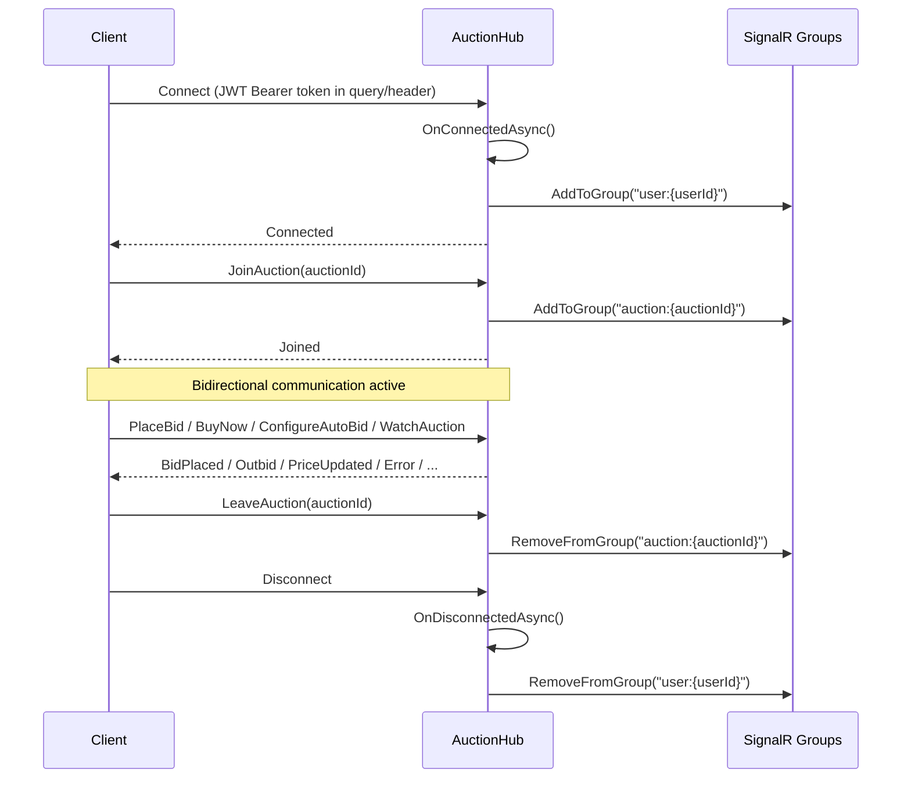

# SignalR Auction Hub

## Overview

The `AuctionHub` is the primary real-time communication channel for the bidding system.
It provides Client-to-Server RPC methods for placing bids, buying now, configuring auto-bids,
and watching auctions, as well as Server-to-Client push events for all auction activity.

---

## Connection Lifecycle



---

## Hub Configuration

| Property | Value |
|----------|-------|
| Path | `/hubs/auction` |
| Auth | `[Authorize]` -- JWT Bearer token required |
| Registration | `app.MapHub<AuctionHub>("/hubs/auction")` in `Program.cs` |
| Typed client | `Hub<IAuctionHubClient>` |
| Hub filter | `AuctionBidIdempotencyHubFilter` (idempotency for `PlaceBid`) |

---

## Groups

| Group pattern | Scope | Description |
|---------------|-------|-------------|
| `auction:{auctionId}` | Broadcast | All clients watching a specific auction. Joined via `JoinAuction`, left via `LeaveAuction`. |
| `user:{userId}` | Personal | Auto-joined on connect, auto-left on disconnect. Used for personal notifications (e.g. `Outbid`). |

Group name helpers:

```csharp
public static string AuctionGroupName(Guid auctionId) => $"auction:{auctionId}";
public static string UserGroupName(Guid userId) => $"user:{userId}";
```

---

## Client-to-Server Methods (6)

### 1. `PlaceBid`

```csharp
[HasPermission(App.Permissions.Catalogs.Auctions.Bid)]
public async Task<HubCommandResult<BidDto>> PlaceBid(
    Guid auctionId,
    decimal amount,
    string currency,
    string? idempotencyKey = null)
```

Places a live bid on the auction. The optional `idempotencyKey` is processed by
`AuctionBidIdempotencyHubFilter` to prevent duplicate bids. The filter generates a cache
fingerprint from `amount|currency` and caches the result under
`bid:idempotency:{userId}:{auctionId}`.

**Returns:** `HubCommandResult<BidDto>` with `Success`, `Data`, and optional `Error`.

### 2. `BuyNow`

```csharp
[HasPermission(App.Permissions.Catalogs.Auctions.BuyNow)]
public async Task<HubCommandResult<BuyNowCheckoutDto>> BuyNow(Guid auctionId)
```

Initiates a buy-now reservation and returns a VNPay checkout URL. Delegates to
`BuyNowCommand`.

**Returns:** `HubCommandResult<BuyNowCheckoutDto>`.

### 3. `ConfigureAutoBid`

```csharp
[HasPermission(App.Permissions.Catalogs.Auctions.AutoBid)]
public async Task ConfigureAutoBid(
    Guid auctionId,
    decimal maxAmount,
    string currency,
    decimal? incrementAmount)
```

Creates or updates an auto-bid configuration. On failure, sends an error via
`Clients.Caller.Error()`.

**Returns:** `void` (fire-and-forget; errors pushed via `Error` event).

### 4. `WatchAuction`

```csharp
[HasPermission(App.Permissions.Catalogs.Auctions.Watch)]
public async Task WatchAuction(
    Guid auctionId,
    bool notifyOnBid = true,
    bool notifyOnEnd = true)
```

Adds the current user as a watcher with the specified notification preferences.
On failure, sends an error via `Clients.Caller.Error()`.

**Returns:** `void`.

### 5. `JoinAuction`

```csharp
public async Task JoinAuction(Guid auctionId)
```

Adds the caller's connection to the `auction:{auctionId}` SignalR group to receive
broadcast events for that auction.

**Returns:** `void`.

### 6. `LeaveAuction`

```csharp
public async Task LeaveAuction(Guid auctionId)
```

Removes the caller's connection from the `auction:{auctionId}` SignalR group.

**Returns:** `void`.

---

## Server-to-Client Events (11)

All events are defined in `IAuctionHubClient` and dispatched by `AuctionNotificationService`
using `IHubContext<AuctionHub, IAuctionHubClient>`.

### 1. `BidPlaced`

Broadcast to `auction:{auctionId}` group.

```csharp
public sealed record BidNotification(
    Guid AuctionId,
    Guid BidId,
    Guid BidderId,
    string BidderDisplayName,
    decimal Amount,
    decimal CurrentPrice,
    decimal MinimumNextBid,
    int TotalBids,
    bool IsAutoBid,
    DateTimeOffset Timestamp);
```

### 2. `Outbid`

Sent to `user:{outbidUserId}` group (personal notification).

```csharp
public sealed record OutbidNotification(
    Guid AuctionId,
    decimal NewHighAmount,
    decimal MinimumNextBid,
    string NewHighBidderDisplayName);
```

### 3. `BuyNowReserved`

Broadcast to `auction:{auctionId}` group.

```csharp
public sealed record BuyNowReservedNotification(
    Guid AuctionId,
    Guid ReservationId,
    Guid BuyerId,
    decimal BuyNowPrice,
    decimal DepositAppliedAmount,
    decimal AmountDue,
    DateTimeOffset ExpiresAt);
```

### 4. `BuyNowReservationReleased`

Broadcast to `auction:{auctionId}` group.

```csharp
public sealed record BuyNowReservationReleasedNotification(
    Guid AuctionId,
    Guid ReservationId,
    Guid BuyerId,
    string Reason,
    DateTimeOffset ReleasedAt);
```

### 5. `BuyNowExecuted`

Broadcast to `auction:{auctionId}` group.

```csharp
public sealed record BuyNowNotification(
    Guid AuctionId,
    Guid BuyerId,
    decimal Price);
```

### 6. `AuctionStarted`

Broadcast to `auction:{auctionId}` group.

```csharp
public sealed record AuctionStartedNotification(
    Guid AuctionId,
    DateTimeOffset StartTime,
    DateTimeOffset EndTime);
```

### 7. `AuctionEnded`

Broadcast to `auction:{auctionId}` group. Additionally, if there is a winner, a personalised
copy (with `WinnerDisplayName = "You"`) is sent to the `user:{winnerId}` group.

```csharp
public sealed record AuctionEndedNotification(
    Guid AuctionId,
    Guid? WinnerId,
    string? WinnerDisplayName,
    decimal FinalPrice,
    int TotalBids,
    bool ReserveMet);
```

### 8. `AuctionExtended`

Broadcast to `auction:{auctionId}` group.

```csharp
public sealed record AuctionExtendedNotification(
    Guid AuctionId,
    DateTimeOffset NewEndTime,
    int ExtensionMinutes);
```

### 9. `AuctionCancelled`

Broadcast to `auction:{auctionId}` group.

```csharp
public sealed record AuctionCancelledNotification(
    Guid AuctionId,
    string Reason);
```

### 10. `PriceUpdated`

Broadcast to `auction:{auctionId}` group.

```csharp
public sealed record PriceUpdateNotification(
    Guid AuctionId,
    decimal CurrentPrice,
    decimal MinimumNextBid,
    int TotalBids,
    TimeSpan RemainingTime);
```

### 11. `Error`

Sent to the **caller only** (`Clients.Caller.Error()`).

```csharp
public sealed record ErrorNotification(
    string Code,
    string Message,
    Dictionary<string, string[]>? Errors);
```

The `Errors` dictionary is populated from `ViolationsError.Violations`, grouped by
`PropertyName`. For non-validation errors, `Errors` is `null`.

---

## Error Handling

When a hub method (e.g. `ConfigureAutoBid`, `WatchAuction`) encounters a domain error, the
hub converts it to an `ErrorNotification` and sends it to the caller:

```csharp
private static ErrorNotification ToErrorNotification(Error error)
{
    if (error is not ViolationsError violationsError)
        return new ErrorNotification(error.Code, error.Message, null);

    var errorsDict = violationsError.Violations
        .GroupBy(e => ((ICheckError)e).PropertyName)
        .ToDictionary(
            g => g.Key,
            g => g.Select(e => e.Message).ToArray());

    return new ErrorNotification(violationsError.Code, violationsError.Message, errorsDict);
}
```

For `PlaceBid` and `BuyNow`, errors are returned inline as part of the `HubCommandResult<T>`
response (`.Success = false`, `.Error` populated).

---

## HubCommandResult

```csharp
public sealed record HubCommandResult<T>(
    bool Success,
    T? Data,
    ErrorNotification? Error);
```

Used by `PlaceBid` and `BuyNow` to return structured results. Created via:

- `HubCommandResult<T>.FromResult(result)` -- maps `Result<T, Error>` to success/error.
- `HubCommandResult<T>.FromError(error)` -- wraps an error directly.
