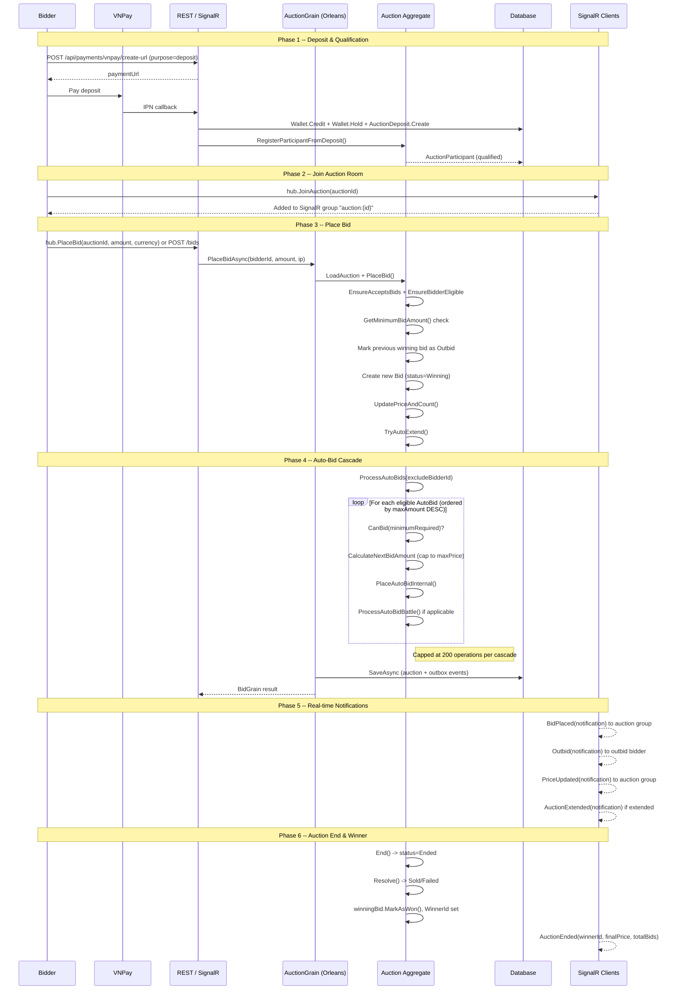

# Flow 07 -- Bidding

## Module Overview

The OIO Auction Platform bidding module provides real-time bidding via **SignalR hub** (`/hubs/auction`) with a **REST API fallback** for each operation. All bid-mutating operations route through an **Orleans `AuctionGrain`** (keyed by `AuctionId`) which guarantees single-threaded access per auction -- eliminating race conditions without external locking.

**Key components:**

| Layer | Component | Responsibility |
|---|---|---|
| Presentation | `AuctionHub` | SignalR hub -- `PlaceBid`, `BuyNow`, `ConfigureAutoBid`, `WatchAuction`, `JoinAuction`, `LeaveAuction` |
| Presentation | REST Endpoints | HTTP fallback for each bidding operation |
| Application | Command Handlers | Validation, grain invocation, invalid-bid tracking |
| Infrastructure | `AuctionGrain` (Orleans) | Load aggregate, execute domain logic, wallet holds, persist |
| Domain | `Auction` aggregate | All bidding rules: `PlaceBid`, `ConfigureAutoBid`, `ProcessAutoBids`, `SubmitSealedBid`, `RevealAllSealedBids` |
| Domain | `Bid`, `AutoBid`, `SealedBid` | Child entities within the Auction aggregate |

## End-to-End Bidding Flow



## REST Endpoints

| # | Method | URL | Permission | Description |
|---|--------|-----|------------|-------------|
| 1 | `POST` | `/api/auctions/{auctionId}/bids` | `auctions:bid` | Place a manual bid (idempotent via `Idempotency-Key` header) |
| 2 | `GET` | `/api/auctions/{auctionId}/bids` | `auctions:auto-bid:read` | Get paginated bid history for an auction |
| 3 | `PUT` | `/api/auctions/{auctionId}/auto-bid` | `auctions:auto-bid` | Configure or update auto-bid (maxAmount, incrementAmount) |
| 4 | `POST` | `/api/auctions/{auctionId}/auto-bid/pause` | `auctions:auto-bid` | Pause auto-bid (wallet hold retained) |
| 5 | `POST` | `/api/auctions/{auctionId}/auto-bid/resume` | `auctions:auto-bid` | Resume paused auto-bid (immediately engages) |
| 6 | `GET` | `/api/auctions/{auctionId}/auto-bid/my` | (authenticated) | Get current user's auto-bid for an auction |
| 7 | `POST` | `/api/auctions/{auctionId}/sealed-bids` | `auctions:bid` | Submit encrypted sealed bid |
| 8 | `POST` | `/api/auctions/{auctionId}/buy-now` | `auctions:buy-now` | Initiate buy-now reservation + get VNPay checkout URL |
| 9 | `POST` | `/api/auctions/{auctionId}/watch` | `auctions:watch` | Watch an auction (notification preferences) |
| 10 | `DELETE` | `/api/auctions/{auctionId}/watch` | `auctions:unwatch` | Unwatch an auction |

## SignalR Hub Methods

Hub URL: `/hubs/auction` (requires authentication)

| # | Method | Parameters | Permission | Description |
|---|--------|-----------|------------|-------------|
| 1 | `JoinAuction` | `auctionId` | (authenticated) | Subscribe to real-time events for an auction |
| 2 | `LeaveAuction` | `auctionId` | (authenticated) | Unsubscribe from auction events |
| 3 | `PlaceBid` | `auctionId, amount, currency, idempotencyKey?` | `auctions:bid` | Place a bid via SignalR |
| 4 | `BuyNow` | `auctionId` | `auctions:buy-now` | Initiate buy-now via SignalR |
| 5 | `ConfigureAutoBid` | `auctionId, maxAmount, currency, incrementAmount?` | `auctions:auto-bid` | Configure auto-bid via SignalR |
| 6 | `WatchAuction` | `auctionId, notifyOnBid?, notifyOnEnd?` | `auctions:watch` | Watch auction via SignalR |

## Subflow Index

| File | Topic |
|------|-------|
| [01-deposit-qualification.md](./01-deposit-qualification.md) | Deposit payment & bidder qualification |
| [02-manual-bid.md](./02-manual-bid.md) | Manual bid placement (REST + SignalR) |
| [03-auto-bid.md](./03-auto-bid.md) | Auto-bid configuration, cascade, pause/resume |
| [04-sealed-bid.md](./04-sealed-bid.md) | Sealed-bid submission & reveal |

## SignalR Events Summary

Events are defined in `IAuctionHubClient` and broadcast to connected clients:

| Event | Sent To | Payload Fields | Trigger |
|-------|---------|----------------|---------|
| `BidPlaced` | Auction group | `auctionId, bidId, bidderId, bidderDisplayName, amount, currentPrice, minimumNextBid, totalBids, isAutoBid, timestamp` | Any bid placed (manual or auto) |
| `Outbid` | Previous winning bidder | `auctionId, newHighAmount, minimumNextBid, newHighBidderDisplayName` | A different bidder takes the lead |
| `BuyNowReserved` | Auction group | `auctionId, reservationId, buyerId, buyNowPrice, depositAppliedAmount, amountDue, expiresAt` | Buy-now reservation created |
| `BuyNowReservationReleased` | Auction group | `auctionId, reservationId, buyerId, reason, releasedAt` | Buy-now reservation expired/failed |
| `BuyNowExecuted` | Auction group | `auctionId, buyerId, price` | Buy-now payment completed, auction sold |
| `AuctionStarted` | Auction group | `auctionId, startTime, endTime` | Auction transitions to Active |
| `AuctionEnded` | Auction group | `auctionId, winnerId, winnerDisplayName, finalPrice, totalBids, reserveMet` | Auction transitions to Ended |
| `AuctionExtended` | Auction group | `auctionId, newEndTime, extensionMinutes` | Auto-extend triggered by late bid |
| `AuctionCancelled` | Auction group | `auctionId, reason` | Auction cancelled by seller/admin |
| `PriceUpdated` | Auction group | `auctionId, currentPrice, minimumNextBid, totalBids, remainingTime` | Price change (bid, auto-bid, repricing) |
| `Error` | Caller only | `code, message, errors` | Validation or business rule failure |

## Permissions

| Permission String | Used By | Description |
|---|---|---|
| `auctions:bid` | PlaceBid endpoint, SubmitSealedBid endpoint, SignalR `PlaceBid` | Place manual bids and sealed bids |
| `auctions:buy-now` | BuyNow endpoint, SignalR `BuyNow` | Initiate buy-now checkout |
| `auctions:auto-bid` | ConfigureAutoBid, PauseAutoBid, ResumeAutoBid endpoints, SignalR `ConfigureAutoBid` | Manage auto-bid configuration |
| `auctions:auto-bid:read` | GetMyAutoBid, GetAuctionBids endpoints | Read auto-bid state and bid history |
| `auctions:watch` | WatchAuction endpoint, SignalR `WatchAuction` | Watch an auction |
| `auctions:unwatch` | UnwatchAuction endpoint | Unwatch an auction |

## DTOs Overview

### BidDto

```
BidDto(Id, AuctionId, BidderId, Amount: MoneyDto, IsAutoBid, Status, CreatedAt)
```

### AutoBidDto

```
AutoBidDto(Id, AuctionId, BidderId, IsEnabled, MaxAmount: MoneyDto,
           CurrentAmount: MoneyDto, RemainingBudget: MoneyDto,
           IncrementAmount: MoneyDto?, Status, TotalAutoBids,
           LastAutoBidAt?, StopReason?, StoppedAt?, LastValidationAt?, CreatedAt)
```

### SealedBidDto

```
SealedBidDto(Id, AuctionId, BidderId, AmountEncrypted, Status,
             CreatedAt, RevealedAt?, RevealedBy?, RevealedAmount?)
```

### BuyNowCheckoutDto

```
BuyNowCheckoutDto(ReservationId, PaymentUrl, ExpiresAt,
                  BuyNowPrice: MoneyDto, DepositAppliedAmount: MoneyDto, AmountDue: MoneyDto)
```

### MoneyDto

```
MoneyDto(Amount: decimal, Currency: string, Symbol: string)
```
