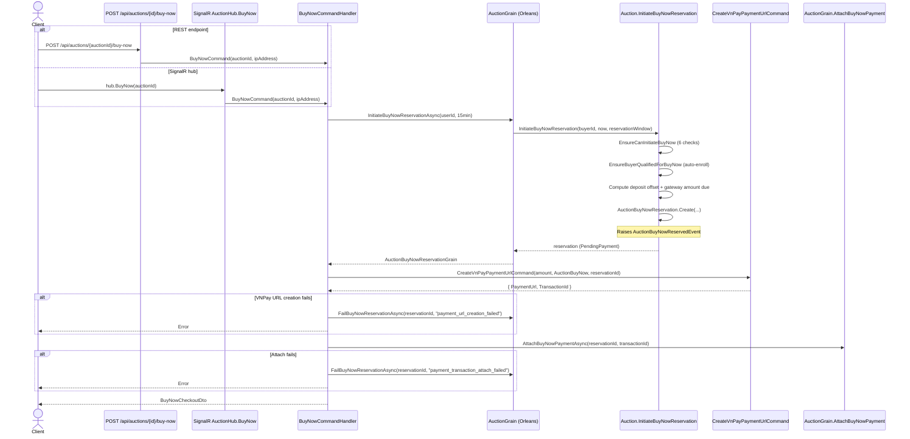

# 01 - Initiate Buy Now Reservation

## Sequence Diagram



---

## Endpoints

### REST

```
POST /api/auctions/{auctionId:guid}/buy-now
```

- **Idempotent**: protected by `IdempotencyFilter<BuyNowCheckoutDto>` with `IdempotencyHttpPolicies.BuyNow()`.
- **Authorization**: requires `App.Permissions.Catalogs.Auctions.BuyNow`.
- **Success**: 201 Created with `BuyNowCheckoutDto`.
- **Error**: 400 Bad Request (validation) or 409 Conflict (reservation active, wrong state).

### SignalR

```
AuctionHub.BuyNow(Guid auctionId) -> HubCommandResult<BuyNowCheckoutDto>
```

- Same authorization: `[HasPermission(App.Permissions.Catalogs.Auctions.BuyNow)]`.
- Same underlying `BuyNowCommand` handler.

---

## Reservation Window

```csharp
private static readonly TimeSpan ReservationWindow = TimeSpan.FromMinutes(15);
```

Hardcoded in `BuyNowCommandHandler`. The reservation `ExpiresAt` is computed as `nowUtc.Add(reservationWindow)` inside `AuctionBuyNowReservation.Create`.

---

## Validation Chain

### EnsureCanInitiateBuyNow (6 checks)

| # | Check | Error |
|---|-------|-------|
| 1 | `Pricing.BuyNowAmount is null \|\| !Pricing.IsBuyNowAvailable` | `Auction.NotSupportBuyNow` |
| 2 | `GetActiveBuyNowReservation(now) is not null` | `Auction.BuyNowReservationActive` |
| 3 | `buyerId == Item.SellerId` (via `EnsureNotSeller`) | `Auction.SelfBid` |
| 4 | `Status != AuctionStatus.Scheduled` | `Auction.BuyNowUnavailableForScheduledAuction` |
| 5 | `Info is null` | `Auction.TimingRequired` |
| 6 | `!Info.HasQualification \|\| !Info.IsQualificationOpen(now)` | `Auction.BuyNowUnavailableForScheduledAuction` |

### EnsureBuyerQualifiedForBuyNow (auto-enroll)

- If buyer has **no participant record** (or all are `Withdrawn`): creates a new `AuctionParticipant.Create(auctionId, buyerId, "buy_now", now)`.
- If buyer has a participant but `!IsQualified`: calls `participant.Qualify(now)`.
- Always succeeds (no error returned).

---

## Deposit Calculation

```csharp
var buyNowPrice = Pricing.BuyNowPrice!;
var heldDeposit = _deposits.FirstOrDefault(d => d.BidderId == buyerId && d.IsHeld);
var depositAmount = heldDeposit?.Amount ?? Money.Zero(buyNowPrice.Currency);
var appliedDepositAmount = Math.Min(depositAmount.Amount, buyNowPrice.Amount);
var gatewayAmountDue = buyNowPrice.Amount - appliedDepositAmount;
```

- If buyer has a held deposit, the lesser of `deposit.Amount` and `buyNowPrice` is applied.
- `GatewayAmountDue` is what the buyer pays through VNPay.
- `AuctionBuyNowReservation.Create` validates: `depositApplied + gatewayAmountDue == buyNowPrice`.

---

## VNPay Payment URL

The handler sends `CreateVnPayPaymentUrlCommand` with:

| Parameter | Value |
|-----------|-------|
| `Amount` | `reservation.GatewayAmountDue.Amount` |
| `Currency` | `reservation.GatewayAmountDue.Currency` |
| `Purpose` | `PaymentPurpose.AuctionBuyNow.Id` |
| `IpAddress` | From HTTP context (fallback `IPAddress.Loopback`) |
| `Description` | `"AuctionBuyNow - Auction #{auctionId}"` |
| `AuctionId` | `request.AuctionId` |
| `BuyNowReservationId` | `reservation.Id` |

The `BuyNowReservationId` stored on the transaction is how the IPN callback later identifies the reservation.

---

## Error Handling

If VNPay URL creation or payment attachment fails, the handler immediately fails the reservation:

1. **URL creation failure**: `grain.FailBuyNowReservationAsync(reservationId, "payment_url_creation_failed")` -- then returns the VNPay error.
2. **Attach failure**: `grain.FailBuyNowReservationAsync(reservationId, "payment_transaction_attach_failed")` -- then returns the attach error.

Both paths raise `AuctionBuyNowReservationReleasedEvent` with the corresponding reason.

---

## Error Codes

| Error Code | Scenario |
|------------|----------|
| `Auction.NotSupportBuyNow` | Auction has no BuyNowPrice or it is unavailable |
| `Auction.BuyNowReservationActive` | Another active reservation exists on this auction |
| `Auction.SelfBid` | Buyer is the seller |
| `Auction.BuyNowUnavailableForScheduledAuction` | Status is not Scheduled, or qualification window not open |
| `Auction.TimingRequired` | Auction Info (timing) not configured |
| `AuctionBuyNowReservation.InvalidInput` | Empty AuctionId or BuyerId |
| `AuctionBuyNowReservation.InvalidFundingSplit` | deposit + gateway != buyNowPrice |
| `AuctionBuyNowReservation.InvalidExpiration` | ExpiresAt <= now |
