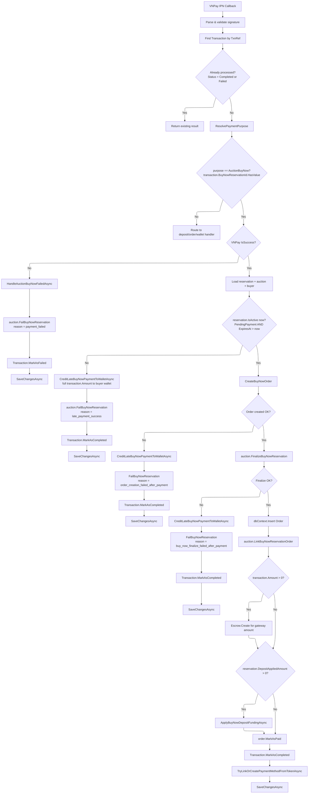

# 02 - Payment Callback (VNPay IPN)

## Callback Decision Tree



---

## Routing

The `ProcessVnPayCallbackCommandHandler` resolves payment purpose via `ResolvePaymentPurpose`:

```
if (transaction.BuyNowReservationId.HasValue)  →  PaymentPurpose.AuctionBuyNow
```

When `purpose == PaymentPurpose.AuctionBuyNow`:
- **Success callback** (`callback.IsSuccess == true`): routes to `HandleAuctionBuyNowAsync`.
- **Failed callback** (`callback.IsSuccess == false`): routes to `HandleAuctionBuyNowFailedAsync`.

---

## Normal Path (Happy Flow)

When VNPay payment succeeds and the reservation is still active (`PendingPayment` + `ExpiresAt > now`):

| Step | Operation | Detail |
|------|-----------|--------|
| 1 | Load reservation | Query by `BuyNowReservationId` or `PaymentTransactionId`, include Auction with Bids, AutoBids, Deposits, Participants, BuyNowReservations, Item |
| 2 | Load buyer | With Profile and Addresses |
| 3 | `CreateBuyNowOrder` | Creates `Order.Create(...)` with buyer shipping snapshot, `OrderPricing` at buy-now price, zero fees |
| 4 | `auction.FinalizeBuyNowReservation` | Cancels active/winning bids, creates winning bid, marks reservation Paid, sets auction to Sold |
| 5 | `dbContext.Insert(order)` | Persists the new order |
| 6 | `auction.LinkBuyNowReservationOrder` | Sets `reservation.OrderId = order.Id` |
| 7 | `Escrow.Create` | Creates escrow for the gateway payment amount (if `transaction.Amount > 0`) |
| 8 | `ApplyBuyNowDepositFundingAsync` | If `reservation.DepositAppliedAmount > 0`: converts deposit, debits wallet pending balance, creates second escrow |
| 9 | `order.MarkAsPaid` | Transitions order to Paid status |
| 10 | `transaction.MarkAsCompleted` | Marks VNPay transaction as completed with gateway info |
| 11 | `TryLinkOrCreatePaymentMethodFromTokenAsync` | Best-effort: auto-create/update PaymentMethod from VNPay token |
| 12 | `SaveChangesAsync` | Single unit of work commit |

---

## Late Payment Path

When VNPay payment succeeds but `reservation.IsActive(now) == false` (expired):

1. `CreditLateBuyNowPaymentToWalletAsync`: credits full `transaction.Amount` to buyer wallet.
2. `auction.FailBuyNowReservation(reservationId, "late_payment_success")`: marks reservation as Failed.
3. No order created. Auction remains in its current state.

See [04-late-payment.md](./04-late-payment.md) for details.

---

## Payment Failure Path

When VNPay reports `IsSuccess == false`:

1. `transaction.MarkAsFailed(gatewayInfo, now)` -- marks the transaction as failed.
2. `HandleAuctionBuyNowFailedAsync`:
   - Loads reservation by `BuyNowReservationId` or `PaymentTransactionId`.
   - Calls `auction.FailBuyNowReservation(reservationId, "payment_failed", now)`.
   - Reservation status becomes `Failed`.
   - Raises `AuctionBuyNowReservationReleasedEvent` with reason `"payment_failed"`.
3. `SaveChangesAsync`.

The auction is unlocked and other buyers can initiate new reservations.

---

## Error Handling with Wallet Credit Fallback

After a successful VNPay payment, if any subsequent step fails (order creation, finalization), the handler:

1. Credits the full `transaction.Amount` to the buyer's wallet via `CreditLateBuyNowPaymentToWalletAsync`.
2. Fails the reservation with a descriptive reason.
3. The buyer retains funds in their wallet for future use.

This avoids the complexity of VNPay refund processing. The three failure-after-payment scenarios:

| Failure Point | Reservation Failure Reason |
|---------------|---------------------------|
| `CreateBuyNowOrder` fails | `order_creation_failed_after_payment` |
| `FinalizeBuyNowReservation` fails | `buy_now_finalize_failed_after_payment` |
| Reservation expired (late payment) | `late_payment_success` |
