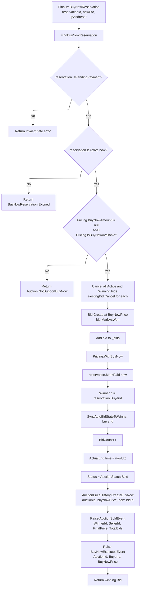

# 03 - Finalize Buy Now Reservation

## Finalization Flow



---

## Domain Method Signature

```csharp
public Result<Bid, Error> FinalizeBuyNowReservation(
    AuctionBuyNowReservationId reservationId,
    DateTime nowUtc,
    IPAddress? ipAddress = null)
```

Returns the newly created winning `Bid` on success, or an `Error` on failure.

---

## Step-by-Step Breakdown

### 1. Validation

Three guard checks before any mutation:

| Check | Condition | Error |
|-------|-----------|-------|
| Reservation status | `!reservation.IsPendingPayment` | `BuyNowReservation.InvalidState` |
| Reservation active | `!reservation.IsActive(nowUtc)` | `BuyNowReservation.Expired` |
| Buy-now supported | `Pricing.BuyNowAmount is null \|\| !Pricing.IsBuyNowAvailable` | `Auction.NotSupportBuyNow` |

### 2. Cancel All Active/Winning Bids

```csharp
foreach (var existingBid in _bids.Where(b =>
    b.Status == BidStatus.Active || b.Status == BidStatus.Winning))
{
    existingBid.Cancel();
}
```

All currently active or winning bids are cancelled. This clears the competitive state since the auction is being sold directly.

### 3. Create Winning Bid

```csharp
var bid = Bid.Create(Id, reservation.Value.BuyerId, Pricing.BuyNowPrice!, autoBidId: null, ipAddress, nowUtc);
bid.MarkAsWon();
_bids.Add(bid);
```

A new bid is created at the full `BuyNowPrice` and immediately marked as `Won`. The `autoBidId` is `null` since this is a direct purchase.

### 4. Update Pricing

```csharp
var buyNowResult = Pricing.WithBuyNow();
```

`Pricing.WithBuyNow()` updates the pricing state to reflect a buy-now sale (sets current price to the buy-now price and marks buy-now as exercised).

### 5. Mark Reservation Paid

```csharp
reservation.Value.MarkPaid(nowUtc);
```

Transitions reservation status from `PendingPayment` to `Paid`. Sets `ReleasedAt = nowUtc`.

### 6. Set Winner and Auction State

```csharp
WinnerId = reservation.Value.BuyerId;
SyncAutoBidStateToWinner(reservation.Value.BuyerId, nowUtc);
BidCount++;
ActualEndTime = nowUtc;
Status = AuctionStatus.Sold;
```

- `WinnerId` is set to the buyer.
- `SyncAutoBidStateToWinner` updates any auto-bid configuration for the winner.
- `BidCount` incremented for the new winning bid.
- `ActualEndTime` set to the current time (auction ends now).
- `Status` transitions directly to `Sold`.

### 7. Price History

```csharp
_priceHistories.Add(AuctionPriceHistory.CreateBuyNow(Id, Pricing.BuyNowPrice!, nowUtc, bid.Id));
```

Records a price history entry specifically tagged as a buy-now event.

### 8. Domain Events

Two events are raised:

**AuctionSoldEvent:**
```
AuctionId, WinnerId, SellerId, FinalPrice (BuyNowAmount), Currency, TotalBids, OccurredAt
```

**BuyNowExecutedEvent:**
```
AuctionId, BuyerId, BuyNowPrice, OccurredAt
```

---

## Comparison: Normal Auction End vs Buy Now Finalize

| Aspect | Normal Auction End | Buy Now Finalize |
|--------|-------------------|------------------|
| **State transitions** | `Active` -> `End()` -> `Ended` -> `Resolve()` -> `Sold` or `Failed` | `Scheduled` -> `FinalizeBuyNowReservation()` -> `Sold` (single step) |
| **Winner determination** | `Resolve()` picks highest bid, marks as `Won` | Creates new bid at BuyNowPrice, marks as `Won` immediately |
| **Existing bids** | Outbid bids marked as `Outbid` during active phase | All active/winning bids force-cancelled |
| **Reserve price check** | `Resolve()` checks `ReserveMet` -- may result in `Failed` | No reserve check -- buy-now price always satisfies |
| **Events raised** | `AuctionEndedEvent` then `AuctionSoldEvent` (or `AuctionFailedEvent`) | `AuctionSoldEvent` + `BuyNowExecutedEvent` (no ended event) |
| **ActualEndTime** | Set in `End()` | Set in `FinalizeBuyNowReservation()` |
| **Price history** | `AuctionPriceHistory.CreateBid` for each bid | `AuctionPriceHistory.CreateBuyNow` (single entry) |

---

## LinkBuyNowReservationOrder

Called after finalization and order insertion to associate the reservation with its order:

```csharp
public UnitResult<Error> LinkBuyNowReservationOrder(
    AuctionBuyNowReservationId reservationId,
    OrderId orderId,
    DateTime nowUtc)
```

Sets `reservation.OrderId = orderId` via `reservation.LinkOrder(orderId, nowUtc)`. This is a non-critical step -- the callback handler logs a warning on failure but does not abort the overall flow.
