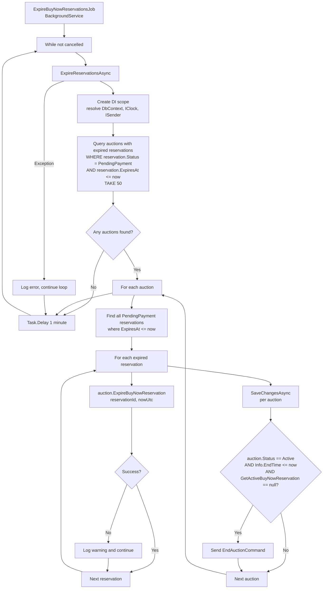

# 05 - Reservation Expiry

## Job Flow



---

## Job Configuration

| Setting | Value |
|---------|-------|
| **Type** | `BackgroundService` (hosted service) |
| **Interval** | `TimeSpan.FromMinutes(1)` -- runs every 1 minute |
| **Batch size** | `Take(50)` -- max 50 auctions per run |
| **Error handling** | Catches all exceptions, logs, and continues the loop |

---

## Query

```csharp
var auctions = await dbContext.Set<Auction>()
    .Include(x => x.BuyNowReservations)
    .Where(x => x.BuyNowReservations.Any(r =>
        r.Status == BuyNowReservationStatus.PendingPayment &&
        r.ExpiresAt <= nowUtc))
    .Take(50)
    .ToListAsync(cancellationToken);
```

Loads auctions that have at least one reservation where:
- `Status == PendingPayment` (not yet terminal)
- `ExpiresAt <= nowUtc` (past the 15-minute window)

Limited to 50 auctions per run to bound database and processing load.

---

## Expiration Logic

For each auction, the job:

1. Collects all `PendingPayment` reservations with `ExpiresAt <= now`.
2. Calls `auction.ExpireBuyNowReservation(reservationId, nowUtc)` for each.

### auction.ExpireBuyNowReservation

```csharp
public UnitResult<Error> ExpireBuyNowReservation(
    AuctionBuyNowReservationId reservationId,
    DateTime nowUtc)
```

Steps:
1. `FindBuyNowReservation(reservationId)` -- locates the reservation.
2. Checks `reservation.IsPendingPayment` -- if already terminal, returns success (idempotent).
3. Calls `reservation.Expire(nowUtc)`:
   - `Status = BuyNowReservationStatus.Expired`
   - `ReleasedAt = nowUtc`
4. Sets `auction.ModifiedAt = nowUtc`.
5. Raises `AuctionBuyNowReservationReleasedEvent`:
   - `AuctionId`, `ReservationId`, `BuyerId`
   - `Reason = "expired"`

---

## Auto-End Trigger

After expiring all reservations for an auction, the job checks whether the auction should have ended while it was locked by the reservation:

```csharp
if (auction.Status == AuctionStatus.Active &&
    auction.Info is not null &&
    auction.Info.EndTime <= nowUtc &&
    auction.GetActiveBuyNowReservation(nowUtc) is null)
{
    await sender.Send(new EndAuctionCommand(auction.Id.Value), cancellationToken);
}
```

| Condition | Purpose |
|-----------|---------|
| `Status == Active` | Only active auctions need ending |
| `Info.EndTime <= nowUtc` | The scheduled end time has passed |
| `GetActiveBuyNowReservation(nowUtc) is null` | No other active reservation is blocking |

This handles the scenario where an auction's end time passed while a buy-now reservation was holding it open. Once the reservation expires, the job ensures the auction proceeds to its natural end via `EndAuctionCommand`.

---

## Save Strategy

`SaveChangesAsync` is called **per auction** (inside the foreach loop), not per reservation. This means:
- Multiple expired reservations on the same auction are batched into one save.
- If one auction fails to save, it does not block processing of subsequent auctions.
- The `EndAuctionCommand` is sent after the save, so the expired reservations are persisted before the auction end is triggered.

---

## Timing Characteristics

- **Poll interval**: 1 minute. A reservation that expires may take up to 1 minute to be detected and processed.
- **Batch limit**: 50 auctions. If more than 50 auctions have expired reservations, the remainder will be processed in the next cycle.
- **Per-auction save**: Each auction is saved independently, providing fault isolation.
- **Non-overlapping**: Since this is a `BackgroundService` with `await Task.Delay` at the end of each cycle, runs do not overlap.
