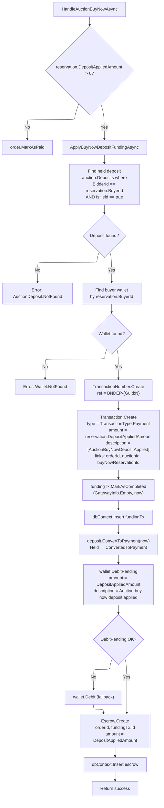

# 06 - Deposit Funding (Buy Now)

## Overview

When a buy-now reservation finalizes and the buyer had a held auction deposit, the system converts that deposit into partial payment for the order. This is handled by `ApplyBuyNowDepositFundingAsync` inside `ProcessVnPayCallbackCommandHandler`.

The method is called only when `reservation.DepositAppliedAmount.Amount > 0`.

---

## Deposit Funding Flow



---

## Steps in Detail

| Step | Operation | Detail |
|------|-----------|--------|
| 1 | Find held deposit | `auction.Deposits.FirstOrDefault(x => x.BidderId == reservation.BuyerId && x.IsHeld)` |
| 2 | Find buyer wallet | `dbContext.Set<Wallet>().FirstOrDefaultAsync(x => x.UserId == reservation.BuyerId)` |
| 3 | Create transaction number | Format: `BNDEP-{Guid.CreateVersion7():N}` |
| 4 | Create internal funding transaction | `Transaction.Create` with `type = TransactionType.Payment`, `amount = reservation.DepositAppliedAmount`, description prefix `[AuctionBuyNowDepositApplied]` |
| 5 | Mark transaction completed immediately | `fundingTx.MarkAsCompleted(GatewayInfo.Empty, now)` -- no external gateway involved |
| 6 | Insert funding transaction | `dbContext.Insert(fundingTx.Value)` |
| 7 | Convert deposit status | `deposit.ConvertToPayment(now)` transitions from Held to ConvertedToPayment |
| 8 | Debit wallet pending balance | `wallet.DebitPending(DepositAppliedAmount, ...)` removes from pending; falls back to `wallet.Debit` if DebitPending fails |
| 9 | Create escrow for deposit portion | `Escrow.Create(order.Id, fundingTx.Id, DepositAppliedAmount, currency, now)` |
| 10 | Insert escrow | `dbContext.Insert(escrowResult.Value)` |

---

## Two Escrows Per Buy-Now Order

When a buy-now order involves both a VNPay payment and a deposit, two separate escrow records are created:

| Escrow | Source | Transaction | Amount |
|--------|--------|-------------|--------|
| Gateway escrow | VNPay payment | Original VNPay transaction | `transaction.Amount` (VNPay portion) |
| Deposit escrow | Converted deposit | Internal `BNDEP-` transaction | `reservation.DepositAppliedAmount` |

Both escrows reference the same `order.Id` but different `transactionId` values.

---

## Skip Condition

If `reservation.DepositAppliedAmount.Amount == 0`, the entire `ApplyBuyNowDepositFundingAsync` call is skipped. The gateway escrow alone covers the full order amount.

```csharp
if (reservation.DepositAppliedAmount.Amount > 0)
{
    var depositFundingResult = await ApplyBuyNowDepositFundingAsync(...);
}
```

---

## Error Handling

If any step in `ApplyBuyNowDepositFundingAsync` fails, the error propagates up to `HandleAuctionBuyNowAsync`, which logs the error and returns the failure. The entire unit of work (including the gateway escrow and order creation from earlier steps) is not committed because `SaveChangesAsync` has not been called yet.

---

## Source Files

| File | Path |
|------|------|
| ProcessVnPayCallbackCommand handler | `src/core/OIO.Application/Context/PaymentContext/Commands/ProcessVnPayCallback/ProcessVnPayCallbackCommand.cs` |
| `ApplyBuyNowDepositFundingAsync` | Same file, lines 717-796 |
