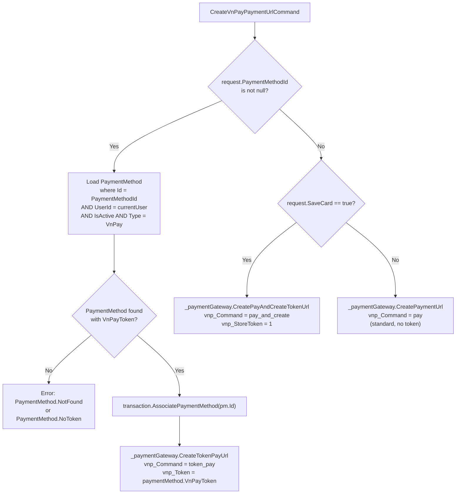
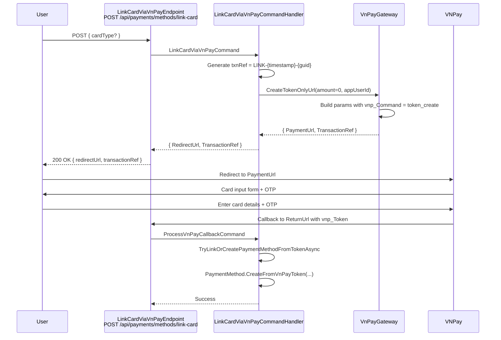

# 07 - VNPay Token Flows

## Payment URL Routing Decision

The `CreateVnPayPaymentUrlCommandHandler` routes to one of three VNPay commands based on the request parameters:



---

## Link Card Flow (token_create)

The `LinkCardViaVnPayCommand` creates a redirect URL for the user to link a card without making a payment.



---

## Three Token Flows

### 1. `token_create` -- Link Card Only

| Property | Value |
|----------|-------|
| VNPay command | `token_create` |
| Endpoint | `POST /api/payments/methods/link-card` |
| Handler | `LinkCardViaVnPayCommandHandler` |
| Gateway method | `CreateTokenOnlyUrl` |
| Amount | `0` (no payment) |
| Transaction ref | `LINK-{yyyyMMddHHmmss}-{guid:N}` (truncated to 36 chars) |
| Description | `Lien ket the thanh toan` |
| VNPay base URL | `TokenCreateUrl` |
| Result | User redirected, callback auto-creates `PaymentMethod` |

### 2. `pay_and_create` -- Pay + Save Card

| Property | Value |
|----------|-------|
| VNPay command | `pay_and_create` |
| Trigger | `CreateVnPayPaymentUrlCommand` with `SaveCard = true` |
| Gateway method | `CreatePayAndCreateTokenUrl` |
| Amount | Actual payment amount |
| Extra params | `vnp_StoreToken = 1`, `vnp_AppUserId = userId` |
| VNPay base URL | `PayAndCreateUrl` |
| Result | Payment processed AND token returned in callback |

### 3. `token_pay` -- Pay with Saved Token

| Property | Value |
|----------|-------|
| VNPay command | `token_pay` |
| Trigger | `CreateVnPayPaymentUrlCommand` with `PaymentMethodId` set |
| Gateway method | `CreateTokenPayUrl` |
| Amount | Actual payment amount |
| Extra params | `vnp_Token = savedToken`, `vnp_AppUserId = userId` |
| VNPay base URL | `TokenPayUrl` |
| Result | Payment charged to saved card token |

---

## Auto-Create PaymentMethod from Callback

After a successful payment, `TryLinkOrCreatePaymentMethodFromTokenAsync` runs (best-effort, does not fail the payment):

1. Check if `callback.VnPayToken` is present (returned by `pay_and_create` / `token_create` / `token_pay`).
2. Look for existing `PaymentMethod` with same `UserId`, `Type = VnPay`, `VnPayToken`, and `IsActive`.
3. If found: call `existing.UpdateVnPayToken(token, maskedCard, cardType, bankCode)` and associate with transaction.
4. If not found: call `PaymentMethod.CreateFromVnPayToken(...)` and associate with transaction.

---

## PaymentMethod Entity

```
PaymentMethod : AggregateRoot<PaymentMethodId>
├── UserId
├── Type              → PaymentMethodType.VnPay
├── Provider          → "vnpay"
├── Card              → CardInfo (last four digits)
├── IsDefault
├── IsVerified        → true (auto-verified from VNPay)
├── IsActive
├── TokenReference    → VnPayToken value
├── VnPayToken        → token string from VNPay callback
├── MaskedCardNumber  → e.g. "970419xxxxxxxxx2198"
├── VnPayCardType     → ATM / QRCODE / etc.
├── BankCode          → e.g. "NCB", "VIETCOMBANK"
└── CreatedAt
```

Key methods:

| Method | Description |
|--------|-------------|
| `CreateFromVnPayToken(...)` | Factory for new PaymentMethod from VNPay token callback. Extracts last 4 digits from masked card number. |
| `UpdateVnPayToken(...)` | Updates token and card info when callback returns new data for an existing method. |
| `SetDefault()` | Marks as default payment method. |
| `RemoveDefault()` | Removes default flag. |
| `Deactivate()` | Sets `IsActive = false`, removes default. |

---

## Payment Method Management Endpoints

| Method | URL | Handler | Auth | Description |
|--------|-----|---------|------|-------------|
| `GET` | `/api/payments/methods` | `GetMyPaymentMethodsQuery` | Required | List current user's payment methods |
| `POST` | `/api/payments/methods` | `AddPaymentMethodCommand` | Required | Add a new payment method manually |
| `POST` | `/api/payments/methods/link-card` | `LinkCardViaVnPayCommand` | Required | Link card via VNPay token_create redirect |
| `POST` | `/api/payments/methods/{id}/default` | `SetDefaultPaymentMethodCommand` | Required | Set a payment method as default |
| `DELETE` | `/api/payments/methods/{id}` | `DeletePaymentMethodCommand` | Required | Deactivate a payment method |

---

## VNPay Token Remove

When a payment method is deleted, the system can call VNPay to remove the token server-side:

| Property | Value |
|----------|-------|
| VNPay command | `token_remove` |
| Gateway method | `RemoveTokenAsync` |
| VNPay base URL | `TokenRemoveUrl` |
| Signature | HMAC-SHA512 over query string |

---

## VNPay Sandbox URLs (from config)

| Config Key | URL |
|------------|-----|
| `PaymentUrl` | `https://sandbox.vnpayment.vn/paymentv2/vpcpay.html` |
| `ApiUrl` | `https://sandbox.vnpayment.vn/merchant_webapi/api/transaction` |
| `TokenCreateUrl` | `https://sandbox.vnpayment.vn/token_ui/create-token.html` |
| `PayAndCreateUrl` | `https://sandbox.vnpayment.vn/token_ui/pay-create-token.html` |
| `TokenPayUrl` | `https://sandbox.vnpayment.vn/token_ui/payment-token.html` |
| `TokenRemoveUrl` | `https://sandbox.vnpayment.vn/token_ui/remove-token.html` |

Return path: `/api/payments/vnpay/return`
IPN path: `/api/payments/vnpay/ipn`

---

## Source Files

| File | Path |
|------|------|
| CreateVnPayPaymentUrlCommand | `src/core/OIO.Application/Context/PaymentContext/Commands/CreateVnPayPaymentUrl/CreateVnPayPaymentUrlCommand.cs` |
| LinkCardViaVnPayCommand | `src/core/OIO.Application/Context/PaymentContext/Commands/PaymentMethods/LinkCardViaVnPayCommand.cs` |
| LinkCardViaVnPayEndpoint | `src/presentation/OIO.Api/Endpoints/PaymentContext/PaymentMethods/LinkCardViaVnPayEndpoint.cs` |
| VnPayGateway | `src/infrastructure/OIO.Infrastructure/Payment/VnPay/VnPayGateway.cs` |
| VnPayConfig | `src/infrastructure/OIO.Infrastructure/Payment/VnPay/VnPayConfig.cs` |
| PaymentMethod entity | `src/core/OIO.Domain/Context/PaymentContext/Aggregates/PaymentMethods/PaymentMethod.cs` |
| IPaymentGatewayService | `src/core/OIO.Application/Abstractions/Payment/IPaymentGatewayService.cs` |
| appsettings.Production.json | `config/appsettings.Production.json` |
