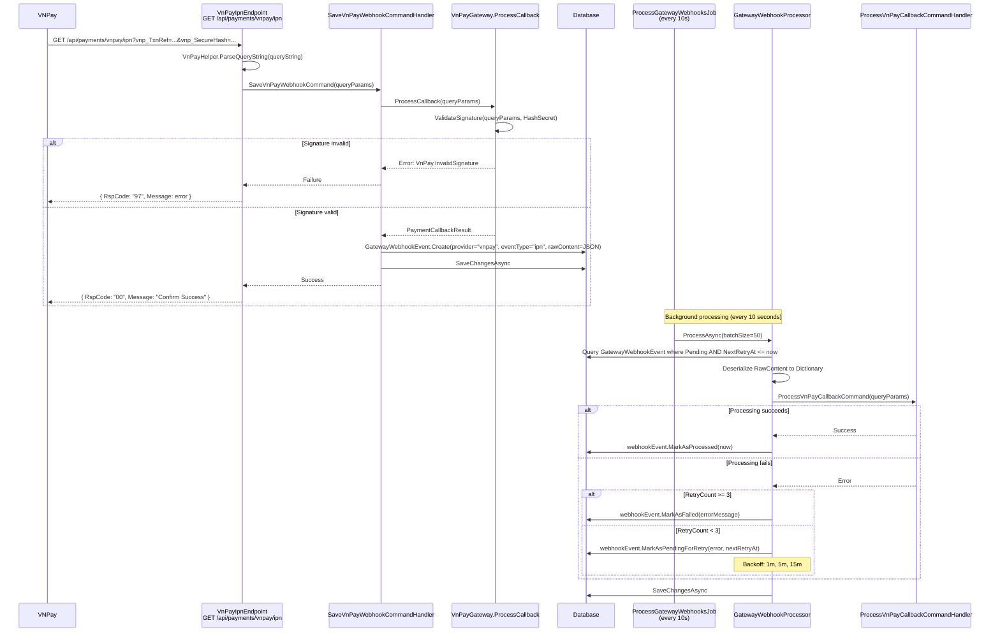

# 08 - IPN & Return URL Callbacks

## IPN Flow (Server-to-Server)



---

## Endpoint Details

### IPN Endpoint (Server-to-Server)

| Property | Value |
|----------|-------|
| Method | `GET` |
| URL | `/api/payments/vnpay/ipn` |
| Auth | `AllowAnonymous` (VNPay calls this directly) |
| Handler | `SaveVnPayWebhookCommand` |
| Response | JSON `{ RspCode, Message }` |

The IPN endpoint does **not** process the payment callback directly. It validates the HMAC signature and saves a `GatewayWebhookEvent` for async processing. This ensures VNPay receives a fast `RspCode = "00"` response.

### Return Endpoint (User Redirect)

| Property | Value |
|----------|-------|
| Method | `GET` |
| URL | `/api/payments/vnpay/return` |
| Auth | `AllowAnonymous` (user redirected from VNPay) |
| Handler | `ProcessVnPayCallbackCommand` |
| Response | `ProcessVnPayCallbackResponse` (200 OK or 400 Bad Request) |

The return endpoint processes the callback synchronously via `ProcessVnPayCallbackCommandHandler`. This gives the user an immediate result.

---

## IPN Processing Pipeline

### Step 1: SaveVnPayWebhookCommand

1. Validate signature via `_paymentGateway.ProcessCallback(queryParams)`.
2. Serialize `queryParams` to JSON.
3. Create `GatewayWebhookEvent` with `provider = "vnpay"`, `eventType = "ipn"`, `ProcessingStatus = Pending`.
4. Save to database.
5. Return success immediately.

### Step 2: ProcessGatewayWebhooksJob (Quartz, every 10 seconds)

- Job key: `gateway-webhooks-process` in `SystemGroup`.
- Trigger: `WithIntervalInSeconds(10)`, `RepeatForever`.
- `[DisallowConcurrentExecution]` prevents overlapping runs.
- Delegates to `GatewayWebhookProcessor.ProcessAsync(batchSize=50)`.

### Step 3: GatewayWebhookProcessor

1. Query pending events: `ProcessingStatus == Pending AND (NextRetryAt == null OR NextRetryAt <= now)`.
2. Order by `CreatedAt`, take `batchSize`.
3. For each event where `Provider == "vnpay"` and `EventType == "ipn"`:
   - Deserialize `RawContent` to `Dictionary<string, string>`.
   - Send `ProcessVnPayCallbackCommand`.
   - On success: `webhookEvent.MarkAsProcessed(now)`.
   - On failure: retry with exponential backoff or mark as permanently failed.
4. Unknown provider/event type: `MarkAsFailed`.
5. `SaveChangesAsync` after processing all events in the batch.

### Retry Strategy

| Attempt | Delay |
|---------|-------|
| 1st retry | 1 minute |
| 2nd retry | 5 minutes |
| 3rd retry | 15 minutes |
| After 3 retries | Permanently `Failed` |

---

## ProcessVnPayCallbackCommand Handler

The core callback processing logic (shared between IPN background processing and Return URL):

| Step | Operation |
|------|-----------|
| 1 | `_paymentGateway.ProcessCallback(queryParams)` -- validate HMAC-SHA512 signature, parse response fields |
| 2 | Find `Transaction` by `TransactionNumber == callback.TransactionRef` |
| 3 | Idempotency check: if status is already `Completed` or `Failed`, return existing result |
| 4 | Create `GatewayInfo` from callback (`provider = "vnpay"`, `transactionId = vnp_TransactionNo`, `response = rawJson`) |
| 5 | `ResolvePaymentPurpose(transaction)` -- route by purpose |
| 6a | If success: route to purpose-specific handler, then `transaction.MarkAsCompleted`, then `TryLinkOrCreatePaymentMethodFromTokenAsync` |
| 6b | If failure: `transaction.MarkAsFailed`, handle purpose-specific failure (e.g., `FailBuyNowReservation`) |
| 7 | `SaveChangesAsync` |

### Purpose Routing

```
BuyNowReservationId.HasValue           → PaymentPurpose.AuctionBuyNow
AuctionId.HasValue + Type == Deposit   → PaymentPurpose.AuctionDeposit
OrderId.HasValue                       → PaymentPurpose.OrderPayment
Description starts with [AuctionDeposit]  → AuctionDeposit (fallback)
Description starts with [AuctionBuyNow]   → AuctionBuyNow (fallback)
Description starts with [OrderPayment]    → OrderPayment (fallback)
Otherwise                              → PaymentPurpose.WalletTopUp
```

---

## GatewayReconciliationJob (Backup)

A second job runs every 15 minutes to catch transactions stuck in `Pending` status:

| Property | Value |
|----------|-------|
| Job key | `gateway-reconciliation-process` in `SystemGroup` |
| Interval | 15 minutes |
| `[DisallowConcurrentExecution]` | Yes |
| Handler | `ProcessGatewayReconciliationCommand` |
| Batch size | 100 |

### Reconciliation Logic

1. Query transactions: `Status == Pending AND CreatedAt <= (now - 15 minutes) AND Gateway.Provider == "vnpay"`.
2. For each transaction, call `_paymentGateway.QueryTransactionAsync(txnRef, createdDate)`.
3. VNPay `querydr` API returns status:
   - `ResponseCode == "00" AND TransactionStatus == "00"`: mark as `Completed`.
   - `TransactionStatus` not in `{00, 01, 02}`: mark as `Failed` (01 = not paid, 02 = in progress).
   - `01` or `02`: leave as Pending for next reconciliation cycle.

---

## GatewayWebhookEvent Entity

```
GatewayWebhookEvent : AggregateRoot<GatewayWebhookEventId>
├── Provider             → "vnpay"
├── EventType            → "ipn"
├── RawContent           → Serialized JSON of query params
├── ProcessingStatus     → Pending | Processed | Failed
├── ErrorMessage         → Error details on failure
├── RetryCount           → 0..3
├── NextRetryAt          → Scheduled retry time
├── CreatedAt
└── ProcessedAt
```

---

## Source Files

| File | Path |
|------|------|
| VnPayIpnEndpoint | `src/presentation/OIO.Api/Endpoints/PaymentContext/VnPay/VnPayIpnEndpoint.cs` |
| VnPayReturnEndpoint | `src/presentation/OIO.Api/Endpoints/PaymentContext/VnPay/VnPayReturnEndpoint.cs` |
| SaveVnPayWebhookCommand | `src/core/OIO.Application/Context/PaymentContext/Commands/SaveVnPayWebhook/SaveVnPayWebhookCommand.cs` |
| ProcessVnPayCallbackCommand | `src/core/OIO.Application/Context/PaymentContext/Commands/ProcessVnPayCallback/ProcessVnPayCallbackCommand.cs` |
| GatewayWebhookProcessor | `src/infrastructure/OIO.Infrastructure/Payment/Webhooks/GatewayWebhookProcessor.cs` |
| ProcessGatewayWebhooksJob | `src/infrastructure/OIO.Infrastructure/Payment/Webhooks/ProcessGatewayWebhooksJob.cs` |
| GatewayReconciliationJob | `src/infrastructure/OIO.Infrastructure/Payment/Reconciliation/GatewayReconciliationJob.cs` |
| ProcessGatewayReconciliationCommand | `src/core/OIO.Application/Context/PaymentContext/Commands/ReconcileTransactions/ProcessGatewayReconciliationCommand.cs` |
| GatewayWebhookEvent entity | `src/core/OIO.Domain/Context/PaymentContext/Aggregates/Webhooks/GatewayWebhookEvent.cs` |
| VnPayGateway (ProcessCallback, QueryTransactionAsync) | `src/infrastructure/OIO.Infrastructure/Payment/VnPay/VnPayGateway.cs` |
