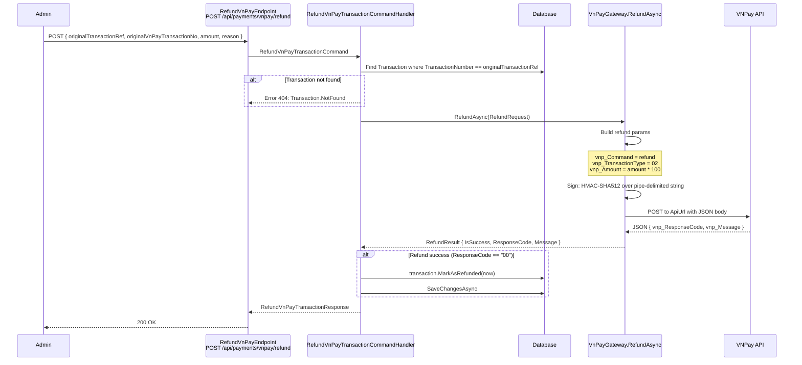

# 09 - VNPay Refund

## Endpoint

| Property | Value |
|----------|-------|
| Method | `POST` |
| URL | `/api/payments/vnpay/refund` |
| Auth | `RequireAuthorization(App.Permissions.Catalogs.Admin.ManagePayments)` (admin-only) |
| Endpoint class | `RefundVnPayEndpoint` |
| Command | `RefundVnPayTransactionCommand` |

---

## Request

```json
{
  "originalTransactionRef": "string",
  "originalVnPayTransactionNo": "string",
  "amount": 0,
  "reason": "string"
}
```

| Field | Type | Source | Description |
|-------|------|--------|-------------|
| `OriginalTransactionRef` | `string` | Request body | Internal transaction ref (`TransactionNumber.Value`) |
| `OriginalVnPayTransactionNo` | `string` | Request body | VNPay transaction ID (`vnp_TransactionNo` from original callback) |
| `Amount` | `decimal` | Request body | Refund amount in VND |
| `Reason` | `string` | Request body | Reason for refund (sent as `vnp_OrderInfo`) |
| `IpAddress` | `IPAddress` | `httpContext.GetIpAddress()` | Admin's IP address (auto-extracted) |

---

## Response

```json
{
  "isSuccess": true,
  "responseCode": "00",
  "message": "string"
}
```

---

## Refund Flow



---

## VNPay Refund API Details

### Command Parameters

| VNPay Parameter | Value |
|-----------------|-------|
| `vnp_RequestId` | `{GMT+7 timestamp}{random 8 chars}` |
| `vnp_Version` | `2.1.0` (from `VnPayConfig.Version`) |
| `vnp_Command` | `refund` |
| `vnp_TmnCode` | From config |
| `vnp_TransactionType` | `02` (full refund) |
| `vnp_TxnRef` | `request.OriginalTransactionRef` |
| `vnp_Amount` | `request.Amount * 100` (VNPay uses smallest currency unit) |
| `vnp_TransactionNo` | `request.OriginalVnPayTransactionNo` |
| `vnp_TransactionDate` | Current GMT+7 timestamp `yyyyMMddHHmmss` |
| `vnp_CreateBy` | Admin's username or userId |
| `vnp_CreateDate` | Current GMT+7 timestamp `yyyyMMddHHmmss` |
| `vnp_IpAddr` | Admin's IP address |
| `vnp_OrderInfo` | `request.Reason` |

### HMAC-SHA512 Signature

The signature is computed over a pipe-delimited (`|`) concatenation of fields in this order:

```
requestId|version|refund|tmnCode|02|txnRef|amount|transactionNo|transactionDate|createBy|createDate|ipAddr|orderInfo
```

The resulting hash is sent as `vnp_SecureHash`.

### API URL

The refund request is sent as a `POST` with JSON body to `VnPayConfig.ApiUrl`:
- Sandbox: `https://sandbox.vnpayment.vn/merchant_webapi/api/transaction`

---

## Validation

The handler validates the original transaction exists in the database before calling VNPay:

1. Query `Transaction` by `TransactionNumber.Value == request.OriginalTransactionRef`.
2. If not found, return `Error.NotFound("Transaction.NotFound", ...)`.
3. If found, proceed with VNPay refund API call.

---

## Transaction Status Update

On successful refund (`ResponseCode == "00"`):
- `transaction.MarkAsRefunded(now)` transitions the transaction status to `Refunded`.
- `SaveChangesAsync` persists the change.

On failed refund:
- The transaction status is **not** changed.
- The error response from VNPay is returned to the admin.

---

## VNPay Response Codes

| Code | Meaning |
|------|---------|
| `00` | Success |
| `02` | Transaction not found at VNPay |
| `03` | Original transaction already refunded |
| `04` | Invalid amount (exceeds original) |
| `91` | Refund not found |
| `93` | Invalid refund amount |
| `94` | Duplicate request |
| `95` | Transaction is processing |
| `97` | Invalid checksum |
| `99` | Unknown error |

---

## Source Files

| File | Path |
|------|------|
| RefundVnPayEndpoint | `src/presentation/OIO.Api/Endpoints/PaymentContext/VnPay/RefundVnPayEndpoint.cs` |
| RefundVnPayTransactionCommand | `src/core/OIO.Application/Context/PaymentContext/Commands/RefundVnPayTransaction/RefundVnPayTransactionCommand.cs` |
| VnPayGateway.RefundAsync | `src/infrastructure/OIO.Infrastructure/Payment/VnPay/VnPayGateway.cs` |
| IPaymentGatewayService.RefundAsync | `src/core/OIO.Application/Abstractions/Payment/IPaymentGatewayService.cs` |
