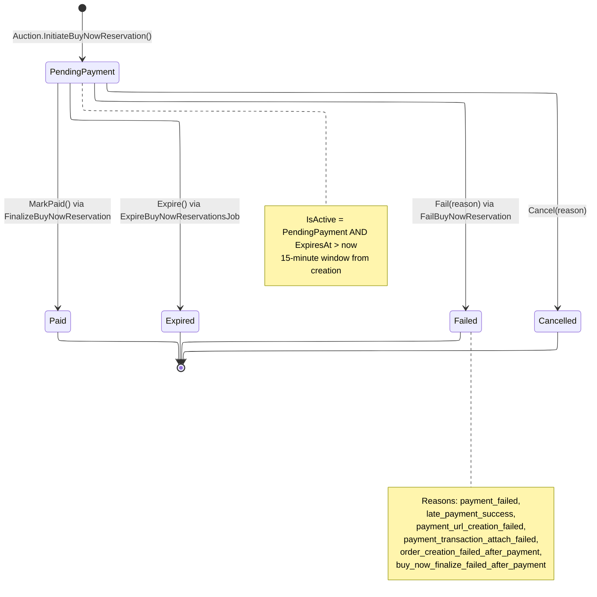
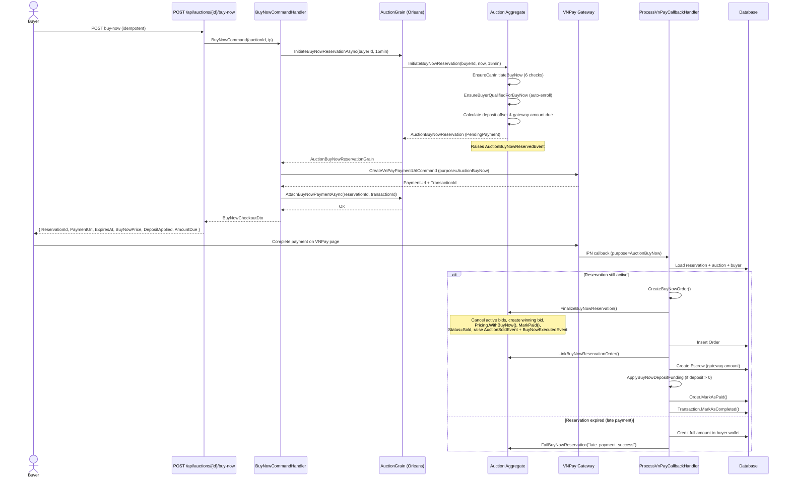

# Buy Now Flow

## Overview

Buy Now provides an instant-purchase path for auctions that have a `BuyNowPrice` configured. Instead of waiting for the auction to end, a qualified buyer can lock the auction with a **reservation**, pay through VNPay, and immediately complete the sale.

The flow follows a **reservation + payment** model:

1. Buyer initiates a buy-now reservation (15-minute window).
2. System calculates deposit offset and generates a VNPay payment URL.
3. Buyer completes payment on VNPay.
4. VNPay IPN callback triggers order creation, auction finalization (status `Sold`), and escrow setup.

All buy-now logic lives in the `Auction` aggregate (`InitiateBuyNowReservation`, `FinalizeBuyNowReservation`) with the `AuctionBuyNowReservation` entity tracking reservation lifecycle.

---

## Reservation State Machine



## End-to-End Sequence



---

## Subflow Index

| # | File | Description |
|---|------|-------------|
| 01 | [01-initiate-reservation.md](./01-initiate-reservation.md) | Reservation creation, validation, deposit calc, VNPay URL |
| 02 | [02-payment-callback.md](./02-payment-callback.md) | VNPay IPN callback decision tree for buy-now payments |
| 03 | [03-finalize.md](./03-finalize.md) | Domain finalization: bids cancelled, winner set, auction Sold |
| 04 | [04-late-payment.md](./04-late-payment.md) | Late payment scenario: wallet credit + reservation failure |
| 05 | [05-reservation-expiry.md](./05-reservation-expiry.md) | Background job: expire stale reservations, trigger auction end |

---

## Key Invariants

| Invariant | Enforcement |
|-----------|-------------|
| **One active reservation per auction** | `EnsureCanInitiateBuyNow` checks `GetActiveBuyNowReservation(now) is not null` and returns `BuyNowReservationActive` |
| **Locks bidding while active** | `EnsureNotLockedByBuyNowReservation(now)` called in `PlaceBid`, `PlaceSealedBid`, and auto-bid paths; returns `BuyNowReservationActive` |
| **15-minute reservation window** | `BuyNowCommandHandler.ReservationWindow = TimeSpan.FromMinutes(15)` hardcoded |
| **Deposit auto-applied** | `min(heldDeposit.Amount, buyNowPrice.Amount)` applied; `GatewayAmountDue = price - appliedDeposit` |
| **Funding split must balance** | `AuctionBuyNowReservation.Create` validates `depositApplied + gatewayAmountDue == buyNowPrice` |
| **Only Scheduled auctions** | `EnsureCanInitiateBuyNow` requires `Status == AuctionStatus.Scheduled` with open qualification window |
| **All terminal states are final** | `BuyNowReservationStatus.IsTerminal` = Paid, Expired, Cancelled, Failed |

---

## Domain Events

| Event | Raised When | Key Data |
|-------|-------------|----------|
| `AuctionBuyNowReservedEvent` | `InitiateBuyNowReservation` succeeds | AuctionId, ReservationId, BuyerId, BuyNowPrice, DepositAppliedAmount, AmountDue, ExpiresAt |
| `AuctionBuyNowReservationReleasedEvent` | `ExpireBuyNowReservation` or `FailBuyNowReservation` | AuctionId, ReservationId, BuyerId, Reason (e.g. "expired", "payment_failed", "late_payment_success") |
| `BuyNowExecutedEvent` | `FinalizeBuyNowReservation` completes | AuctionId, BuyerId, BuyNowPrice |
| `AuctionSoldEvent` | `FinalizeBuyNowReservation` completes | AuctionId, WinnerId, SellerId, FinalPrice, Currency, TotalBids |

Each event triggers a corresponding handler that broadcasts real-time notifications through `IAuctionNotificationService` (SignalR).

---

## BuyNowCheckoutDto Response

Returned to the client after successful reservation initiation:

```
BuyNowCheckoutDto
  ReservationId  : Guid
  PaymentUrl     : string    -- VNPay redirect URL
  ExpiresAt      : DateTime  -- reservation.ExpiresAt (now + 15 min)
  BuyNowPrice    : MoneyDto  -- full buy-now price
  DepositAppliedAmount : MoneyDto  -- portion offset by held deposit
  AmountDue      : MoneyDto  -- gateway amount buyer pays via VNPay
```

---

## VNPay Integration Overview

The buy-now flow uses VNPay as the payment gateway through three key interactions:

1. **Payment URL creation** -- `CreateVnPayPaymentUrlCommand` generates a redirect URL with `Purpose = PaymentPurpose.AuctionBuyNow` and `BuyNowReservationId` embedded in the transaction metadata.
2. **IPN callback processing** -- `ProcessVnPayCallbackCommand` routes to `HandleAuctionBuyNowAsync` when the resolved purpose is `AuctionBuyNow` (detected via `transaction.BuyNowReservationId.HasValue`).
3. **Token management** -- If the callback contains a VNPay token (`pay_and_create` / `token_pay` flow), the handler auto-creates or updates a `PaymentMethod` record for the buyer via `TryLinkOrCreatePaymentMethodFromTokenAsync`.

**Failure paths:**
- Payment URL creation failure: `FailBuyNowReservation("payment_url_creation_failed")`
- Transaction attach failure: `FailBuyNowReservation("payment_transaction_attach_failed")`
- VNPay payment failure (IPN `IsSuccess=false`): `HandleAuctionBuyNowFailedAsync` calls `FailBuyNowReservation("payment_failed")`
- Late payment (success after expiry): `CreditLateBuyNowPaymentToWalletAsync` credits buyer wallet, then `FailBuyNowReservation("late_payment_success")`

**Refund handling:** When any step after payment succeeds but order/finalize fails, the full `transaction.Amount` is credited to the buyer's wallet via `CreditLateBuyNowPaymentToWalletAsync` rather than issuing a gateway refund.
