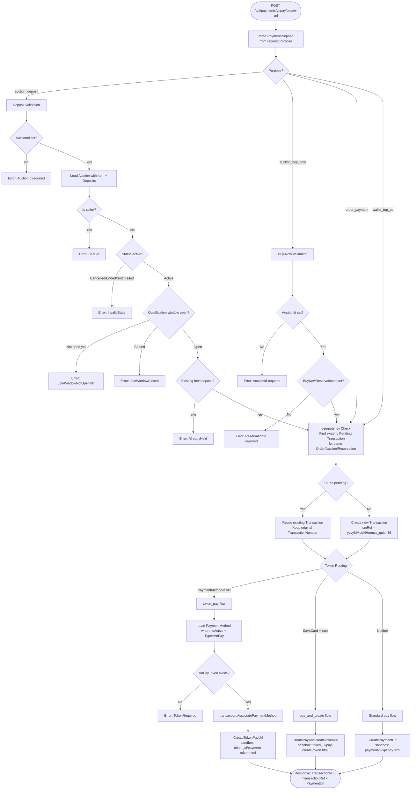

# 01 - Create VNPay Payment URL

## Overview

`POST /api/payments/vnpay/create-url` creates a VNPay payment URL that the frontend uses to redirect the user. The handler validates the payment purpose, checks idempotency, creates or reuses a `Transaction`, and routes to one of three VNPay URL generation strategies based on token settings.

**Source**: `CreateVnPayPaymentUrlCommand` + handler in `OIO.Application/Context/PaymentContext/Commands/CreateVnPayPaymentUrl/`

---

## Decision Flow



---

## Endpoint

| Field | Value |
|-------|-------|
| Method | `POST` |
| Route | `/api/payments/vnpay/create-url` |
| Auth | `RequireAuthorization()` |
| Tags | Payments |

---

## Request DTO

```csharp
public sealed record CreateVnPayPaymentUrlCommand(
    decimal Amount,
    string Currency,
    string Purpose,          // "auction_deposit" | "order_payment" | "auction_buy_now" | "wallet_top_up"
    IPAddress IpAddress,     // Resolved from HttpContext
    string Description,
    string? BankCode = null,
    Guid? AuctionId = null,
    Guid? OrderId = null,
    Guid? BuyNowReservationId = null,
    Guid? PaymentMethodId = null,
    bool SaveCard = false);
```

**Validation** (via `IHasValidate`):
- `Amount`: non-negative
- `Currency`: not whitespace, must be in `Currency.All`
- `Description`: not whitespace
- `Purpose`: not whitespace, must be in `PaymentPurpose.All`

---

## Purpose Validation

### `auction_deposit`

1. `AuctionId` is required
2. Load Auction with `Item`, `Deposits`
3. Seller cannot create deposit on own auction (`SelfBid`)
4. Auction status must not be `Cancelled`, `Ended`, `Sold`, or `Failed`
5. Auction must have timing info with qualification window
6. Qualification window must be currently open (not closed, not "not yet open")
7. No existing held deposit for the same user on this auction

### `auction_buy_now`

1. `AuctionId` is required
2. `BuyNowReservationId` is required

### `order_payment` / `wallet_top_up`

No additional validation beyond the base command validation.

---

## Idempotency Check

Before creating a new Transaction, the handler checks for an existing `Pending` transaction matching the same context:

| Purpose | Match Criteria |
|---------|---------------|
| `order_payment` | Same `UserId` + `OrderId` + `Status=Pending` + `Type=Payment` |
| `auction_deposit` | Same `UserId` + `Status=Pending` + `Type=Deposit` + (`AuctionId` match OR Description starts with `[auction_deposit]` containing the AuctionId) |
| `auction_buy_now` | Same `UserId` + `Status=Pending` + `Type=Payment` + (`BuyNowReservationId` match OR Description starts with `[auction_buy_now]` containing the ReservationId) |

If found: reuse the existing transaction and its original `TransactionNumber` (do NOT regenerate txnRef). This ensures VNPay sees the same reference.

If not found: create a new Transaction with a fresh `txnRef`.

---

## Transaction Creation

- **txnRef format**: `{now:yyyyMMddHHmmss}_{Guid.NewGuid():N}`[..36] (truncated to 36 chars)
- **Type mapping**:
  - `auction_deposit` -> `TransactionType.Deposit`
  - `wallet_top_up` -> `TransactionType.Deposit`
  - `order_payment` -> `TransactionType.Payment`
  - `auction_buy_now` -> `TransactionType.Payment`
  - Default -> `TransactionType.Payment`
- **Description format**: `[{purpose}] {description}` with optional ` - AuctionId: {guid}` and ` - ReservationId: {guid}` suffixes
- **Initial status**: `Pending`
- **Gateway**: `GatewayInfo.Empty`

---

## Token Flow URL Generation

### 1. `token_pay` (PaymentMethodId is set)

- Load `PaymentMethod` where `Id` matches, `UserId` matches, `IsActive = true`, `Type = VnPay`
- Require `VnPayToken` to be non-empty
- Call `transaction.AssociatePaymentMethod(paymentMethod.Id)` and save
- Generate URL via `CreateTokenPayUrl()`:
  - `vnp_Command = "token_pay"`
  - `vnp_Token = paymentMethod.VnPayToken`
  - `vnp_AppUserId = currentUser.UserId`
  - Base URL: `VnPayConfig.TokenPayUrl`

### 2. `pay_and_create` (SaveCard = true, no PaymentMethodId)

- Generate URL via `CreatePayAndCreateTokenUrl()`:
  - `vnp_Command = "pay_and_create"`
  - `vnp_StoreToken = "1"`
  - `vnp_AppUserId = currentUser.UserId`
  - Base URL: `VnPayConfig.PayAndCreateUrl`

### 3. Standard `pay` (default)

- Generate URL via `CreatePaymentUrl()`:
  - `vnp_Command = "pay"`
  - `vnp_Amount = amount * 100` (VNPay requires multiplication by 100)
  - `vnp_OrderType = "250000"`
  - `vnp_ExpireDate = createDate + 15 minutes` (GMT+7)
  - Optional `vnp_BankCode` if provided
  - Base URL: `VnPayConfig.PaymentUrl`

All URLs are signed with `HMAC-SHA512(HashSecret, queryString)` appended as `vnp_SecureHash`.

---

## Response

```csharp
public sealed record CreateVnPayPaymentUrlResponse(
    Guid TransactionId,
    string TransactionRef,
    string PaymentUrl);
```
