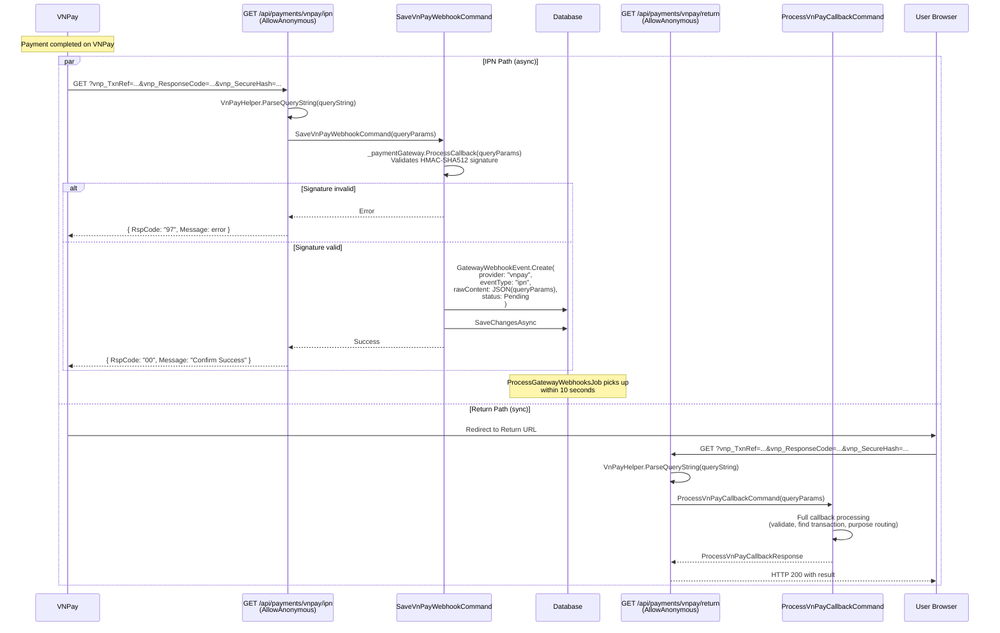

# 02 - IPN & Return Callback

## Overview

VNPay sends payment results through two parallel channels:
1. **IPN** (Instant Payment Notification): server-to-server GET request that must return quickly
2. **Return URL**: browser redirect after user completes payment on VNPay

The IPN endpoint saves the webhook for async processing; the Return endpoint processes synchronously.

**Source files**:
- `OIO.Api/Endpoints/PaymentContext/VnPay/VnPayIpnEndpoint.cs`
- `OIO.Api/Endpoints/PaymentContext/VnPay/VnPayReturnEndpoint.cs`
- `OIO.Application/Context/PaymentContext/Commands/SaveVnPayWebhook/SaveVnPayWebhookCommand.cs`

---

## Dual Callback Sequence

---

## Endpoints

### GET `/api/payments/vnpay/ipn`

| Field | Value |
|-------|-------|
| Auth | `AllowAnonymous` (VNPay calls directly) |
| Handler | `SaveVnPayWebhookCommand` |
| Response | JSON `{ RspCode, Message }` |

**Why async?** VNPay has a strict timeout on IPN responses. Processing the full callback (wallet operations, escrow creation, order updates) could exceed that timeout. The IPN endpoint validates the signature, persists the raw webhook, and returns `RspCode: "00"` immediately. The `ProcessGatewayWebhooksJob` picks it up within 10 seconds for full processing.

### GET `/api/payments/vnpay/return`

| Field | Value |
|-------|-------|
| Auth | `AllowAnonymous` (user redirected from VNPay) |
| Handler | `ProcessVnPayCallbackCommand` (synchronous) |
| Response | `ProcessVnPayCallbackResponse` via `ToOkHttpResult()` |

The Return endpoint processes the callback synchronously because the user is waiting for the result in their browser. Both endpoints ultimately run the same `ProcessVnPayCallbackCommand` logic.

---

## SaveVnPayWebhookCommand Handler

1. **Validate signature**: Calls `_paymentGateway.ProcessCallback(queryParams)` which internally runs `VnPayHelper.ValidateSignature()` using HMAC-SHA512 against the configured `HashSecret`
2. **Serialize raw content**: `JsonSerializer.Serialize(queryParams)`
3. **Create GatewayWebhookEvent**:
   - `Provider = "vnpay"`
   - `EventType = "ipn"`
   - `RawContent = serialized JSON`
   - `ProcessingStatus = Pending`
   - `RetryCount = 0`
   - `NextRetryAt = nowUtc` (eligible for immediate processing)
4. **Insert and save**: Returns immediately

---

## GatewayWebhookEvent Entity

Created by `SaveVnPayWebhookCommand`, processed by `ProcessGatewayWebhooksJob` + `GatewayWebhookProcessor`.

| Field | Type | Value on creation |
|-------|------|-------------------|
| `Id` | `GatewayWebhookEventId` | `Guid.CreateVersion7()` |
| `Provider` | `string` | `"vnpay"` |
| `EventType` | `string` | `"ipn"` |
| `RawContent` | `string` | JSON of VNPay query params |
| `ProcessingStatus` | `WebhookProcessingStatus` | `Pending` |
| `ErrorMessage` | `string?` | `null` |
| `RetryCount` | `int` | `0` |
| `NextRetryAt` | `DateTime?` | `nowUtc` |
| `CreatedAt` | `DateTime` | `nowUtc` |
| `ProcessedAt` | `DateTime?` | `null` |

**Status transitions**:
- `Pending` -> `Processed` (via `MarkAsProcessed(now)`)
- `Pending` -> `Failed` (via `MarkAsFailed(errorMessage, now)` after max retries)
- `Pending` -> `Pending` (via `MarkAsPendingForRetry(errorMessage, nextRetryAt)` with incremented RetryCount)

---

## How Both Paths Converge

Both the IPN async path and the Return sync path ultimately execute `ProcessVnPayCallbackCommand`. The command handler has built-in idempotency: if a Transaction is already `Completed` or `Failed`, it returns the existing result without re-processing. This means whichever path runs first does the actual work, and the second path safely returns the cached result.

| Scenario | IPN runs first | Return runs first |
|----------|---------------|-------------------|
| Normal | IPN via background job processes callback. Return finds Transaction already Completed, returns cached result. | Return processes callback synchronously. IPN background job finds Transaction already Completed, marks webhook as Processed. |
| IPN delayed | Return processes first. IPN catches up and finds idempotent result. | Same as normal. |
