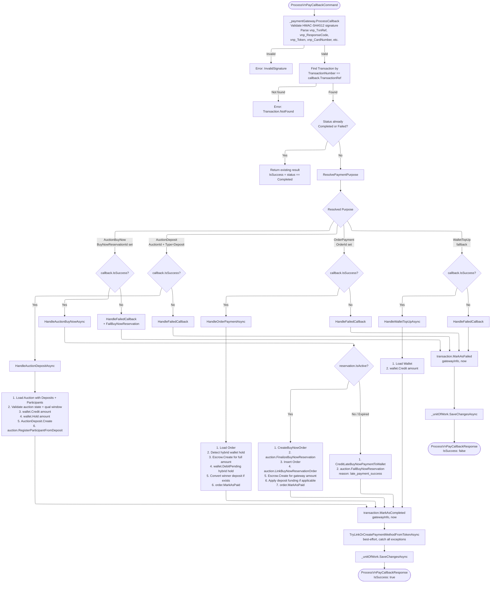

# 03 - Callback Processing (ProcessVnPayCallbackCommand)

## Overview

`ProcessVnPayCallbackCommand` is the core handler that processes VNPay payment results. It validates the callback signature, finds the matching Transaction, resolves the payment purpose, and executes purpose-specific business logic (deposit, order payment, buy-now, or wallet top-up).

**Source**: `OIO.Application/Context/PaymentContext/Commands/ProcessVnPayCallback/ProcessVnPayCallbackCommand.cs`

---

## Processing Flow



---

## Step-by-Step Processing

### 1. Parse and Validate

Calls `_paymentGateway.ProcessCallback(queryParams)` which:
- Validates HMAC-SHA512 signature via `VnPayHelper.ValidateSignature(queryParams, HashSecret)`
- Parses: `vnp_TxnRef`, `vnp_TransactionNo`, `vnp_Amount` (divided by 100), `vnp_ResponseCode`, `vnp_TransactionStatus`, `vnp_BankCode`, `vnp_CardType`, `vnp_PayDate`
- Parses token fields: `vnp_Token` (with case fallback `vnp_token`), `vnp_CardNumber` (with fallback `vnp_card_number`)
- Success determination: `ResponseCode == "00" && TransactionStatus == "00"`

### 2. Find Transaction

Queries `Transaction` where `TransactionNumber.Value == callback.TransactionRef`.

### 3. Idempotency Check

If `Transaction.Status` is already `Completed` or `Failed`, returns immediately with the existing result. This prevents duplicate processing when both IPN and Return paths fire.

### 4. Purpose Resolution

```csharp
private static PaymentPurpose ResolvePaymentPurpose(Transaction transaction)
{
    if (transaction.BuyNowReservationId.HasValue)
        return PaymentPurpose.AuctionBuyNow;

    if (transaction.AuctionId.HasValue && transaction.Type == TransactionType.Deposit)
        return PaymentPurpose.AuctionDeposit;

    if (transaction.OrderId.HasValue)
        return PaymentPurpose.OrderPayment;

    // Fallback: check Description prefix
    // "[AuctionDeposit]..." -> AuctionDeposit
    // "[AuctionBuyNow]..." -> AuctionBuyNow
    // "[OrderPayment]..."  -> OrderPayment
    // else -> WalletTopUp
}
```

Priority order: `BuyNowReservationId` > `AuctionId + Deposit type` > `OrderId` > Description prefix > fallback `WalletTopUp`.

---

## Purpose Handlers (Success Path)

### HandleAuctionDepositAsync

1. Require `transaction.AuctionId`
2. Load Auction with `Item`, `Deposits`, `Participants`
3. Validate: not seller, auction not in terminal state, qualification window open, no duplicate held deposit
4. Load user's Wallet
5. `wallet.Credit(amount, transactionId, description, now)` -- add funds from VNPay
6. `wallet.Hold(amount, transactionId, description, now)` -- hold funds for deposit
7. `AuctionDeposit.Create(auctionId, userId, amount, transactionId, now)`
8. `auction.RegisterParticipantFromDeposit(userId, now)` -- auto-register as participant
9. Insert AuctionDeposit entity

### HandleOrderPaymentAsync

1. Require `transaction.OrderId`
2. Load Order
3. **Detect hybrid wallet hold**: Load buyer's Wallet with WalletTransactions, find last `[HybridHold]` transaction containing the OrderId
4. **Create Escrow**: Amount = `transaction.Amount + walletHoldAmount` (full order amount for hybrid payments)
5. **Commit hybrid hold** (if present): `wallet.DebitPending(walletHoldAmount, transactionId, "[HybridHold] committed", now)`
6. **Convert winner deposit** (if exists): Find held `AuctionDeposit` for the buyer on this auction -> `deposit.ConvertToPayment(now)` -> `wallet.DebitPending(depositAmount, ...)`
7. `order.MarkAsPaid(now)`

### HandleAuctionBuyNowAsync

1. Load `AuctionBuyNowReservation` with Auction (+ Item, Bids, AutoBids, Deposits, Participants, BuyNowReservations)
2. Load Buyer (User with Profile, Addresses)
3. **Check if reservation is still active** (`reservation.IsActive(now)`)

**If active:**
1. `CreateBuyNowOrder()` -- builds Order from buyer's default address, reservation pricing
2. `auction.FinalizeBuyNowReservation(reservationId, now)`
3. Insert Order, link reservation to order
4. `Escrow.Create(orderId, transactionId, transaction.Amount, currency, now)` for the gateway payment
5. If `reservation.DepositAppliedAmount > 0`: call `ApplyBuyNowDepositFundingAsync` which creates a separate Transaction (`BNDEP-{guid}`), converts the deposit, debits wallet, and creates a second Escrow for the deposit portion
6. `order.MarkAsPaid(now)`

**If expired:**
1. `CreditLateBuyNowPaymentToWalletAsync` -- credits the payment amount to buyer's wallet
2. `auction.FailBuyNowReservation(reservationId, "late_payment_success", now)`

### HandleWalletTopUpAsync

1. Load user's Wallet
2. `wallet.Credit(amount, transactionId, description, now)`

---

## Failure Path

1. `transaction.MarkAsFailed(gatewayInfo, now)` -- raises `TransactionFailedDomainEvent`
2. **Buy-now specific**: If purpose is `AuctionBuyNow`, also calls `HandleAuctionBuyNowFailedAsync`:
   - Loads the reservation
   - `auction.FailBuyNowReservation(reservationId, "payment_failed", now)`
3. Save changes

---

## Auto-Link PaymentMethod from Token

After successful processing, `TryLinkOrCreatePaymentMethodFromTokenAsync` runs as **best-effort** (wrapped in try-catch, exceptions are logged but do not fail the payment):

1. If `callback.VnPayToken` is empty, skip
2. Search for existing `PaymentMethod` with same `UserId`, `Type=VnPay`, same `VnPayToken`, `IsActive`
3. **If found**: `existing.UpdateVnPayToken(token, maskedCard, cardType, bankCode)` + `transaction.AssociatePaymentMethod(existing.Id)`
4. **If not found**: `PaymentMethod.CreateFromVnPayToken(...)` with `IsDefault=false`, insert, then `transaction.AssociatePaymentMethod(newPM.Id)`

---

## Response

```csharp
public sealed record ProcessVnPayCallbackResponse(
    string TransactionRef,
    bool IsSuccess,
    string ResponseCode,
    string Message);  // "Thanh toan thanh cong" or "Thanh toan that bai (ma: {code})"
```
