# 04 - Checkout Order

## Overview

`POST /api/payments/checkout` is the unified checkout endpoint that supports three payment methods: pure VNPay, full wallet, and hybrid wallet + VNPay. The handler loads the order, initializes payment tracking, calculates the remaining amount after any auction winner deposit, and branches into the appropriate payment flow.

**Source**: `OIO.Application/Context/PaymentContext/Commands/CheckoutOrder/CheckoutOrderCommand.cs`

---

## Payment Method Decision Flow

```mermaid
flowchart TD
    Start([POST /api/payments/checkout]) --> LoadOrder[Load Order by OrderId]
    LoadOrder -->|Not found| ErrNotFound[Error: Order.NotFound]
    LoadOrder -->|Found| InitPayment[order.InitializePayment now<br/>PaymentAttemptCount++]
    InitPayment -->|Failure| ErrInitFail[Error: Invalid order state]
    InitPayment -->|Success| SaveInit[SaveChangesAsync]
    SaveInit --> MethodCheck{request.PaymentMethod?}

    MethodCheck -->|"vnpay"| VnPayFlow[HandleVnPayPaymentAsync]
    MethodCheck -->|"wallet"| WalletCalc[Calculate remaining amount]
    MethodCheck -->|"wallet_vnpay"| WalletCalc

    VnPayFlow --> CreateUrlCmd[CreateVnPayPaymentUrlCommand<br/>Amount: order.Pricing.TotalAmount<br/>Purpose: order_payment<br/>Description: OrderPayment - Order #number<br/>AuctionId: order.AuctionId<br/>OrderId: order.Id]
    CreateUrlCmd --> VnPayResponse([CheckoutOrderResponse<br/>TransactionId, TransactionRef, PaymentUrl])

    WalletCalc --> LoadWallet[Load buyer's Wallet]
    LoadWallet -->|Not found| ErrNoWallet[Error: Wallet.NotFound]
    LoadWallet -->|Found| LoadDeposit[Load winner AuctionDeposit<br/>where AuctionId + BuyerId + IsHeld]
    LoadDeposit --> CalcRemaining[remainingAmount = orderAmount - depositAmount<br/>if negative then 0]
    CalcRemaining --> WalletBranch{PaymentMethod?}

    WalletBranch -->|"wallet"| FullWallet[HandleFullWalletPaymentAsync]
    WalletBranch -->|"wallet_vnpay"| HybridCalc[Calculate split:<br/>walletPortion = min walletBalance, remaining<br/>vnpayPortion = remaining - walletPortion]

    HybridCalc --> HybridCheck{vnpayPortion <= 0?}
    HybridCheck -->|Yes| FullWallet
    HybridCheck -->|No| HybridFlow[HandleHybridWalletVnPayPaymentAsync]

    FullWallet --> CheckBalance{wallet.BalanceAmount<br/>>= remainingAmount?}
    CheckBalance -->|No| ErrInsufficient[Error: InsufficientBalance<br/>Required vs Available]
    CheckBalance -->|Yes| CreateWalletTxn[Create Transaction<br/>txnRef: WLT-yyyyMMddHHmmss_guid..36<br/>Type: Payment<br/>Amount: orderAmount full]

    CreateWalletTxn --> ApplyDeposit{Winner deposit exists?}
    ApplyDeposit -->|Yes| ConvertDeposit[winnerDeposit.ConvertToPayment now<br/>wallet.DebitPending depositAmount]
    ApplyDeposit -->|No| DebitRemaining

    ConvertDeposit --> DebitRemaining{remainingAmount > 0?}
    DebitRemaining -->|Yes| WalletDebit[wallet.Debit remainingAmount]
    DebitRemaining -->|No| CreateEscrow

    WalletDebit --> CreateEscrow[Escrow.Create<br/>orderId, transactionId<br/>amount: orderAmount full]
    CreateEscrow --> MarkComplete[transaction.MarkAsCompleted<br/>GatewayInfo.Empty, now]
    MarkComplete --> MarkPaid[order.MarkAsPaid now]
    MarkPaid --> SaveWallet[SaveChangesAsync]
    SaveWallet --> WalletResponse([CheckoutOrderResponse<br/>TransactionId, TransactionRef<br/>PaymentUrl: null])

    HybridFlow --> HoldWallet{walletPortion > 0?}
    HoldWallet -->|Yes| DoHold["wallet.Hold(walletPortion, null,<br/>[HybridHold] Hold for hybrid payment<br/>- OrderId: {id} - WalletPortion: {amount})<br/>SaveChangesAsync"]
    HoldWallet -->|No| CreateHybridUrl

    DoHold --> CreateHybridUrl[CreateVnPayPaymentUrlCommand<br/>Amount: vnpayPortion only<br/>Purpose: order_payment<br/>Description: includes hybrid marker]
    CreateHybridUrl -->|Failure| RollbackHold["wallet.Unhold(walletPortion, null,<br/>[HybridHold] Rollback hold...<br/>SaveChangesAsync)"]
    RollbackHold --> ErrVnPay[Return VNPay URL error]
    CreateHybridUrl -->|Success| HybridResponse([CheckoutOrderResponse<br/>TransactionId, TransactionRef<br/>PaymentUrl: VNPay URL for vnpayPortion])
```



---

## Endpoint

| Field | Value |
|-------|-------|
| Method | `POST` |
| Route | `/api/payments/checkout` |
| Auth | `RequireAuthorization()` |
| Tags | Payments |

---

## Request DTO

```csharp
public sealed record CheckoutOrderCommand(
    Guid OrderId,
    IPAddress IpAddress,          // Resolved from HttpContext
    string? BankCode = null,
    string PaymentMethod = "vnpay"  // "vnpay" | "wallet" | "wallet_vnpay"
);
```

Endpoint request (before mapping):
```csharp
public sealed record Request(
    [Required] Guid OrderId,
    string? BankCode,
    string PaymentMethod = "vnpay");
```

---

## Common Setup (All Methods)

1. Load Order by `OrderId`
2. `order.InitializePayment(now)` -- increments `PaymentAttemptCount`, transitions order payment state
3. `SaveChangesAsync` -- persist the initialization

---

## VNPay Flow (`PaymentMethod = "vnpay"`)

Delegates entirely to `CreateVnPayPaymentUrlCommand`:

| Parameter | Value |
|-----------|-------|
| `Amount` | `order.Pricing.TotalAmount.Amount` |
| `Currency` | `order.Currency` |
| `Purpose` | `"order_payment"` |
| `Description` | `"OrderPayment - Order #{order.OrderNumber.Value}"` |
| `BankCode` | from request |
| `AuctionId` | `order.AuctionId.Value` |
| `OrderId` | `order.Id.Value` |

Returns the `PaymentUrl` for frontend redirect.

---

## Full Wallet Flow (`PaymentMethod = "wallet"`)

### Prerequisites
- Load buyer's Wallet
- Load winner `AuctionDeposit` (where `AuctionId` matches, `BuyerId` matches, `IsHeld = true`)
- Calculate: `remainingAmount = orderAmount - depositAmount` (min 0)
- Check: `wallet.WalletFunds.BalanceAmount >= remainingAmount`

### Execution Steps

1. **Create Transaction**: `txnRef = "WLT-{now:yyyyMMddHHmmss}_{Guid:N}"[..36]`, Type = `Payment`, Amount = `orderAmount` (full), Description = `[OrderPayment] Wallet payment for order {id}`

2. **Convert winner deposit** (if exists):
   - `winnerDeposit.ConvertToPayment(now)` -- changes deposit status from `Held` to `ConvertedToPayment`
   - `wallet.DebitPending(depositAmount, transactionId, "Auction winner deposit applied for order {id}", now)` -- releases the held deposit amount

3. **Debit remaining from wallet** (if `remainingAmount > 0`):
   - `wallet.Debit(remainingAmount, transactionId, "Wallet payment for order {id}", now)`

4. **Create Escrow**: `Escrow.Create(orderId, transactionId, orderAmount, currency, now)` -- full order amount

5. **Mark transaction completed**: `transaction.MarkAsCompleted(GatewayInfo.Empty, now)` -- no gateway involved

6. **Mark order paid**: `order.MarkAsPaid(now)`

7. **Response**: `PaymentUrl = null` (no redirect needed)

---

## Hybrid Wallet + VNPay Flow (`PaymentMethod = "wallet_vnpay"`)

### Split Calculation

```
walletBalance = wallet.WalletFunds.BalanceAmount
walletPortion = min(walletBalance, remainingAmount)
vnpayPortion  = remainingAmount - walletPortion
```

If `vnpayPortion <= 0`, falls through to `HandleFullWalletPaymentAsync` (wallet covers everything).

### Execution Steps

1. **Hold wallet portion** (if `walletPortion > 0`):
   - `wallet.Hold(walletPortion, null, "[HybridHold] Hold for hybrid payment - OrderId: {id} - WalletPortion: {amount}", now)`
   - `SaveChangesAsync` -- persist the hold before calling VNPay

2. **Create VNPay URL** for `vnpayPortion` only:
   - Delegates to `CreateVnPayPaymentUrlCommand` with `Amount = vnpayPortion`
   - Description: `"OrderPayment - Order #{number} (hybrid: VNPay portion)"`

3. **On VNPay URL failure** -- rollback:
   - `wallet.Unhold(walletPortion, null, "[HybridHold] Rollback hold for failed hybrid payment - OrderId: {id}", now)`
   - `SaveChangesAsync`
   - Return error

4. **On success**: Return `PaymentUrl` for the VNPay portion

### How the Hybrid Hold Gets Committed

When VNPay calls back successfully, `HandleOrderPaymentAsync` in the callback handler:
1. Detects the `[HybridHold]` wallet transaction by searching for transactions containing `[HybridHold]` and the OrderId
2. Creates Escrow with `transaction.Amount + walletHoldAmount` (full order amount)
3. Commits the hold via `wallet.DebitPending(walletHoldAmount, ...)`

---

## Response

```csharp
public sealed record CheckoutOrderResponse(
    Guid TransactionId,
    string TransactionRef,
    string? PaymentUrl);  // null for full wallet payment, URL for VNPay/hybrid
```

| Payment Method | PaymentUrl | Next Step |
|---------------|------------|-----------|
| `vnpay` | VNPay URL for full amount | Frontend redirects user |
| `wallet` | `null` | Payment complete, no redirect |
| `wallet_vnpay` | VNPay URL for VNPay portion | Frontend redirects user for remaining amount |
