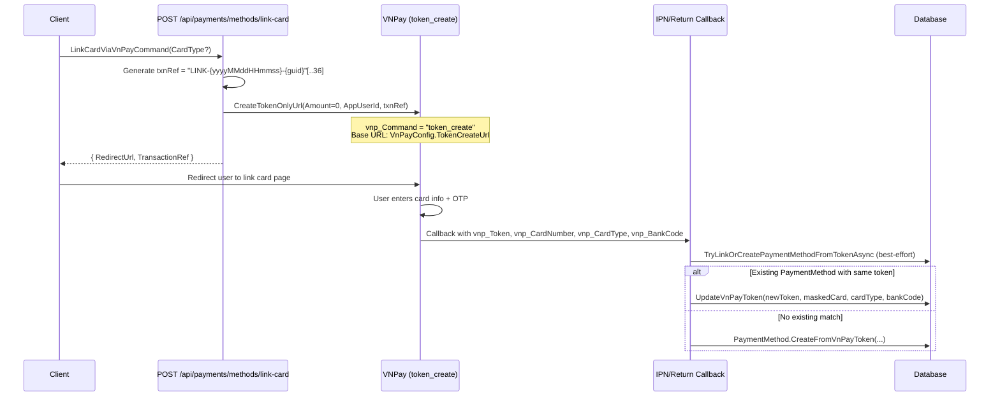

# 05 - Token Management (PaymentMethod CRUD)

## Overview

The PaymentMethod subsystem manages saved VNPay card tokens. Users can link a card via VNPay's `token_create` flow (no charge), and the platform auto-creates a `PaymentMethod` entity from the callback. Users can also manually add, list, delete, and set a default payment method.

**Source files**:
- `LinkCardViaVnPayCommand` in `OIO.Application/Context/PaymentContext/Commands/PaymentMethods/LinkCardViaVnPayCommand.cs`
- `AddPaymentMethodCommand` in `OIO.Application/Context/PaymentContext/Commands/PaymentMethods/AddPaymentMethodCommand.cs`
- `DeletePaymentMethodCommand` in `OIO.Application/Context/PaymentContext/Commands/PaymentMethods/DeletePaymentMethodCommand.cs`
- `SetDefaultPaymentMethodCommand` in `OIO.Application/Context/PaymentContext/Commands/PaymentMethods/SetDefaultPaymentMethodCommand.cs`
- `PaymentMethod` entity in `OIO.Domain/Context/PaymentContext/Aggregates/PaymentMethods/PaymentMethod.cs`

---

## Link Card Flow



---

## Endpoints

| # | Method | Route | Auth | Handler | Description |
|---|--------|-------|------|---------|-------------|
| 1 | POST | `/api/payments/methods/link-card` | Authenticated | `LinkCardViaVnPayCommand` | Generate VNPay token_create redirect URL |
| 2 | POST | `/api/payments/methods` | Authenticated | `AddPaymentMethodCommand` | Manually add a payment method |
| 3 | GET | `/api/payments/methods` | Authenticated | `GetMyPaymentMethodsQuery` | List user's active payment methods |
| 4 | DELETE | `/api/payments/methods/{id}` | Authenticated | `DeletePaymentMethodCommand` | Deactivate + remove VNPay token |
| 5 | PUT | `/api/payments/methods/{id}/default` | Authenticated | `SetDefaultPaymentMethodCommand` | Set a payment method as default |

---

## PaymentMethod Entity

| Field | Type | Description |
|-------|------|-------------|
| `Id` | `PaymentMethodId` | GUID v7 |
| `UserId` | `UserId` | Owner |
| `Type` | `PaymentMethodType` | `credit_card` / `debit_card` / `bank_account` / `e_wallet` / `vnpay` |
| `Provider` | `string?` | e.g. `"vnpay"` |
| `Card` | `CardInfo` | Last four digits, expiry, holder name |
| `IsDefault` | `bool` | Default payment method flag |
| `IsVerified` | `bool` | Always `true` on creation |
| `IsActive` | `bool` | Soft-delete flag |
| `TokenReference` | `string?` | Same value as `VnPayToken` |
| `VnPayToken` | `string?` | VNPay token for recurring/token_pay flows |
| `MaskedCardNumber` | `string?` | e.g. `"970419xxxxxxxxx2198"` |
| `VnPayCardType` | `string?` | `ATM` / `QRCODE` / etc. |
| `BankCode` | `string?` | Bank code from VNPay |
| `CreatedAt` | `DateTime` | Creation timestamp |

---

## Handler Details

### LinkCardViaVnPayCommand

1. Generate `txnRef` = `"LINK-{now:yyyyMMddHHmmss}-{Guid:N}"`[..36]
2. Call `IPaymentGatewayService.CreateTokenOnlyUrl()` with:
   - `Amount = 0` (no charge)
   - `AppUserId` = current user ID
   - `CardType` = optional filter (e.g. ATM only)
3. VNPay builds URL with `vnp_Command = "token_create"`
4. Return `{ RedirectUrl, TransactionRef }` to client

The actual PaymentMethod creation happens in the callback handler (`TryLinkOrCreatePaymentMethodFromTokenAsync`), not in this command. This is a **best-effort** operation wrapped in try/catch -- a failed token link does not fail the overall callback.

### AddPaymentMethodCommand

1. Validate `Type` is in `PaymentMethodType.All`
2. If `IsDefault = true`, unset all existing defaults for the user
3. Create `PaymentMethod.Create(userId, type, provider, cardInfo, tokenReference, isDefault, now)`
4. Return the new `PaymentMethodId`

### DeletePaymentMethodCommand

1. Find `PaymentMethod` by ID where `UserId` matches current user
2. If already inactive, return success (idempotent)
3. If type is `VnPay` and `VnPayToken` is set:
   - Call `IPaymentGatewayService.RemoveTokenAsync()` (best-effort, logged on failure)
   - Uses `vnp_Command = "token_remove"` against `VnPayConfig.TokenRemoveUrl`
   - `txnRef` = `"DEL-{yyyyMMddHHmmss}-{guid:N}"`[..36]
4. Call `paymentMethod.Deactivate()` which sets `IsActive = false` and `IsDefault = false`

### SetDefaultPaymentMethodCommand

1. Find `PaymentMethod` by ID where `UserId` matches
2. Reject if inactive: `"Cannot set an inactive payment method as default."`
3. If already default, return success (idempotent)
4. Remove default from all other active payment methods for the user
5. Call `targetMethod.SetDefault()`

---

## Auto-Creation from Callback

When `ProcessVnPayCallbackCommand` processes a successful payment that includes `vnp_Token` in the response (from `pay_and_create` or `token_create` flows), `TryLinkOrCreatePaymentMethodFromTokenAsync` runs:

1. Search for existing active `PaymentMethod` with same `UserId`, `Type = VnPay`, and `VnPayToken`
2. If found: call `UpdateVnPayToken()` to refresh card info, then `transaction.AssociatePaymentMethod(existing.Id)`
3. If not found: call `PaymentMethod.CreateFromVnPayToken()` with:
   - `lastFour` = last 4 chars of `maskedCardNumber`
   - `isDefault = false`
   - `Provider = "vnpay"`
4. Associate the new PaymentMethod with the transaction
5. Entire operation is wrapped in try/catch -- failure is logged but does not block the payment

---

## Response DTO

```csharp
public sealed record PaymentMethodDto(
    Guid Id,
    string Type,
    string? Provider,
    string? LastFour,
    int? ExpiryMonth,
    int? ExpiryYear,
    string? HolderName,
    bool IsDefault,
    bool IsActive,
    DateTime CreatedAt,
    string? MaskedCardNumber = null,
    string? VnPayCardType = null,
    string? BankCode = null);
```
