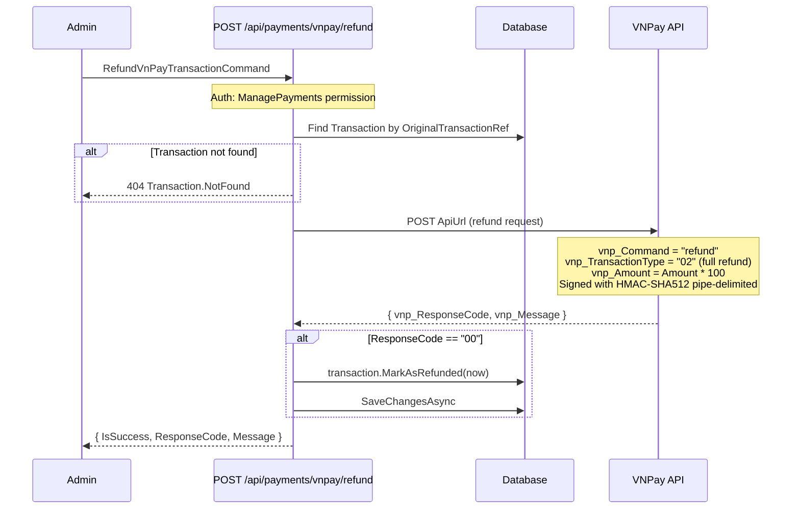

# 06 - Refund

## Overview

`POST /api/payments/vnpay/refund` is an admin-only endpoint that initiates a full refund through VNPay's refund API. The handler finds the original transaction, calls VNPay, and marks the transaction as `Refunded` on success.

**Source files**:
- `RefundVnPayTransactionCommand` + handler in `OIO.Application/Context/PaymentContext/Commands/RefundVnPayTransaction/`
- `RefundVnPayEndpoint` in `OIO.Api/Endpoints/PaymentContext/VnPay/RefundVnPayEndpoint.cs`
- `VnPayGateway.RefundAsync()` in `OIO.Infrastructure/Payment/VnPay/VnPayGateway.cs`
- `VnPayGateway.RemoveTokenAsync()` in `OIO.Infrastructure/Payment/VnPay/VnPayGateway.cs`

---

## Refund Sequence



---

## Endpoint

| Field | Value |
|-------|-------|
| Method | `POST` |
| Route | `/api/payments/vnpay/refund` |
| Auth | `RequireAuthorization(App.Permissions.Catalogs.Admin.ManagePayments)` |
| Tags | Payments |

---

## Request DTO

```csharp
public sealed record Request(
    [Required] string OriginalTransactionRef,
    [Required] string OriginalVnPayTransactionNo,
    [Required] decimal Amount,
    [Required] string Reason);
```

The `IpAddress` is resolved from `HttpContext` at the endpoint level.

---

## Handler Steps

1. **Find original Transaction** in DB by `TransactionNumber == OriginalTransactionRef`
   - Returns `404 Transaction.NotFound` if missing
2. **Call `IPaymentGatewayService.RefundAsync()`** with:
   - `OriginalTransactionRef` and `OriginalVnPayTransactionNo` for identifying the original payment
   - `Amount` = refund amount (cast to `long`)
   - `Reason` = admin-provided reason
   - `IpAddress` = from request context
   - `CreatedBy` = current user's username or userId
3. **On success** (`ResponseCode == "00"`):
   - Call `transaction.MarkAsRefunded(now)` which transitions status `Completed -> Refunded`
   - If mark fails (e.g. wrong current status), log warning but still return the VNPay result
4. **Return** `RefundVnPayTransactionResponse { IsSuccess, ResponseCode, Message }`

---

## VNPay Refund API Details

`VnPayGateway.RefundAsync()` sends a POST to `VnPayConfig.ApiUrl`:

### Request Parameters

| Parameter | Value |
|-----------|-------|
| `vnp_RequestId` | `{GMT+7:yyyyMMddHHmmss}{guid:N[..8]}` |
| `vnp_Version` | `VnPayConfig.Version` (default `"2.1.0"`) |
| `vnp_Command` | `"refund"` |
| `vnp_TmnCode` | `VnPayConfig.TmnCode` |
| `vnp_TransactionType` | `"02"` (full refund) |
| `vnp_TxnRef` | Original transaction ref |
| `vnp_Amount` | `Amount * 100` |
| `vnp_TransactionNo` | Original VNPay transaction number |
| `vnp_TransactionDate` | Current GMT+7 timestamp |
| `vnp_CreateBy` | Admin username or userId |
| `vnp_CreateDate` | Current GMT+7 timestamp |
| `vnp_IpAddr` | Request IP |
| `vnp_OrderInfo` | Refund reason |

### HMAC-SHA512 Signature (Pipe-Delimited)

The sign data is a pipe (`|`) delimited string of values in fixed order:

```
requestId|version|"refund"|tmnCode|"02"|txnRef|amount*100|transactionNo|transactionDate|createBy|createDate|ipAddr|orderInfo
```

Signed with `VnPayHelper.HmacSha512(HashSecret, signData)` and sent as `vnp_SecureHash`.

### Response Parsing

- `vnp_ResponseCode == "00"` -> refund successful
- Any other code -> refund failed
- `vnp_Message` -> human-readable message from VNPay

---

## Token Removal API

`VnPayGateway.RemoveTokenAsync()` is used when deleting a VNPay-type PaymentMethod (see [05-token-management.md](05-token-management.md)). It sends a POST to `VnPayConfig.TokenRemoveUrl`:

### Request Parameters

| Parameter | Value |
|-----------|-------|
| `vnp_Version` | `VnPayConfig.Version` |
| `vnp_Command` | `"token_remove"` |
| `vnp_TmnCode` | `VnPayConfig.TmnCode` |
| `vnp_TxnRef` | Generated transaction ref |
| `vnp_AppUserId` | User's ID |
| `vnp_Token` | The VNPay token to remove |
| `vnp_OrderInfo` | Normalized description |
| `vnp_IpAddr` | `"127.0.0.1"` |
| `vnp_CreateDate` | Current GMT+7 timestamp |

### Signature

Uses query-string-based HMAC-SHA512 (same as payment URL signing), not pipe-delimited.

### Response Parsing

- `vnp_response_code == "00"` -> token removed successfully (note: lowercase field names)
- `vnp_message` -> human-readable message
