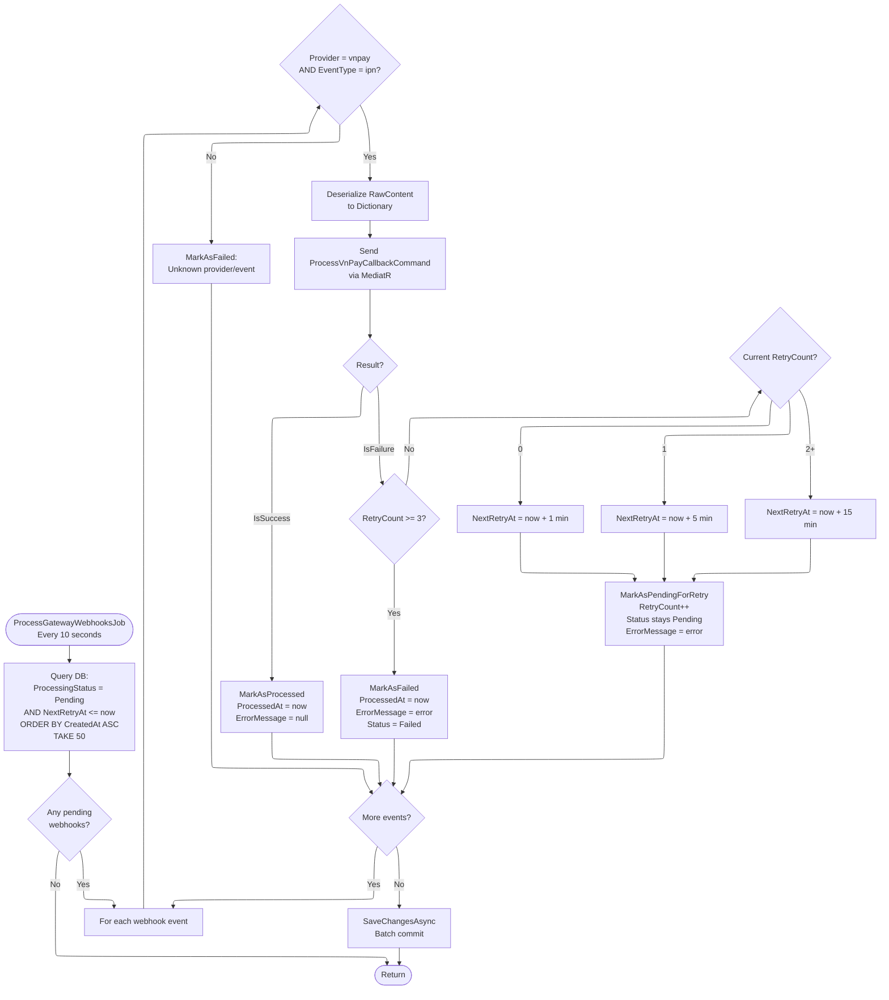

# 07 - Webhook Retry

## Overview

VNPay IPN callbacks are persisted as `GatewayWebhookEvent` entities and processed asynchronously by `ProcessGatewayWebhooksJob`. Failed webhooks are retried with exponential backoff up to 3 attempts before being permanently marked as failed.

**Source files**:
- `ProcessGatewayWebhooksJob` in `OIO.Infrastructure/Payment/Webhooks/ProcessGatewayWebhooksJob.cs`
- `GatewayWebhookProcessor` in `OIO.Infrastructure/Payment/Webhooks/GatewayWebhookProcessor.cs`
- `GatewayWebhookEvent` entity in `OIO.Domain/Context/PaymentContext/Aggregates/Webhooks/GatewayWebhookEvent.cs`

---

## Retry Flow

---

## Job Configuration

| Setting | Value |
|---------|-------|
| Job key | `gateway-webhooks-process` (group: `system`) |
| Trigger interval | Every **10 seconds** |
| Repeat | Forever |
| Concurrency | `[DisallowConcurrentExecution]` |
| Batch size | **50** webhooks per run |
| Error handling | `JobExecutionException(refireImmediately: true)` on unhandled errors |

---

## GatewayWebhookEvent Entity

| Field | Type | Description |
|-------|------|-------------|
| `Id` | `GatewayWebhookEventId` | GUID v7 |
| `Provider` | `string` | `"vnpay"` |
| `EventType` | `string` | `"ipn"` |
| `RawContent` | `string` | JSON-serialized query params from VNPay |
| `ProcessingStatus` | `WebhookProcessingStatus` | `pending` / `processed` / `failed` / `ignored` |
| `ErrorMessage` | `string?` | Error details on failure or retry |
| `RetryCount` | `int` | Number of retry attempts (starts at 0) |
| `NextRetryAt` | `DateTime?` | Scheduled next processing time |
| `CreatedAt` | `DateTime` | When the webhook was received |
| `ProcessedAt` | `DateTime?` | When finally processed or permanently failed |

---

## State Transitions

| Method | Effect |
|--------|--------|
| `GatewayWebhookEvent.Create(...)` | `Status = Pending`, `RetryCount = 0`, `NextRetryAt = now` |
| `MarkAsProcessed(now)` | `Status = Processed`, `ProcessedAt = now`, `ErrorMessage = null` |
| `MarkAsFailed(error, now)` | `Status = Failed`, `ProcessedAt = now`, `ErrorMessage = error` |
| `MarkAsPendingForRetry(error, nextRetryAt)` | `Status = Pending`, `RetryCount++`, `NextRetryAt = nextRetryAt`, `ErrorMessage = error` |

---

## Retry Backoff Schedule

| Attempt | RetryCount before attempt | Delay | NextRetryAt |
|---------|--------------------------|-------|-------------|
| 1st retry | 0 | 1 minute | `now + 1m` |
| 2nd retry | 1 | 5 minutes | `now + 5m` |
| 3rd retry | 2 | 15 minutes | `now + 15m` |
| Permanent failure | 3 | N/A | `MarkAsFailed()` |

Total maximum retry window: approximately 21 minutes from first failure to permanent failure.

---

## Processing Logic (`GatewayWebhookProcessor`)

1. **Query**: Select webhooks where `ProcessingStatus == Pending` AND (`NextRetryAt == null` OR `NextRetryAt <= now`), ordered by `CreatedAt`, limited to `batchSize` (default 50 from job, method default 20)
2. **For each webhook**:
   - If `Provider == "vnpay"` AND `EventType == "ipn"`: deserialize `RawContent` to `Dictionary<string, string>`, create `ProcessVnPayCallbackCommand`, send via MediatR
   - Otherwise: immediately `MarkAsFailed("Unknown provider/event: {provider}/{eventType}")`
3. **On success**: `MarkAsProcessed(now)`
4. **On failure** (result error or exception):
   - If `RetryCount >= 3`: `MarkAsFailed(errorMessage, now)` -- permanent
   - If `RetryCount < 3`: `MarkAsPendingForRetry(errorMessage, nextRetryAt)` with exponential backoff
5. **After loop**: single `SaveChangesAsync()` to batch-commit all updates
