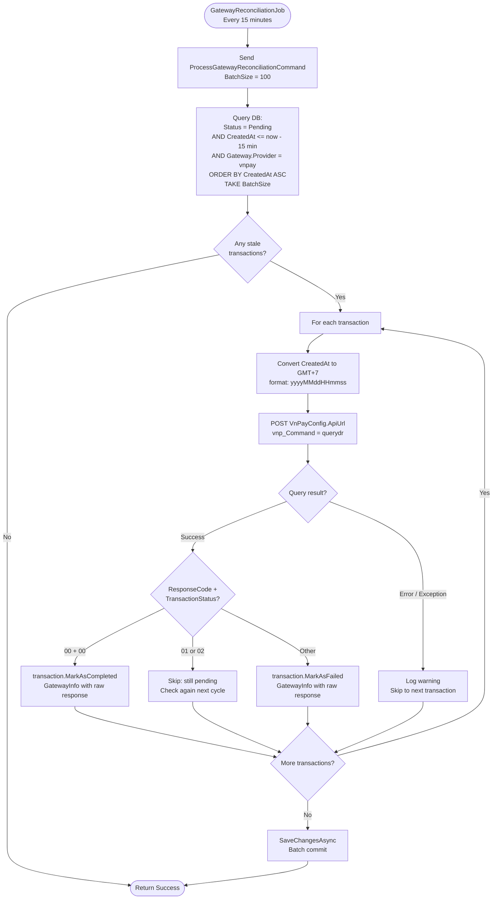

# 08 - Reconciliation

## Overview

`GatewayReconciliationJob` runs every 15 minutes to detect stale `Pending` transactions that never received a VNPay callback. It queries VNPay's `querydr` API to determine the actual transaction status and updates the local Transaction accordingly.

**Source files**:
- `GatewayReconciliationJob` in `OIO.Infrastructure/Payment/Reconciliation/GatewayReconciliationJob.cs`
- `ProcessGatewayReconciliationCommand` + handler in `OIO.Application/Context/PaymentContext/Commands/ReconcileTransactions/`
- `VnPayGateway.QueryTransactionAsync()` in `OIO.Infrastructure/Payment/VnPay/VnPayGateway.cs`

---

## Reconciliation Flow



---

## Job Configuration

| Setting | Value |
|---------|-------|
| Job key | `gateway-reconciliation-process` (group: `system`) |
| Trigger interval | Every **15 minutes** |
| Repeat | Forever |
| Concurrency | `[DisallowConcurrentExecution]` |
| Batch size | **100** transactions per run |
| Threshold | Only transactions older than **15 minutes** |
| Error handling | `JobExecutionException(refireImmediately: true)` on unhandled errors |

---

## Handler Steps (`ProcessGatewayReconciliationCommandHandler`)

1. **Calculate threshold**: `now - 15 minutes` (only check transactions that have been pending long enough for VNPay to have processed them)
2. **Query pending transactions**:
   ```
   WHERE Status == Pending
     AND CreatedAt <= thresholdDate
     AND Gateway.Provider == "vnpay"
   ORDER BY CreatedAt ASC
   TAKE BatchSize (default 100)
   ```
3. **For each transaction**, call `VnPayGateway.QueryTransactionAsync(txnRef, createdDateGMT7)`
4. **Parse VNPay response**:

   | `vnp_ResponseCode` | `vnp_TransactionStatus` | Action |
   |---------------------|-------------------------|--------|
   | `00` | `00` | `MarkAsCompleted(gatewayInfo, now)` |
   | any | `01` (unpaid) | Skip -- check again next cycle |
   | any | `02` (processing) | Skip -- check again next cycle |
   | other combinations | other values | `MarkAsFailed(gatewayInfo, now)` |

5. **Batch save**: single `SaveChangesAsync()` after processing all transactions

---

## VNPay QueryDR API Details

`VnPayGateway.QueryTransactionAsync()` sends a POST to `VnPayConfig.ApiUrl`:

### Request Parameters

| Parameter | Value |
|-----------|-------|
| `vnp_RequestId` | `{GMT+7:yyyyMMddHHmmss}{guid:N[..8]}` |
| `vnp_Version` | `VnPayConfig.Version` (default `"2.1.0"`) |
| `vnp_Command` | `"querydr"` |
| `vnp_TmnCode` | `VnPayConfig.TmnCode` |
| `vnp_TxnRef` | Transaction ref to query |
| `vnp_OrderInfo` | `"Query transaction {txnRef}"` |
| `vnp_TransactionDate` | Original transaction's `CreatedAt` in GMT+7 `yyyyMMddHHmmss` |
| `vnp_CreateDate` | Current GMT+7 timestamp |
| `vnp_IpAddr` | `"127.0.0.1"` (background job) |

### HMAC-SHA512 Signature (Pipe-Delimited)

```
requestId|version|"querydr"|tmnCode|txnRef|transactionDate|createDate|"127.0.0.1"|"Query transaction {txnRef}"
```

Signed with `VnPayHelper.HmacSha512(HashSecret, signData)` and sent as `vnp_SecureHash`.

### Response Parsing

The response is JSON. Key fields extracted:
- `vnp_ResponseCode` -- `"00"` means query succeeded and transaction found
- `vnp_TransactionStatus` -- `"00"` = completed, `"01"` = unpaid, `"02"` = processing
- `vnp_Amount` -- divided by 100 to get VND amount

---

## Design Notes

- The 15-minute threshold avoids querying VNPay for very recent transactions where the user might still be on the payment page.
- Domain events (`TransactionCompletedDomainEvent`) are raised by `MarkAsCompleted` but downstream side-effects (wallet credit, escrow creation) are not triggered by reconciliation. The comment in source notes this should eventually be refactored to dispatch domain events or reuse the webhook processing logic.
- Each transaction query failure is logged and skipped individually; it does not abort the batch.
