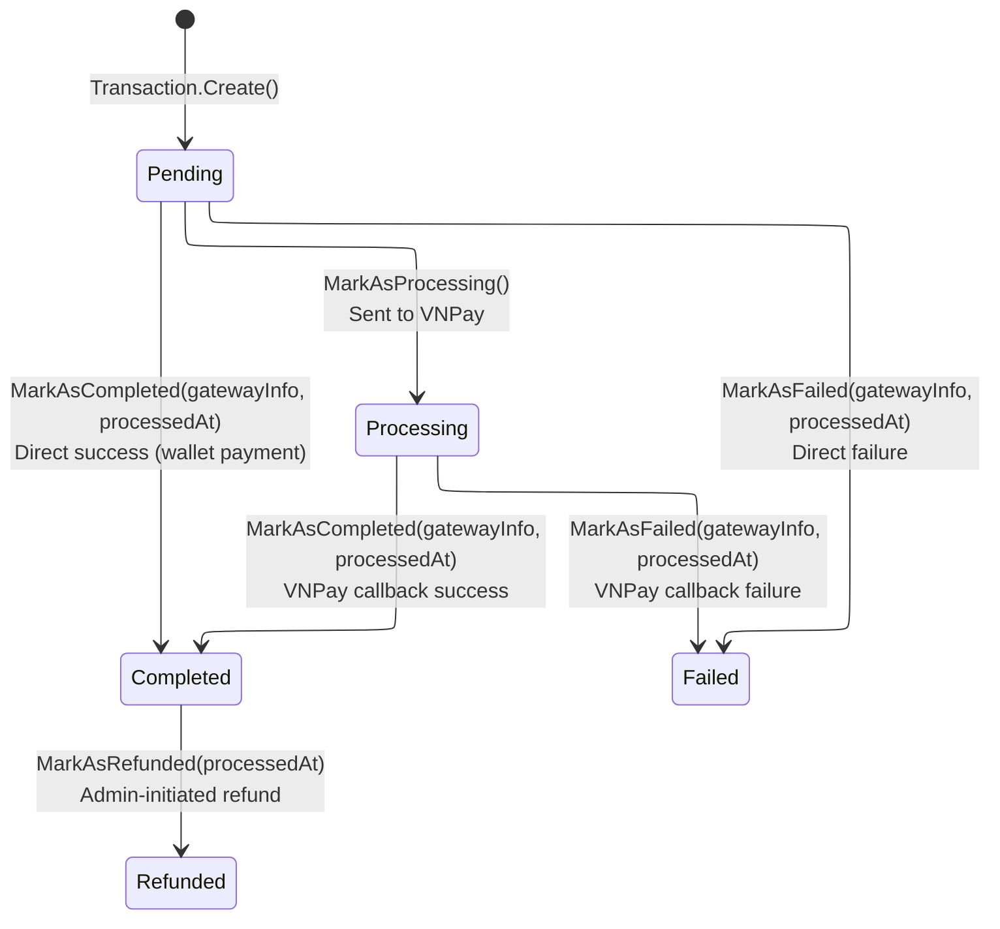
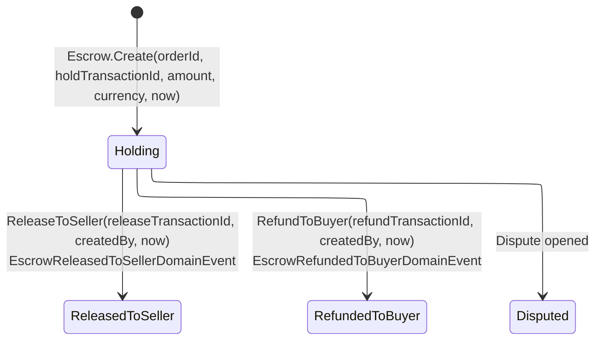
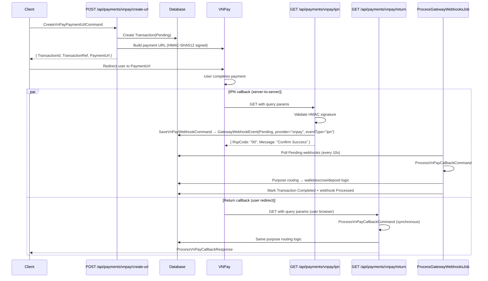

# 09 - Payment & VNPay Flow

## Overview

The Payment module handles all monetary transactions in the OIO Auction Platform through VNPay as the primary payment gateway. It supports four distinct payment purposes, three token-based flows, escrow management, and background webhook processing with retry logic.

---

## Transaction State Machine

**TransactionStatus enum** (6 values): `pending`, `processing`, `completed`, `failed`, `cancelled`, `refunded`

**TransactionType enum** (6 values): `payment`, `refund`, `deposit`, `withdrawal`, `fee`, `payout`

---

## Escrow State Machine

**EscrowStatus enum** (4 values): `holding`, `released_to_seller`, `refunded_to_buyer`, `disputed`

**EscrowReleaseTo enum** (4 values): `none`, `platform`, `seller`, `buyer`

**EscrowReleaseType enum** (4 values): `full`, `partial`, `refund`, `adjustment`

---

## End-to-End Payment Sequence

---

## Aggregates

### Transaction

| Field | Type | Description |
|-------|------|-------------|
| `Id` | `TransactionId` | GUID v7 |
| `TransactionNumber` | `TransactionNumber` | Unique ref, format: `{yyyyMMddHHmmss}_{guid}`[..36] |
| `UserId` | `UserId` | Owner of the transaction |
| `OrderId?` | `OrderId` | Linked order (for order_payment) |
| `AuctionId?` | `AuctionId` | Linked auction (for deposit/buy-now) |
| `BuyNowReservationId?` | `AuctionBuyNowReservationId` | Linked buy-now reservation |
| `PaymentMethodId?` | `PaymentMethodId` | Linked payment method (token flows) |
| `Type` | `TransactionType` | payment/refund/deposit/withdrawal/fee/payout |
| `Amount` | `Money` | Transaction amount |
| `Fee` | `decimal` | Fee (defaults to 0) |
| `NetAmount` | `Money` | Net amount after fee |
| `Currency` | `string` | Currency code |
| `Status` | `TransactionStatus` | Current state |
| `Gateway` | `GatewayInfo` | Provider, transactionId, raw response |
| `Description?` | `string` | Format: `[{purpose}] {desc} - AuctionId: {guid}` |
| `ProcessedAt?` | `DateTime` | When processed |
| `CreatedAt` | `DateTime` | Creation timestamp |

Domain events raised: `TransactionCompletedDomainEvent`, `TransactionFailedDomainEvent`, `TransactionRefundedDomainEvent`

### PaymentMethod

| Field | Type | Description |
|-------|------|-------------|
| `Id` | `PaymentMethodId` | GUID v7 |
| `UserId` | `UserId` | Owner |
| `Type` | `PaymentMethodType` | credit_card/debit_card/bank_account/e_wallet/vnpay |
| `Provider?` | `string` | e.g. "vnpay" |
| `Card` | `CardInfo` | Last four digits, etc. |
| `IsDefault` | `bool` | Default payment method flag |
| `IsVerified` | `bool` | Always true on creation |
| `IsActive` | `bool` | Active flag |
| `TokenReference?` | `string` | Same as VnPayToken |
| `VnPayToken?` | `string` | VNPay token for recurring payments |
| `MaskedCardNumber?` | `string` | e.g. "970419xxxxxxxxx2198" |
| `VnPayCardType?` | `string` | ATM/QRCODE/etc. |
| `BankCode?` | `string` | Bank code |
| `CreatedAt` | `DateTime` | Creation timestamp |

### Escrow

| Field | Type | Description |
|-------|------|-------------|
| `Id` | `EscrowId` | GUID v7 |
| `OrderId` | `OrderId` | Linked order |
| `HoldTransactionId?` | `TransactionId` | Transaction that funded the escrow |
| `ReleaseTransactionId?` | `TransactionId` | Transaction for release/refund |
| `Amount` | `Money` | Escrowed amount |
| `Currency` | `string` | Currency code |
| `Status` | `EscrowStatus` | holding/released_to_seller/refunded_to_buyer/disputed |
| `HeldAt` | `DateTime` | When escrow was created |
| `ReleasedAt?` | `DateTime` | When released/refunded |
| `ReleasedTo` | `EscrowReleaseTo` | none/platform/seller/buyer |
| `ReleaseEvents` | `List<EscrowReleaseEvent>` | Audit trail of release events |

Domain events raised: `EscrowReleasedToSellerDomainEvent`, `EscrowRefundedToBuyerDomainEvent`

### GatewayWebhookEvent

| Field | Type | Description |
|-------|------|-------------|
| `Id` | `GatewayWebhookEventId` | GUID v7 |
| `Provider` | `string` | "vnpay" |
| `EventType` | `string` | "ipn" |
| `RawContent` | `string` | JSON-serialized query params |
| `ProcessingStatus` | `WebhookProcessingStatus` | pending/processed/failed/ignored |
| `ErrorMessage?` | `string` | Error details on failure |
| `RetryCount` | `int` | Number of retry attempts |
| `NextRetryAt?` | `DateTime` | Scheduled next retry time |
| `CreatedAt` | `DateTime` | When received |
| `ProcessedAt?` | `DateTime` | When processed/failed |

**WebhookProcessingStatus enum** (4 values): `pending`, `processed`, `failed`, `ignored`

---

## Endpoints

| # | Method | Route | Auth | Description |
|---|--------|-------|------|-------------|
| 1 | POST | `/api/payments/vnpay/create-url` | Authenticated | Create VNPay payment URL |
| 2 | GET | `/api/payments/vnpay/ipn` | AllowAnonymous | VNPay IPN callback (server-to-server) |
| 3 | GET | `/api/payments/vnpay/return` | AllowAnonymous | VNPay return URL (user redirect) |
| 4 | POST | `/api/payments/vnpay/refund` | Admin (`ManagePayments`) | Refund a VNPay transaction |
| 5 | POST | `/api/payments/checkout` | Authenticated | Checkout order (vnpay/wallet/hybrid) |
| 6 | POST | `/api/payments/methods` | Authenticated | Add payment method |
| 7 | GET | `/api/payments/methods` | Authenticated | List user's payment methods |
| 8 | DELETE | `/api/payments/methods/{id}` | Authenticated | Delete a payment method |
| 9 | PUT | `/api/payments/methods/{id}/default` | Authenticated | Set default payment method |
| 10 | POST | `/api/payments/methods/link-card` | Authenticated | Link card via VNPay token_create |

---

## Background Jobs

### 1. ProcessGatewayWebhooksJob (every 10 seconds)

- **Trigger**: `WithIntervalInSeconds(10)`, `RepeatForever()`, `DisallowConcurrentExecution`
- **Batch size**: 50 webhooks per run
- **Query**: `WebhookProcessingStatus.Pending` AND `NextRetryAt <= now`
- **Action**: Deserializes `RawContent` to `Dictionary<string,string>`, dispatches `ProcessVnPayCallbackCommand` via MediatR
- **Success**: `MarkAsProcessed(now)`
- **Failure with retry**: Exponential backoff: retry 0 = 1 min, retry 1 = 5 min, retry 2 = 15 min
- **Max retries**: 3 attempts, then `MarkAsFailed(errorMessage, now)` permanently

### 2. GatewayReconciliationJob (every 15 minutes)

- **Trigger**: `WithIntervalInMinutes(15)`, `RepeatForever()`, `DisallowConcurrentExecution`
- **Batch size**: 100 transactions per run
- **Query**: `TransactionStatus.Pending` AND `CreatedAt <= now - 15min` AND `Gateway.Provider == "vnpay"`
- **Action**: Calls `VnPayGateway.QueryTransactionAsync()` (POST to VNPay API URL) for each stale Pending transaction
- **Success (00/00)**: `MarkAsCompleted`
- **Final failure (not 00/01/02)**: `MarkAsFailed`
- **Still pending (01/02)**: Skip, check again next cycle

### 3. ProcessGatewayWebhooksJob retry (exponential backoff)

Built into the webhook processor. Uses `MarkAsPendingForRetry(errorMessage, nextRetryAt)` which increments `RetryCount` and sets `NextRetryAt` with delays of 1, 5, and 15 minutes respectively.

---

## Payment Purposes

| Purpose | Value | TransactionType mapping | Description |
|---------|-------|------------------------|-------------|
| Auction Deposit | `auction_deposit` | `deposit` | VNPay -> Wallet credit -> Wallet hold -> AuctionDeposit + RegisterParticipant |
| Order Payment | `order_payment` | `payment` | VNPay -> Escrow.Create -> hybrid hold commit -> deposit conversion -> Order.MarkAsPaid |
| Auction Buy Now | `auction_buy_now` | `payment` | VNPay -> reservation check -> if active: finalize+order+escrow / if expired: wallet credit |
| Wallet Top Up | `wallet_top_up` | `deposit` | VNPay -> Wallet.Credit |

---

## Token Flows

| Flow | VNPay Command | URL Used | Trigger |
|------|---------------|----------|---------|
| `pay_and_create` | `pay_and_create` | `PayAndCreateUrl` (sandbox: `https://sandbox.vnpayment.vn/token_ui/pay-create-token.html`) | `SaveCard = true` and no existing PaymentMethodId |
| `token_pay` | `token_pay` | `TokenPayUrl` (sandbox: `https://sandbox.vnpayment.vn/token_ui/payment-token.html`) | `PaymentMethodId` is set, uses stored `VnPayToken` |
| `token_create` | `token_create` | `TokenCreateUrl` (sandbox: `https://sandbox.vnpayment.vn/token_ui/create-token.html`) | Link card only (no payment), via `/api/payments/methods/link-card` |

Standard payment (no token): uses `PaymentUrl` (sandbox: `https://sandbox.vnpayment.vn/paymentv2/vpcpay.html`) with `vnp_Command = "pay"`.

Token removal: uses `TokenRemoveUrl` (sandbox: `https://sandbox.vnpayment.vn/token_ui/remove-token.html`) with `vnp_Command = "token_remove"`.

---

## VNPay Configuration

Bound from `appsettings` section `"VnPay"` via `VnPayConfig`:

| Property | Default (Sandbox) |
|----------|-------------------|
| `TmnCode` | _(from config)_ |
| `HashSecret` | _(from config)_ |
| `PaymentUrl` | `https://sandbox.vnpayment.vn/paymentv2/vpcpay.html` |
| `ApiUrl` | `https://sandbox.vnpayment.vn/merchant_webapi/api/transaction` |
| `TokenCreateUrl` | `https://sandbox.vnpayment.vn/token_ui/create-token.html` |
| `PayAndCreateUrl` | `https://sandbox.vnpayment.vn/token_ui/pay-create-token.html` |
| `TokenPayUrl` | `https://sandbox.vnpayment.vn/token_ui/payment-token.html` |
| `TokenRemoveUrl` | `https://sandbox.vnpayment.vn/token_ui/remove-token.html` |
| `Version` | `2.1.0` |
| `ReturnPath` | _(from config)_ |
| `IpnPath` | _(from config)_ |

Return URL is built as: `{AppInfo.BeUrl}{VnPayConfig.ReturnPath}`

---

## Subflow Index

| # | File | Description |
|---|------|-------------|
| 1 | [01-create-payment-url.md](01-create-payment-url.md) | Create VNPay payment URL with purpose validation and token routing |
| 2 | [02-ipn-return-callback.md](02-ipn-return-callback.md) | IPN and Return callback handling, webhook persistence |
| 3 | [03-callback-processing.md](03-callback-processing.md) | ProcessVnPayCallbackCommand: purpose routing and all 4 handlers |
| 4 | [04-checkout-order.md](04-checkout-order.md) | Checkout order: VNPay, full wallet, and hybrid wallet+VNPay flows |
| 5 | [05-token-management.md](05-token-management.md) | PaymentMethod CRUD: link card via token_create, add/delete/set-default, auto-creation from callback |
| 6 | [06-refund.md](06-refund.md) | Admin-only VNPay refund API and token removal |
| 7 | [07-webhook-retry.md](07-webhook-retry.md) | ProcessGatewayWebhooksJob retry flow with exponential backoff (1m/5m/15m) |
| 8 | [08-reconciliation.md](08-reconciliation.md) | GatewayReconciliationJob: querydr API for stale pending transactions |
| 9 | [09-vnpay-technical.md](09-vnpay-technical.md) | VNPay technical reference: URL construction, HMAC-SHA512, config, helpers |
