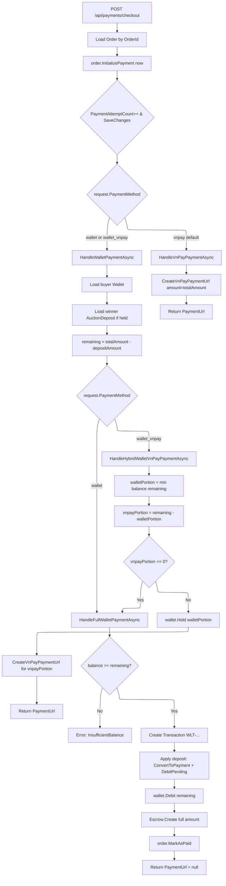

# 02 -- Checkout Payment

## Payment Method Decision Tree



## Endpoint

```
POST /api/payments/checkout
Authorization: Required
```

### Request Body

```json
{
  "OrderId": "guid",
  "BankCode": "string?",
  "PaymentMethod": "vnpay" | "wallet" | "wallet_vnpay"
}
```

`IpAddress` is extracted from `HttpContext` server-side.

### Response

```json
{
  "TransactionId": "guid",
  "TransactionRef": "string",
  "PaymentUrl": "string?"
}
```

`PaymentUrl` is `null` for full-wallet payments (order is paid immediately).

## Handler Flow: CheckoutOrderCommandHandler

### 1. Initialize Payment

```csharp
order.InitializePayment(now)
```

- Guard: `Status != PendingPayment` -> error
- Increments `PaymentAttemptCount`
- Sets `LastPaymentAttemptAt = now`
- SaveChanges immediately (optimistic concurrency checkpoint)

### 2. VNPay Standard Flow

Triggered when `PaymentMethod` is not `"wallet"` or `"wallet_vnpay"` (defaults to `"vnpay"`).

- `CreateVnPayPaymentUrlCommand` with:
  - `Amount = order.Pricing.TotalAmount.Amount`
  - `Purpose = PaymentPurpose.OrderPayment`
  - `Description = "OrderPayment - Order #{orderNumber}"`
  - `AuctionId`, `OrderId` set for callback routing
- Returns `PaymentUrl` for buyer redirect

### 3. Full Wallet Payment

Triggered when `PaymentMethod == "wallet"`.

1. Load buyer's `Wallet`
2. Load winner's `AuctionDeposit` (if `IsHeld`)
3. `remainingAmount = totalAmount - depositAmount` (clamped to 0)
4. Guard: `wallet.WalletFunds.BalanceAmount >= remainingAmount`
5. Create `Transaction`:
   - Ref: `WLT-{yyyyMMddHHmmss}_{Guid:N}` (truncated to 36 chars)
   - Type: `TransactionType.Payment`
   - Amount: `orderAmount` (full order amount)
   - Description: `"[OrderPayment] Wallet payment for order {orderId}"`
6. If deposit exists:
   - `winnerDeposit.ConvertToPayment(now)` -- Held -> ConvertedToPayment
   - `wallet.DebitPending(depositAmount, txId, ...)` -- deducts from pending
7. If `remainingAmount > 0`: `wallet.Debit(remainingAmount, txId, ...)`
8. `Escrow.Create(orderId, txId, orderAmount, currency, now)` -- single escrow for full amount
9. `transaction.MarkAsCompleted(GatewayInfo.Empty, now)`
10. `order.MarkAsPaid(now)` -- Status = Paid
11. Return `CheckoutOrderResponse(txId, txnRef, PaymentUrl: null)`

### 4. Hybrid Wallet+VNPay Payment

Triggered when `PaymentMethod == "wallet_vnpay"`.

1. Calculate split:
   - `walletPortion = min(wallet.BalanceAmount, remainingAmount)`
   - `vnpayPortion = remainingAmount - walletPortion`
2. If `vnpayPortion <= 0`: delegate to full wallet payment
3. If `walletPortion > 0`:
   - `wallet.Hold(walletPortion, null, "[HybridHold] Hold for hybrid payment - OrderId: {orderId} ...")`
   - SaveChanges
4. `CreateVnPayPaymentUrlCommand` for `vnpayPortion` only
   - Description: `"OrderPayment - Order #{orderNumber} (hybrid: VNPay portion)"`
5. If VNPay URL creation fails: rollback wallet hold via `wallet.Unhold(...)`
6. Return `PaymentUrl` for buyer to complete VNPay portion

The wallet hold is committed later by `ProcessVnPayCallbackCommand.HandleOrderPaymentAsync` when VNPay IPN arrives (see [03-payment-callback.md](03-payment-callback.md)).

### Winner Deposit Conversion

The winner's `AuctionDeposit` was created during the qualification phase and is held in the wallet's pending balance. During checkout:

| Step | Method | Effect |
|------|--------|--------|
| 1 | `winnerDeposit.ConvertToPayment(now)` | Deposit status: Held -> ConvertedToPayment |
| 2 | `wallet.DebitPending(amount, txId, ...)` | Deducts from wallet pending balance |

## Source Files

| File | Path |
|------|------|
| CheckoutOrderCommand | `src/core/OIO.Application/Context/PaymentContext/Commands/CheckoutOrder/CheckoutOrderCommand.cs` |
| CheckoutOrderEndpoint | `src/presentation/OIO.Api/Endpoints/PaymentContext/CheckoutOrderEndpoint.cs` |
