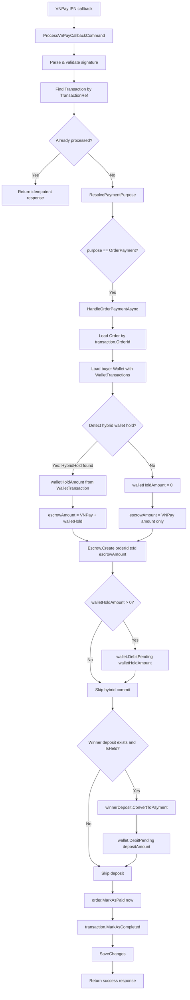

# 03 -- Payment Callback (Order Payment)

## VNPay IPN Callback Flow for Order Payments

## HandleOrderPaymentAsync Detail

This method is called inside `ProcessVnPayCallbackCommandHandler.HandleSuccessfulCallbackAsync` when `ResolvePaymentPurpose` returns `PaymentPurpose.OrderPayment` (i.e., `transaction.OrderId.HasValue`).

### Step-by-Step

1. **Load Order** -- `dbContext.Set<Order>().FirstOrDefaultAsync(o => o.Id == transaction.OrderId.Value)`

2. **Load Buyer Wallet** -- `dbContext.Set<Wallet>().Include(w => w.WalletTransactions).FirstOrDefaultAsync(w => w.UserId == order.BuyerId)` -- includes wallet transactions for hybrid hold detection.

3. **Detect Hybrid Hold** -- Searches `wallet.WalletTransactions` for a transaction where:
   - `Description` contains `"[HybridHold]"`
   - `Description` contains `order.Id.Value.ToString()`
   - Takes the most recent match (`OrderByDescending(wt => wt.CreatedAt).FirstOrDefault()`)
   - `walletHoldAmount = hybridHoldTx.Amount` (or 0 if no hold found)

4. **Create Escrow** --
   - **Pure VNPay**: `Escrow.Create(orderId, txId, transaction.Amount, currency, now)` -- 1 escrow with VNPay amount
   - **Hybrid**: `Money.Create(transaction.Amount.Amount + walletHoldAmount, currency)` -> `Escrow.Create(orderId, txId, fullAmount, currency, now)` -- 1 escrow combining both portions

5. **Commit Hybrid Hold** -- If `walletHoldAmount > 0`:
   - `wallet.DebitPending(walletHoldAmount, txId, "[HybridHold] Wallet portion committed for order {orderId}")`

6. **Winner Deposit Conversion** -- Loads `AuctionDeposit` where `AuctionId == order.AuctionId && BidderId == order.BuyerId && IsHeld`:
   - `winnerDeposit.ConvertToPayment(now)` -- status: Held -> ConvertedToPayment
   - `wallet.DebitPending(depositAmount, txId, "Auction winner deposit applied for order {orderId}")`

7. **Mark Order Paid** -- `order.MarkAsPaid(now)`:
   - Guard: must be in `PendingPayment` status
   - Sets `Status = Paid`, `PaidAt = now`

8. **Mark Transaction Completed** -- `transaction.MarkAsCompleted(gatewayInfo, now)` -- called after `HandleOrderPaymentAsync` returns, in the parent `HandleSuccessfulCallbackAsync`

9. **SaveChanges** -- Single save after all mutations

### Payment Purpose Resolution

`ResolvePaymentPurpose` determines routing based on:

| Check | Purpose |
|-------|---------|
| `transaction.BuyNowReservationId.HasValue` | `AuctionBuyNow` |
| `transaction.AuctionId.HasValue && Type == Deposit` | `AuctionDeposit` |
| `transaction.OrderId.HasValue` | `OrderPayment` |
| Description starts with `[AuctionDeposit]` | `AuctionDeposit` |
| Description starts with `[AuctionBuyNow]` | `AuctionBuyNow` |
| Description starts with `[OrderPayment]` | `OrderPayment` |
| Default | `WalletTopUp` |

### Failed Callback

For `OrderPayment` purpose, a failed VNPay callback only marks the transaction as failed (`transaction.MarkAsFailed(gatewayInfo, now)`). The order remains in `PendingPayment` and the buyer can retry checkout. The `CancelExpiredOrdersJob` will eventually cancel the order if `PaymentDueAt` expires.

## Escrow Scenarios Summary

| Scenario | Escrows Created |
|----------|----------------|
| Pure VNPay | 1 escrow: VNPay amount |
| Hybrid wallet+VNPay | 1 escrow: VNPay + wallet combined |
| Full wallet (in checkout) | 1 escrow: full order amount |
| Buy-now (VNPay + deposit) | 2 escrows: VNPay amount + deposit amount |

## Source Files

| File | Path |
|------|------|
| ProcessVnPayCallbackCommand | `src/core/OIO.Application/Context/PaymentContext/Commands/ProcessVnPayCallback/ProcessVnPayCallbackCommand.cs` |
