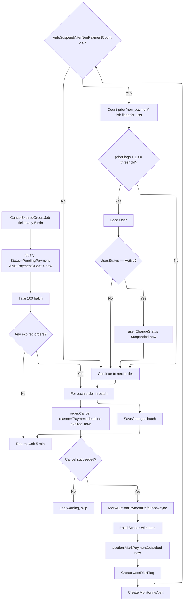

# 04 -- Cancel Expired Orders Job

## Job Flow



## CancelExpiredOrdersJob

**Type**: `BackgroundService` (hosted service)
**Interval**: 5 minutes (`TimeSpan.FromMinutes(5)`)
**Batch size**: 100 orders per tick

### Query

```csharp
dbContext.Set<Order>()
    .Where(o => o.Status == OrderStatus.PendingPayment
             && o.PaymentDueAt != null
             && o.PaymentDueAt < nowUtc)
    .Take(100)
    .ToListAsync(ct);
```

### Order Cancellation

```csharp
order.Cancel("Payment deadline expired", nowUtc)
```

Effects on `Order`:
- `Status = OrderStatus.Cancelled`
- `CancelledAt = nowUtc`
- `Notes` appended with `"Cancel Reason: Payment deadline expired"`
- Raises `OrderCancelledEvent(OrderId, BuyerId, OrderNumber, Reason, OccurredAt)`

### Side Effects: MarkAuctionPaymentDefaultedAsync

For each successfully cancelled order, the job performs the following:

#### 1. Mark Auction as Payment Defaulted

```csharp
auction.MarkPaymentDefaulted(nowUtc)
```

#### 2. Create User Risk Flag

```csharp
UserRiskFlag.Create(
    userId: order.BuyerId,
    flagType: "non_payment",
    reason: "Order {orderNumber} expired without payment.",
    severity: RiskFlagSeverity.Medium,
    createdBy: null,
    nowUtc: nowUtc)
```

#### 3. Create Monitoring Alert

```csharp
MonitoringAlert.Create(
    entityType: "User",
    entityId: order.BuyerId.Value,
    alertType: "repeated_non_payment",
    severity: AlertSeverity.Medium,
    payload: { userId, orderId, auctionId },
    nowUtc: nowUtc)
```

#### 4. Auto-Suspend Check

If `runtimeSettings.Ops.AutoSuspendAfterNonPaymentCount > 0`:
- Count existing `"non_payment"` risk flags for the buyer
- If `priorFlags + 1 >= AutoSuspendAfterNonPaymentCount` AND `user.Status == Active`:
  - `user.ChangeStatus(UserStatus.Suspended, nowUtc)`

### OrderCancelledEvent

```csharp
public sealed record OrderCancelledEvent(
    string OrderId,
    string BuyerId,
    string OrderNumber,
    string Reason,
    DateTime OccurredAt) : DomainEvent(OccurredAt);
```

Raised inside `Order.Cancel()`. Downstream handlers (e.g., notification handlers) can subscribe to this event.

## Source Files

| File | Path |
|------|------|
| CancelExpiredOrdersJob | `src/infrastructure/OIO.Infrastructure/Scheduling/Jobs/Orders/CancelExpiredOrdersJob.cs` |
| Order.Cancel() | `src/core/OIO.Domain/Context/OrderContext/Aggregates/Orders/Order.cs` |
| OrderCancelledEvent | `src/core/OIO.Domain/Context/OrderContext/Aggregates/Orders/Events/OrderEvents.cs` |
