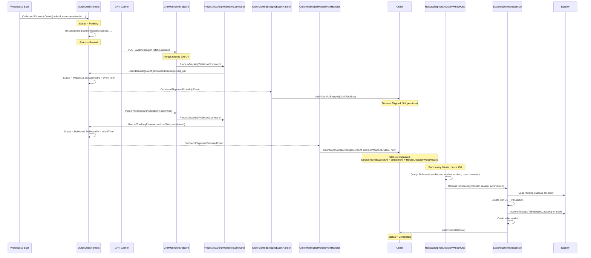

# 05 -- Shipping & Delivery

## Sequence: Warehouse to Delivery to Completion



## OutboundShipment Lifecycle

```
Pending -> Booked -> PickedUp -> InTransit -> Delivered
                                            \-> Failed -> Returning -> Returned
         \-> Cancelled (only before PickedUp)
```

### Key Methods

| Method | From Status | To Status | Domain Event |
|--------|-------------|-----------|-------------|
| `Create()` | -- | Pending | `OutboundShipmentCreatedEvent` |
| `RecordBooked()` | Pending | Booked | `OutboundShipmentBookedEvent` |
| `RecordPickedUp()` | Booked | PickedUp | `OutboundShipmentPickedUpEvent` |
| `RecordDelivered()` | PickedUp/InTransit | Delivered | `OutboundShipmentDeliveredEvent` |
| `RecordFailed()` | any | Failed | `OutboundShipmentFailedEvent` |
| `RecordReturning()` | any | Returning | `OutboundShipmentReturningEvent` |
| `RecordReturned()` | any | Returned | `OutboundShipmentReturnedEvent` |
| `Cancel()` | Pending/Booked | Cancelled | `OutboundShipmentCancelledEvent` |

`RecordTrackingEvent()` also auto-advances status based on `NormalizedTrackingStatus`:

| NormalizedStatus | Maps To |
|-----------------|---------|
| `picked_up` | PickedUp (also sets DispatchedAt) |
| `in_transit` | InTransit |
| `delivered` | Delivered (also sets DeliveredAt) |
| `failed` | Failed |
| `returning` | Returning |
| `returned` | Returned |

## OrderLifecycleEventHandlers

### OrderMarkedShippedEventHandler

Listens to: `OutboundShipmentPickedUpEvent`

```csharp
order.MarkAsShipped(clock.UtcNow)
```

- Guard: `Status` must be `Paid` or `Processing`
- Sets `Status = Shipped`, `ShippedAt = now`

### OrderMarkedDeliveredEventHandler

Listens to: `OutboundShipmentDeliveredEvent`

```csharp
var decisionWindowDays = runtimeSettings.Order.ReturnDecisionWindowDays;
order.MarkAsDelivered(
    notification.DeliveredAt,
    notification.DeliveredAt.AddDays(decisionWindowDays),
    clock.UtcNow);
```

- Guard: `Status` must be `Shipped` or `Processing`
- Sets `Status = Delivered`, `DeliveredAt`, `DecisionWindowEndsAt = deliveredAt + ReturnDecisionWindowDays`
- Default `ReturnDecisionWindowDays = 7` (from config)

## GHN Webhook Endpoint

**Route**: `POST /webhooks/ghn`
**Auth**: `AllowAnonymous`
**Convention**: Always returns 200 OK (non-200 causes GHN to retry indefinitely)

### Flow

1. Read raw body from request
2. Resolve GHN shipping provider via `IShippingProviderSelector.Select("ghn")`
3. Load active `ShippingProviderConfig` for GHN from DB
4. Parse webhook: `providerResult.Value.ParseWebhook(body, headers, query, config)` -- verifies ShopId
5. Dispatch `ProcessTrackingWebhookCommand` with normalized tracking data
6. On any error: log warning, still return 200 OK

### ProcessTrackingWebhookCommand

Dispatched fields:
- `ProviderCode`, `ClientOrderCode`, `CarrierTrackingNumber`
- `CarrierStatusRaw`, `CarrierStatusDesc`, `NormalizedStatusId`
- `Location`, `ReasonCode`, `ReasonDescription`
- `EventTime`, `RawPayloadJson`

This command calls `OutboundShipment.RecordTrackingEvent()` which auto-advances the shipment status and raises `OutboundTrackingEventRecordedEvent`. Status-specific events (`PickedUp`, `Delivered`, etc.) are raised by the explicit status-transition methods called from `RecordTrackingEvent`.

## ReleaseExpiredDecisionWindowJob

**Type**: `BackgroundService`
**Interval**: 10 minutes
**Batch size**: 100

### Query

```csharp
dbContext.Set<Order>()
    .Include(x => x.Return)
    .Include(x => x.Escrows)
    .Where(x =>
        x.Status == OrderStatus.Delivered &&
        x.DisputedAt == null &&
        x.DecisionWindowEndsAt != null &&
        x.DecisionWindowEndsAt <= nowUtc)
    .Take(100)
```

### Skip Condition

Orders with an active return are skipped:

```csharp
if (order.Return is not null &&
    order.Return.Status != OrderReturnStatus.Rejected &&
    order.Return.Status != OrderReturnStatus.Cancelled &&
    order.Return.Status != OrderReturnStatus.Resolved)
{
    continue;
}
```

Only orders with no return, or returns in terminal states (Rejected, Cancelled, Resolved), are eligible for auto-completion.

### EscrowSettlementService.ReleaseToSellerAsync

1. Load all `Escrow` records with `Status == Holding` for the order
2. Load seller's active `Wallet`
3. Create `PAYOUT` transaction: ref = `PAYOUT-{Guid:N}`, amount = sum of all escrows
4. Mark transaction completed
5. `sellerWallet.Credit(totalAmount, txId, ...)`
6. For each escrow: `escrow.ReleaseToSeller(txId, actorId ?? SystemActorId, now)` -- SystemActorId = `Guid.Empty`
7. `order.Complete(now)` -- Status = Completed, CompletedAt set

## Source Files

| File | Path |
|------|------|
| OrderLifecycleEventHandlers | `src/core/OIO.Application/Context/OrderContext/EventHandlers/OrderLifecycleEventHandlers.cs` |
| OutboundShipment | `src/core/OIO.Domain/Context/WarehouseContext/Aggregates/OutboundShipments/OutboundShipments.cs` |
| OutboundShipmentEvents | `src/core/OIO.Domain/Context/WarehouseContext/Aggregates/OutboundShipments/Events/OutboundShipmentEvents.cs` |
| GhnWebhookEndpoint | `src/presentation/OIO.Api/Endpoints/WarehouseContext/Webhooks/GhnWebhookEndpoint.cs` |
| ReleaseExpiredDecisionWindowJob | `src/infrastructure/OIO.Infrastructure/Scheduling/Jobs/Orders/ReleaseExpiredDecisionWindowJob.cs` |
| EscrowSettlementService | `src/core/OIO.Application/Context/OrderContext/Services/EscrowSettlementService.cs` |
