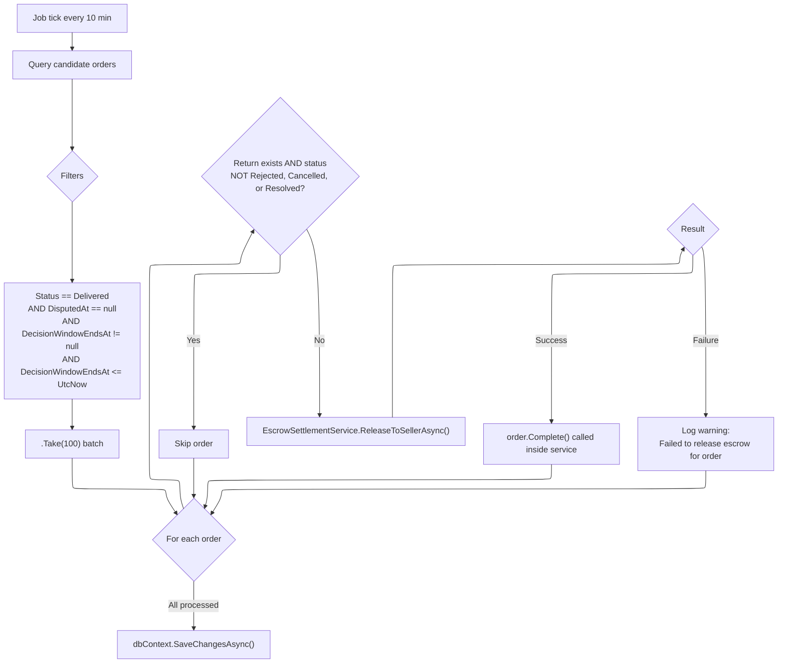

# Decision Window Expiry & Escrow Release

## Overview

After an order is delivered, a decision window gives the buyer time to request a return or open a dispute. When that window expires without action, a background job automatically releases escrowed funds to the seller and completes the order.

## Background Job: `ReleaseExpiredDecisionWindowJob`

| Property | Value |
|---|---|
| Base class | `BackgroundService` |
| Interval | 10 minutes (`TimeSpan.FromMinutes(10)`) |
| Batch size | 100 orders per tick |
| Scoped services | `ApplicationDbContext`, `EscrowSettlementService`, `IClock` |

**Source:** `src/infrastructure/OIO.Infrastructure/Scheduling/Jobs/Orders/ReleaseExpiredDecisionWindowJob.cs`

## Job Flow

## Candidate Query Criteria

The job queries orders matching ALL of the following conditions:

1. `Status == OrderStatus.Delivered` -- order must be in delivered state
2. `DisputedAt == null` -- no dispute has been opened
3. `DecisionWindowEndsAt != null` -- decision window was started
4. `DecisionWindowEndsAt <= clock.UtcNow` -- window has expired

Includes are loaded for `Return` and `Escrows` navigation properties.

## Skip Logic

For each candidate order, the job checks if there is an active return request. An order is **skipped** if:
- `order.Return` is not null, AND
- `order.Return.Status` is NOT `Rejected`, NOT `Cancelled`, NOT `Resolved`

This means the job only releases escrow when there is **no return** OR the return has been rejected/cancelled/resolved (terminal states that do not block payout).

## Escrow Release: `EscrowSettlementService.ReleaseToSellerAsync()`

When the job determines an order is safe to release, it calls `ReleaseToSellerAsync` with:
- `order` -- the order entity (with Escrows included)
- `reason` -- `"Decision window expired without return or dispute"`
- `actorId` -- `null` (system-initiated; defaults to `Guid.Empty` inside the service)

The release process inside the service:

1. **Load Holding escrows** -- queries `Escrow` entities where `OrderId` matches and `Status == EscrowStatus.Holding`
2. **Find seller wallet** -- looks up the seller's active wallet (`UserId == order.SellerId && IsActive`)
3. **Create Payout transaction** -- generates `Transaction` with type `TransactionType.Payout`, number format `PAYOUT-{GUIDv7}`, immediately marked as `Completed`
4. **Credit seller wallet** -- calls `sellerWallet.Credit(totalAmount, transactionId, ...)`
5. **Release each escrow** -- calls `escrow.ReleaseToSeller(transactionId, actorId, now)` which sets status to `ReleasedToSeller`, `ReleasedTo = Seller`, and raises `EscrowReleasedToSellerDomainEvent`
6. **Complete order** -- calls `order.Complete(now)` to transition order to `Completed` status

All changes are saved in a single `SaveChangesAsync()` call back in the job after processing the entire batch.

## Error Handling

- The outer `ExecuteAsync` loop catches all exceptions and logs them without crashing the service
- Individual order failures within the batch are logged as warnings: `"Failed to release escrow for order {OrderId}: {Error}"`
- Failed orders do not block processing of remaining orders in the batch
- The job continues on the next tick regardless of failures

## Key Design Decisions

- **Batch processing**: Limits to 100 orders per tick to avoid long-running transactions
- **System actor**: When `actorId` is null, the service uses `UserId.From(Guid.Empty)` as the system actor
- **Idempotency**: Orders already completed or with escrows already released will naturally be excluded (status no longer `Delivered` or escrows no longer `Holding`)
