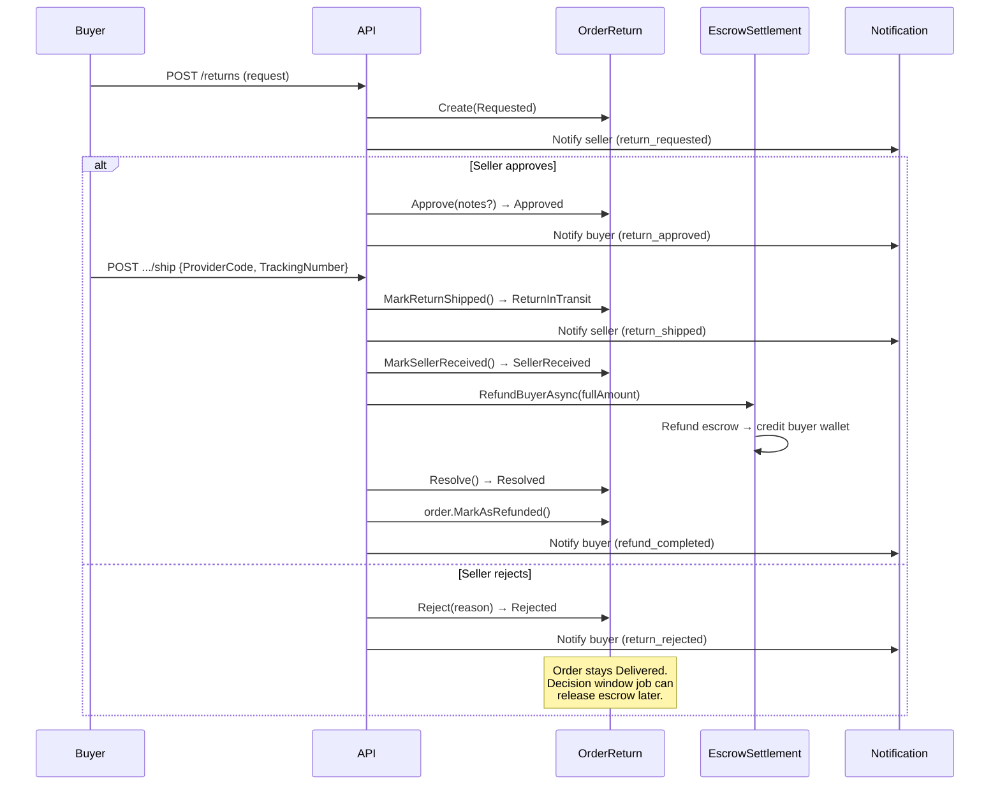

# Return Approval, Rejection, Shipping & Confirmation

## Overview

Once a buyer submits a return request, the return goes through a multi-step lifecycle involving both buyer and seller. This document covers all four subsequent return operations: seller approve, seller reject, buyer ship, and seller confirm receipt (which triggers automatic refund).

## Full Return Flow



## 1. Seller Approve Return

### Endpoint

| Property | Value |
|---|---|
| Method | `POST` |
| URL | `/api/orders/{orderId}/returns/{returnId}/approve` |
| Auth | Required (seller only) |
| Success | `200 OK` with `OrderReturnDto` |

**Source:** `src/presentation/OIO.Api/Endpoints/OrderContext/ApproveOrderReturnEndpoint.cs`

### Request Body

```json
{
  "notes": "string (optional)"
}
```

### Handler Logic

**Source:** `src/core/OIO.Application/Context/OrderContext/Commands/ApproveOrderReturn/ApproveOrderReturnCommand.cs`

1. Load order with `Return` included
2. Verify `order.SellerId == currentUser.UserId` (403 if not)
3. Verify `order.Return` exists and matches `returnId` (404 if not)
4. Call `order.Return.Approve(notes, DateTime.UtcNow)`
   - Requires `Status == Requested` (409 Conflict otherwise)
   - Sets `Status = Approved`, `ApprovedAt = now`, `DecisionReason = notes`
5. `SaveChangesAsync()`
6. Notify **buyer** with event `return_approved`, priority `High`

### Produced HTTP Responses

| Status | Description |
|---|---|
| `200 OK` | Return approved |
| `401 Unauthorized` | Not authenticated |
| `403 Forbidden` | Not the seller |
| `404 Not Found` | Order or return not found |
| `409 Conflict` | Return not in Requested status |

---

## 2. Seller Reject Return

### Endpoint

| Property | Value |
|---|---|
| Method | `POST` |
| URL | `/api/orders/{orderId}/returns/{returnId}/reject` |
| Auth | Required (seller only) |
| Success | `200 OK` with `OrderReturnDto` |

**Source:** `src/presentation/OIO.Api/Endpoints/OrderContext/RejectOrderReturnEndpoint.cs`

### Request Body

```json
{
  "reason": "string (required)"
}
```

### Handler Logic

**Source:** `src/core/OIO.Application/Context/OrderContext/Commands/RejectOrderReturn/RejectOrderReturnCommand.cs`

1. Load order with `Return` included
2. Verify `order.SellerId == currentUser.UserId` (403 if not)
3. Verify `order.Return` exists and matches `returnId` (404 if not)
4. Call `order.Return.Reject(reason, DateTime.UtcNow)`
   - Requires `Status == Requested` (409 Conflict otherwise)
   - Sets `Status = Rejected`, `RejectedAt = now`, `DecisionReason = reason`
5. `SaveChangesAsync()`
6. Notify **buyer** with event `return_rejected`, priority `High`, includes `reason` in metadata

### Effect on Order

The order **stays in Delivered status**. A rejected return is a terminal state for that return, but the `ReleaseExpiredDecisionWindowJob` treats `Rejected` as a safe-to-release condition, so the escrow will be released to the seller on the next job tick after the decision window expires.

### Produced HTTP Responses

| Status | Description |
|---|---|
| `200 OK` | Return rejected |
| `400 Bad Request` | Validation (missing reason) |
| `401 Unauthorized` | Not authenticated |
| `403 Forbidden` | Not the seller |
| `404 Not Found` | Order or return not found |
| `409 Conflict` | Return not in Requested status |

---

## 3. Buyer Ship Return

### Endpoint

| Property | Value |
|---|---|
| Method | `POST` |
| URL | `/api/orders/{orderId}/returns/{returnId}/ship` |
| Auth | Required (buyer only) |
| Success | `200 OK` with `OrderReturnDto` |

**Source:** `src/presentation/OIO.Api/Endpoints/OrderContext/ShipOrderReturnEndpoint.cs`

### Request Body

```json
{
  "providerCode": "string (required)",
  "trackingNumber": "string (required)"
}
```

### Handler Logic

**Source:** `src/core/OIO.Application/Context/OrderContext/Commands/ShipOrderReturn/ShipOrderReturnCommand.cs`

1. Load order with `Return` included
2. Verify `order.BuyerId == currentUser.UserId` (403 if not)
3. Verify `order.Return` exists and matches `returnId` (404 if not)
4. Call `order.Return.MarkReturnShipped(providerCode, trackingNumber, DateTime.UtcNow, DateTime.UtcNow)`
   - Requires `Status == Approved` (409 Conflict otherwise)
   - Sets `ProviderCode`, `TrackingNumber`, `ShippedAt`, `ReturnedAt = now`
   - Sets `Status = ReturnInTransit`
5. `SaveChangesAsync()`
6. Notify **seller** with event `return_shipped`, priority `High`, includes `providerCode` and `trackingNumber` in metadata

### Produced HTTP Responses

| Status | Description |
|---|---|
| `200 OK` | Return shipment recorded |
| `400 Bad Request` | Validation (missing fields) |
| `401 Unauthorized` | Not authenticated |
| `403 Forbidden` | Not the buyer |
| `404 Not Found` | Order or return not found |
| `409 Conflict` | Return not in Approved status |

---

## 4. Seller Confirm Return Received

### Endpoint

| Property | Value |
|---|---|
| Method | `POST` |
| URL | `/api/orders/{orderId}/returns/{returnId}/confirm-received` |
| Auth | Required (seller only) |
| Success | `200 OK` with `OrderReturnDto` |
| Request Body | None |

**Source:** `src/presentation/OIO.Api/Endpoints/OrderContext/ConfirmOrderReturnReceivedEndpoint.cs`

### Handler Logic

**Source:** `src/core/OIO.Application/Context/OrderContext/Commands/ConfirmOrderReturnReceived/ConfirmOrderReturnReceivedCommand.cs`

1. Load order with `Return` and `Escrows` included
2. Verify `order.SellerId == currentUser.UserId` (403 if not)
3. Verify `order.Return` exists and matches `returnId` (404 if not)
4. Call `order.Return.MarkSellerReceived(DateTime.UtcNow)`
   - Requires `Status == ReturnInTransit` or `Status == Approved` (409 otherwise)
   - Sets `Status = SellerReceived`, `SellerReceivedAt = now`, `SellerConfirmedReceivedAt = now`
5. Call `EscrowSettlementService.RefundBuyerAsync(order, partialAmount: null, reason: "Return received by seller", actorId: currentUser.UserId)`
   - Full refund to buyer (no partial amount)
   - Sets `order.MarkAsRefunded()` inside the service
6. Call `order.Return.Resolve(DateTime.UtcNow)`
   - Sets `Status = Resolved`
7. `SaveChangesAsync()`
8. Notify **buyer** with event `refund_completed`, priority `High`

### Produced HTTP Responses

| Status | Description |
|---|---|
| `200 OK` | Return confirmed, refund processed |
| `401 Unauthorized` | Not authenticated |
| `403 Forbidden` | Not the seller |
| `404 Not Found` | Order or return not found |
| `409 Conflict` | Return not in valid status for confirmation |

---

## OrderReturn Status Transitions

| From | Action | To |
|---|---|---|
| `requested` | Seller approves | `approved` |
| `requested` | Seller rejects | `rejected` |
| `approved` | Buyer ships | `return_in_transit` |
| `approved` or `return_in_transit` | Seller confirms receipt | `seller_received` |
| `seller_received` | Resolve after refund | `resolved` |
| Any non-terminal | Cancel | `cancelled` |

**All statuses:** `requested`, `approved`, `rejected`, `return_in_transit`, `seller_received`, `buyer_followup`, `resolved`, `cancelled`

## Notification Summary

| Step | Recipient | Event Type | Priority |
|---|---|---|---|
| Approve | Buyer | `return_approved` | High |
| Reject | Buyer | `return_rejected` | High |
| Ship | Seller | `return_shipped` | High |
| Confirm received | Buyer | `refund_completed` | High |
