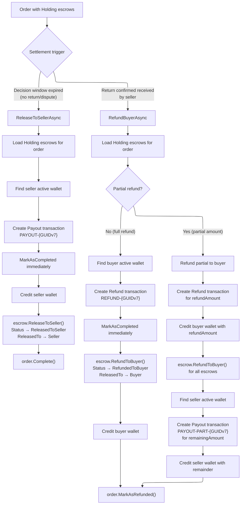

# Escrow Settlement

## Overview

The `EscrowSettlementService` handles the final disposition of escrowed funds: releasing to the seller when an order completes normally, or refunding the buyer when a return is confirmed. It also supports partial refunds that split funds between buyer and seller.

**Source:** `src/core/OIO.Application/Context/OrderContext/Services/EscrowSettlementService.cs`

## Settlement Decision Flow

## `ReleaseToSellerAsync()`

Releases all held escrow funds to the seller's wallet and completes the order.

### Parameters

| Parameter | Type | Description |
|---|---|---|
| `order` | `Order` | Order entity (with Escrows loaded) |
| `reason` | `string` | Reason for release |
| `actorId` | `UserId?` | Initiator; `null` defaults to `Guid.Empty` (system) |
| `cancellationToken` | `CancellationToken` | |

### Steps

1. **Query escrows**: `Escrow` where `OrderId == order.Id` and `Status == EscrowStatus.Holding`
2. **Guard**: If no escrows found, return `OrderErrors.Order.EscrowNotFound`
3. **Find seller wallet**: Active wallet for `order.SellerId`; 404 if not found
4. **Calculate total**: `escrows.Sum(x => x.Amount.Amount)`
5. **Create Payout transaction**:
   - `TransactionNumber`: `PAYOUT-{Guid.CreateVersion7():N}`
   - `TransactionType`: `Payout`
   - `Money`: total amount in escrow currency
   - Description: `"Escrow release for order {orderNumber}. Reason: {reason}"`
   - Immediately `MarkAsCompleted(GatewayInfo.Empty, now)`
6. **Credit seller wallet**: `sellerWallet.Credit(totalAmount, transactionId, ...)`
7. **Release each escrow**: `escrow.ReleaseToSeller(transactionId, actorId, now)`
   - Sets `Status = ReleasedToSeller`, `ReleasedTo = Seller`
   - Creates `EscrowReleaseEvent` with type `Full`, reason `"SellerRelease"`
   - Raises `EscrowReleasedToSellerDomainEvent`
8. **Complete order**: `order.Complete(now)`

### Callers

- `ReleaseExpiredDecisionWindowJob` -- automatic, `actorId: null`

---

## `RefundBuyerAsync()`

Refunds escrowed funds to the buyer's wallet. Supports full or partial refunds.

### Parameters

| Parameter | Type | Description |
|---|---|---|
| `order` | `Order` | Order entity (with Escrows loaded) |
| `partialAmount` | `decimal?` | If null, refunds the full held amount |
| `reason` | `string` | Reason for refund |
| `actorId` | `UserId?` | Initiator; `null` defaults to `Guid.Empty` (system) |
| `cancellationToken` | `CancellationToken` | |

### Steps

1. **Query escrows**: `Escrow` where `OrderId == order.Id` and `Status == EscrowStatus.Holding`
2. **Guard**: If no escrows found, return `OrderErrors.Order.EscrowNotFound`
3. **Calculate**: `totalHeldAmount = escrows.Sum(...)`, `refundAmount = partialAmount ?? totalHeldAmount`
4. **Validate amount**: `refundAmount` must be > 0 and <= `totalHeldAmount` (returns `Refund.InvalidAmount` otherwise)
5. **Find buyer wallet**: Active wallet for `order.BuyerId`; 404 if not found
6. **Create Refund transaction**:
   - `TransactionNumber`: `REFUND-{Guid.CreateVersion7():N}`
   - `TransactionType`: `Refund`
   - Immediately `MarkAsCompleted(GatewayInfo.Empty, now)`
7. **Release each escrow**: `escrow.RefundToBuyer(refundTransactionId, actorId, now)`
   - Sets `Status = RefundedToBuyer`, `ReleasedTo = Buyer`
   - Creates `EscrowReleaseEvent` with type `Refund`, reason `"BuyerRefund"`
   - Raises `EscrowRefundedToBuyerDomainEvent`
8. **Credit buyer wallet**: `buyerWallet.Credit(refundAmount, transactionId, ...)`

### Partial Refund (when `partialAmount` is provided and less than `totalHeldAmount`)

After refunding the buyer, the service also pays out the remainder to the seller:

9. **Find seller wallet**: Active wallet for `order.SellerId`
10. **Calculate remainder**: `totalHeldAmount - refundAmount`
11. **Create partial Payout transaction**:
    - `TransactionNumber`: `PAYOUT-PART-{Guid.CreateVersion7():N}`
    - `TransactionType`: `Payout`
    - Immediately `MarkAsCompleted`
12. **Credit seller wallet**: `sellerWallet.Credit(remainingAmount, ...)`

### Final Step (both full and partial)

13. **Mark order refunded**: `order.MarkAsRefunded(now)`

### Callers

- `ConfirmOrderReturnReceivedCommandHandler` -- `partialAmount: null` (full refund), `actorId: currentUser.UserId`

---

## Escrow Entity

**Source:** `src/core/OIO.Domain/Context/PaymentContext/Aggregates/Escrows/Escrow.cs`

| Property | Type | Description |
|---|---|---|
| `Id` | `EscrowId` | Primary key (GUIDv7) |
| `OrderId` | `OrderId` | Associated order |
| `HoldTransactionId` | `TransactionId?` | Transaction that created the hold |
| `ReleaseTransactionId` | `TransactionId?` | Transaction that released the hold |
| `Amount` | `Money` | Held amount |
| `Currency` | `string` | Currency code |
| `Status` | `EscrowStatus` | Current status |
| `HeldAt` | `DateTime` | When escrow was created |
| `ReleasedAt` | `DateTime?` | When escrow was released |
| `ReleasedTo` | `EscrowReleaseTo` | Who received the funds |
| `ReleaseEvents` | `IReadOnlyCollection<EscrowReleaseEvent>` | Audit trail |

### EscrowStatus Values

| Value | Description |
|---|---|
| `holding` | Funds held in escrow |
| `released_to_seller` | Released to seller (order completed) |
| `refunded_to_buyer` | Refunded to buyer (return confirmed) |
| `disputed` | Under dispute |

### EscrowReleaseTo Values

| Value | Description |
|---|---|
| `none` | Not yet released |
| `platform` | Released to platform |
| `seller` | Released to seller |
| `buyer` | Refunded to buyer |

## Domain Events

| Event | Trigger |
|---|---|
| `EscrowReleasedToSellerDomainEvent` | `escrow.ReleaseToSeller()` |
| `EscrowRefundedToBuyerDomainEvent` | `escrow.RefundToBuyer()` |

Both events carry: `EscrowId`, `OrderId`, `Amount`, `Currency`, `Timestamp`.
