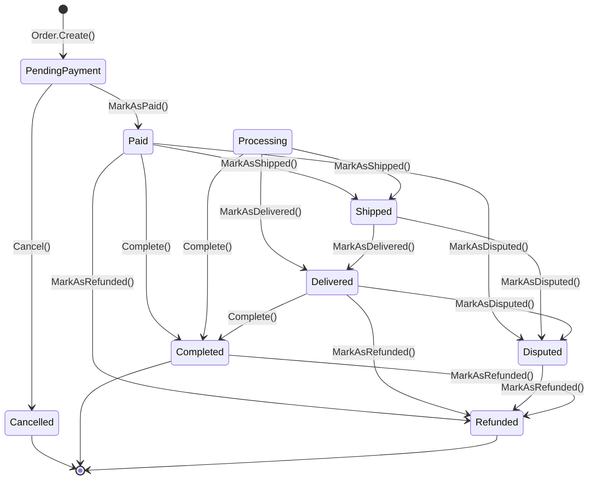
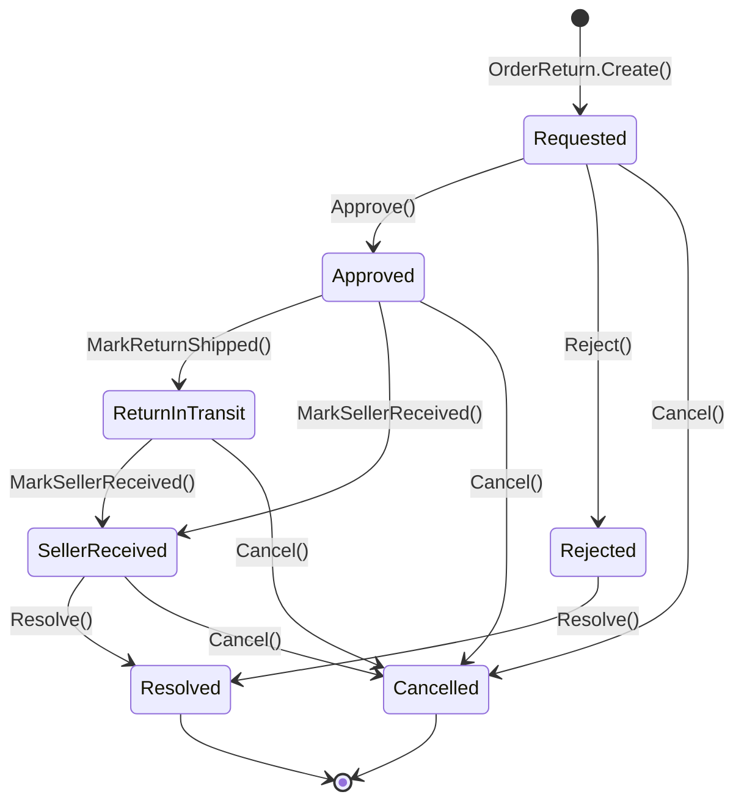
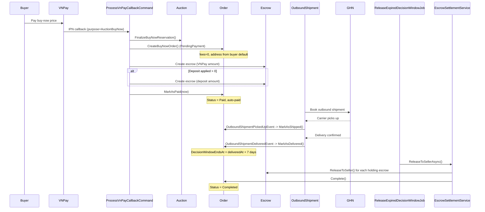
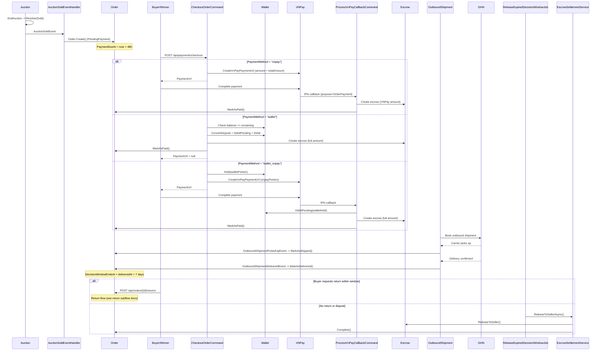

# 10 -- Order Lifecycle

## 1. Order State Machine

## 2. Order Return State Machine

## 3. Path A -- Buy Now Order (auto-created, auto-paid)

## 4. Path B -- Auction Winner Order (checkout required)

## Subflow Index

| # | File | Description |
|---|------|-------------|
| 01 | [01-auto-create-from-auction.md](01-auto-create-from-auction.md) | Order creation from buy-now and auction-won paths |
| 02 | [02-checkout-payment.md](02-checkout-payment.md) | Checkout payment command (3 methods) |
| 03 | [03-payment-callback.md](03-payment-callback.md) | VNPay callback for order payment |
| 04 | [04-cancel-expired.md](04-cancel-expired.md) | CancelExpiredOrdersJob background job |
| 05 | [05-shipping-delivery.md](05-shipping-delivery.md) | Shipping and delivery via GHN webhooks |

## Key Entities

| Entity | Aggregate Root | Description |
|--------|----------------|-------------|
| `Order` | Yes | Core order aggregate with status, pricing, shipping snapshot, payment timestamps |
| `OrderReturn` | No (owned by Order) | 1:1 via `uq_order_returns_order`. Tracks return request through approval, shipping, receipt |
| `Escrow` | Yes | Holds funds in escrow per order. Multiple escrows per order (VNPay + deposit). Status: Holding -> Released/Refunded |
| `OutboundShipment` | Yes | Warehouse-to-buyer shipment. Lifecycle: Pending -> Booked -> PickedUp -> InTransit -> Delivered |

## Background Jobs

| Job | Interval | Batch Size | Description |
|-----|----------|------------|-------------|
| `CancelExpiredOrdersJob` | 5 min | 100 | Cancels PendingPayment orders past PaymentDueAt. Marks auction as payment_defaulted, creates UserRiskFlag ("non_payment", Medium), MonitoringAlert, checks auto-suspend threshold |
| `ReleaseExpiredDecisionWindowJob` | 10 min | 100 | Finds Delivered orders with expired DecisionWindowEndsAt (no active return/dispute). Calls `EscrowSettlementService.ReleaseToSellerAsync()` to release escrow and mark order Completed |

## All Endpoints

| Method | Route | Handler | Auth | Description |
|--------|-------|---------|------|-------------|
| GET | `api/orders/{orderId}` | `GetOrderByIdQuery` | Yes | Get order details by ID |
| GET | `api/me/orders` | `GetMyOrdersQuery` | Yes | List current user's orders |
| POST | `api/payments/checkout` | `CheckoutOrderCommand` | Yes | Checkout order (vnpay / wallet / wallet_vnpay) |
| POST | `api/payments/vnpay/ipn` | `ProcessVnPayCallbackCommand` | No | VNPay IPN callback (order payment path) |
| POST | `api/orders/{orderId}/returns` | `RequestOrderReturnCommand` | Yes | Create return request (buyer, within decision window) |
| POST | `api/orders/{orderId}/returns/{returnId}/approve` | `ApproveOrderReturnCommand` | Yes | Approve return request |
| POST | `api/orders/{orderId}/returns/{returnId}/reject` | `RejectOrderReturnCommand` | Yes | Reject return request (reason required) |
| POST | `api/orders/{orderId}/returns/{returnId}/ship` | `ShipOrderReturnCommand` | Yes | Record return shipment (providerCode + trackingNumber) |
| POST | `api/orders/{orderId}/returns/{returnId}/confirm-received` | `ConfirmOrderReturnReceivedCommand` | Yes | Seller confirms return item received |
| POST | `webhooks/ghn` | `ProcessTrackingWebhookCommand` | No | GHN carrier webhook (updates OutboundShipment status) |

## Domain Events

| Event | Raised By | Description |
|-------|-----------|-------------|
| `OrderCancelledEvent` | `Order.Cancel()` | Fired when order is cancelled (includes OrderId, BuyerId, OrderNumber, Reason) |
| `AuctionSoldEvent` | Auction grain | Auction ended with a winner. Triggers `AuctionSoldEventHandler` which creates the order |
| `OutboundShipmentCreatedEvent` | `OutboundShipment.Create()` | Shipment created for an order |
| `OutboundShipmentBookedEvent` | `OutboundShipment.RecordBooked()` | Carrier confirmed booking, tracking number assigned |
| `OutboundShipmentPickedUpEvent` | `OutboundShipment.RecordPickedUp()` | Carrier picked up from warehouse. Triggers `OrderMarkedShippedEventHandler` |
| `OutboundShipmentDeliveredEvent` | `OutboundShipment.RecordDelivered()` | Carrier confirmed delivery. Triggers `OrderMarkedDeliveredEventHandler` |
| `OutboundShipmentFailedEvent` | `OutboundShipment.RecordFailed()` | Shipment delivery failed |
| `OutboundShipmentReturningEvent` | `OutboundShipment.RecordReturning()` | Package returning to sender |
| `OutboundShipmentReturnedEvent` | `OutboundShipment.RecordReturned()` | Package returned to warehouse |
| `OutboundShipmentCancelledEvent` | `OutboundShipment.Cancel()` | Shipment cancelled (only before PickedUp) |
| `OutboundTrackingEventRecordedEvent` | `OutboundShipment.RecordTrackingEvent()` | Any carrier tracking status update recorded |

## Configuration

| Key | Default | Source |
|-----|---------|--------|
| `Order:ReturnDecisionWindowDays` | `7` | appsettings.json / `IRuntimeSettings.Order.ReturnDecisionWindowDays` |
| `Ops:AutoSuspendAfterNonPaymentCount` | (configurable) | `IRuntimeSettings.Ops.AutoSuspendAfterNonPaymentCount` |
| Payment deadline (auction winner) | 48 hours | `AuctionSoldEventHandler.PaymentDeadlineHours` constant |
