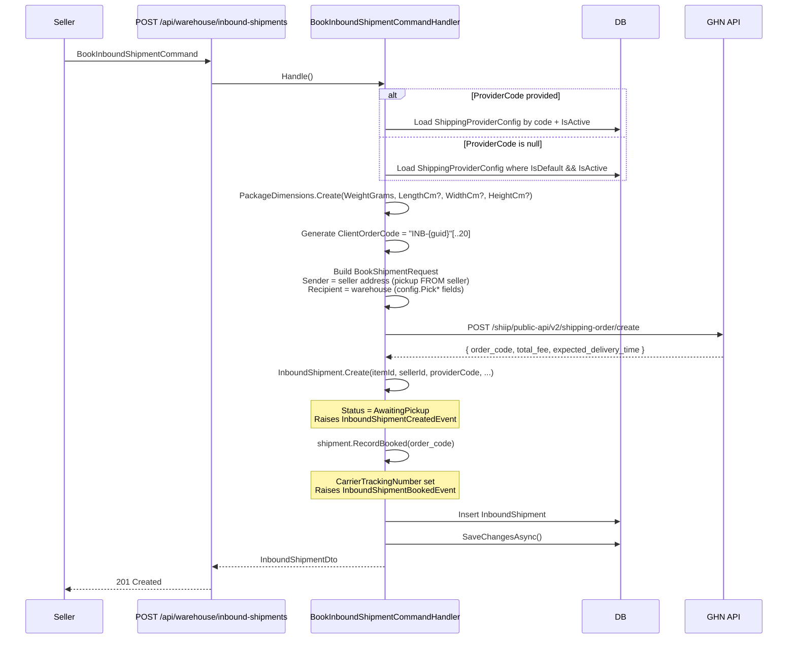

# 01 -- Book Inbound Shipment

> Seller books a shipment to send their item to the OIO warehouse via GHN carrier.

---

## Sequence Diagram

---

## Endpoint

| Field | Value |
|---|---|
| **Method** | `POST` |
| **URL** | `/api/warehouse/inbound-shipments` |
| **Permission** | `warehouse:inbound:book` (`Catalogs.Warehouse.BookInbound`) |
| **Response** | `201 Created` with `InboundShipmentDto` |

---

## Request DTO: `BookInboundShipmentCommand`

| Field | Type | Required | Description |
|---|---|---|---|
| `ItemId` | `Guid` | Yes | The catalog item being shipped to warehouse |
| `SenderName` | `string` | Yes | Seller's name (pickup contact) |
| `SenderPhone` | `string` | Yes | Seller's phone |
| `SenderAddress` | `string` | Yes | Seller's street address |
| `SenderWard` | `string` | Yes | Ward / Phuong |
| `SenderDistrict` | `string` | Yes | District / Quan |
| `SenderProvince` | `string` | Yes | Province / Tinh |
| `WeightGrams` | `int` | Yes | Package weight in grams (> 0) |
| `InsuranceValue` | `decimal` | Yes | Insurance value (>= 0) |
| `ItemName` | `string` | Yes | Item name for carrier manifest |
| `ItemPrice` | `decimal` | Yes | Item price for carrier manifest (>= 0) |
| `LengthCm` | `int?` | No | Package length in cm |
| `WidthCm` | `int?` | No | Package width in cm |
| `HeightCm` | `int?` | No | Package height in cm |
| `SenderCarrierAddressDataJson` | `string?` | No | GHN address IDs: `{"district_id": 1442, "ward_code": "21012"}` |
| `ProviderCode` | `string?` | No | `"ghn"` / `"ghtk"` / `"external"`. Null = use default active provider |
| `Notes` | `string?` | No | Internal notes |
| `GhnHandlingNote` | `string?` | No | `CHOTHUHANG` (allow try) / `CHOXEMHANGKHONGTHU` (allow see) / `KHONGCHOXEMHANG` (no inspection) |

---

## Handler Logic (`BookInboundShipmentCommandHandler`)

1. **Load ShippingProviderConfig** -- by `ProviderCode` if specified, otherwise load default active config.
   - Error `ShippingProvider.NotFound` if no matching active config.
   - Error `ShippingProvider.NoDefault` if no default provider configured.

2. **Build PackageDimensions** -- `PackageDimensions.Create(weightGrams, lengthCm?, widthCm?, heightCm?)`.

3. **Generate ClientOrderCode** -- `$"INB-{Guid.NewGuid():N}"[..20]` (20-char unique reference).

4. **Call carrier API** -- `IShippingService.BookShipmentAsync()` builds the `BookShipmentRequest`:
   - **Sender** = seller's address (carrier picks up FROM the seller)
   - **Recipient** = warehouse address (from `config.Pick*` fields)
   - `CodAmount = 0` (inbound -- no COD collection)
   - Single item in manifest: `{ Name, Code = clientOrderCode, Quantity = 1, Price, WeightGrams }`

5. **Create InboundShipment** -- `InboundShipment.Create()` with `Status = AwaitingPickup`. Raises `InboundShipmentCreatedEvent`.

6. **Record booking** -- `shipment.RecordBooked(booking.CarrierTrackingNumber)` stores the GHN `order_code`. Raises `InboundShipmentBookedEvent`.

7. **Persist** -- insert and save.

---

## GHN API Call

| Field | Value |
|---|---|
| **Endpoint** | `POST /shiip/public-api/v2/shipping-order/create` |
| **Auth Headers** | `Token: {config.Credentials.token}`, `ShopId: {config.Credentials.shop_id}` |
| **Our ref** | `client_order_code` = `ClientOrderCode` |
| **Their ref** | `order_code` = stored as `CarrierTrackingNumber` |
| **Response fields used** | `order_code`, `total_fee` (-> `ShippingFee`), `expected_delivery_time` (-> `ExpectedArrivalAt`) |

**Base URLs:**
- Sandbox: `https://dev-online-gateway.ghn.vn`
- Production: `https://online-gateway.ghn.vn`

---

## Validations

| Field | Rule | Source |
|---|---|---|
| `ItemId` | Must not be empty GUID | `BookInboundShipmentCommand.Validate()` |
| `SenderName` | Not whitespace | `BookInboundShipmentCommand.Validate()` |
| `SenderPhone` | Not whitespace | `BookInboundShipmentCommand.Validate()` |
| `SenderAddress` | Not whitespace | `BookInboundShipmentCommand.Validate()` |
| `SenderWard` | Not whitespace | `BookInboundShipmentCommand.Validate()` |
| `SenderDistrict` | Not whitespace | `BookInboundShipmentCommand.Validate()` |
| `SenderProvince` | Not whitespace | `BookInboundShipmentCommand.Validate()` |
| `WeightGrams` | Greater than 0 | `BookInboundShipmentCommand.Validate()` |
| `InsuranceValue` | Non-negative | `BookInboundShipmentCommand.Validate()` |
| `ItemName` | Not whitespace | `BookInboundShipmentCommand.Validate()` |
| `ItemPrice` | Non-negative | `BookInboundShipmentCommand.Validate()` |

---

## Error Codes

| Code | When |
|---|---|
| `ShippingProvider.NotFound` | Specified provider code not found or inactive |
| `ShippingProvider.NoDefault` | No default active provider configured |
| `InboundShipment.AlreadyBooked` | `RecordBooked()` called but tracking number already set |
| `Ghn.CreateOrder.HttpError` | GHN returned non-success HTTP status |
| `Ghn.CreateOrder.ApiError` | GHN returned error code in response body |
| `Ghn.Address.Missing` | GHN requires carrier address data with `district_id` and `ward_code` |
