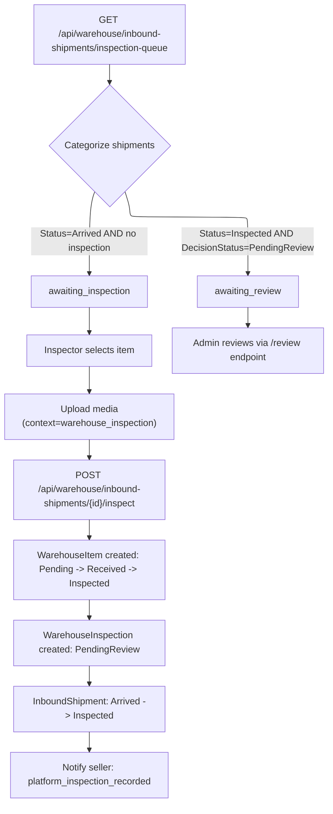

# 02 -- Inspector Queue & Warehouse Item Inspection

> Inspectors view the queue of arrived items and submit physical inspection results.

---

## Inspection Queue Flow

---

## Endpoint: Inspection Queue

| Field | Value |
|---|---|
| **Method** | `GET` |
| **URL** | `/api/warehouse/inbound-shipments/inspection-queue` |
| **Permission** | `warehouse:shipments:read` (`Catalogs.Warehouse.ReadShipments`) |
| **Query Params** | `page` (default 1), `pageSize` (default 20) |
| **Response** | `200 OK` with `InspectionQueueItemDto[]` |

### InspectionQueueItemDto

| Field | Type | Description |
|---|---|---|
| `InboundShipmentId` | `Guid` | Inbound shipment ID |
| `ItemId` | `Guid` | Catalog item ID |
| `ItemTitle` | `string` | Item title for display |
| `SellerId` | `Guid` | Seller user ID |
| `WarehouseItemId` | `Guid?` | Null if not yet inspected |
| `InspectionId` | `Guid?` | Null if not yet inspected |
| `ShipmentStatus` | `string` | `arrived` or `inspected` |
| `QueueStatus` | `string` | `awaiting_inspection` or `awaiting_review` |
| `CarrierTrackingNumber` | `string?` | GHN tracking number |
| `ArrivedAt` | `DateTime?` | When shipment arrived at warehouse |
| `DeclaredCondition` | `string` | Seller's declared item condition (from catalog Item) |
| `ConditionOnArrival` | `string?` | Inspector's assessed condition (null if not inspected) |
| `InspectedAt` | `DateTime?` | When inspection was performed |

### Queue Logic (`GetInspectionQueueQueryHandler`)

1. Load all `InboundShipment` where `Status == Arrived OR Status == Inspected`, ordered by `ArrivedAt` descending.
2. Batch-load related `WarehouseInspection` and `Item` records.
3. Categorize:
   - **`awaiting_inspection`**: `Status == Arrived` AND no `WarehouseInspection` exists.
   - **`awaiting_review`**: `Status == Inspected` AND `WarehouseInspection.DecisionStatus == PendingReview`.
4. Exclude items that don't match either category (already reviewed).
5. Paginate with `Skip/Take`.

---

## Endpoint: Inspect Warehouse Item

| Field | Value |
|---|---|
| **Method** | `POST` |
| **URL** | `/api/warehouse/inbound-shipments/{shipmentId}/inspect` |
| **Permission** | `warehouse:item:inspect` (`Catalogs.Warehouse.Inspect`) |
| **Response** | `200 OK` with `WarehouseInspectionDto` |

### Request DTO: `InspectWarehouseItemCommand`

| Field | Type | Required | Description |
|---|---|---|---|
| `InboundShipmentId` | `Guid` | Yes | Path param: the inbound shipment ID |
| `Condition` | `string` | Yes | Inspector-assessed condition |
| `InspectionNotes` | `string?` | No | Free-text notes |
| `InspectionMediaUploadIds` | `Guid[]` | Yes (min 1) | Pre-uploaded media IDs (context = `warehouse_inspection`) |

### Valid Condition Values (`WarehouseItemCondition`)

| Value | Description |
|---|---|
| `new` | Brand new, unopened |
| `like_new` | Opened but unused |
| `very_good` | Minor signs of use |
| `good` | Normal wear |
| `acceptable` | Heavy wear but functional |
| `damaged` | Significant damage |

---

## Handler Logic (`InspectWarehouseItemCommandHandler`)

1. **Validate media count** -- at least 1 `InspectionMediaUploadIds` required. Error: `WarehouseInspection.EvidenceRequired`.

2. **Load InboundShipment** -- must exist. Error: `InboundShipment.NotFound`.

3. **Check status** -- shipment must be `Arrived`. Error: `InboundShipment.CannotInspect`.

4. **Check no existing inspection** -- only one inspection per inbound shipment. Error: `WarehouseInspection.AlreadyExists`.

5. **Load Item** -- the catalog item (needed for `DeclaredCondition`). Error: `Item.NotFound`.

6. **Validate condition** -- `WarehouseItemCondition.FromId(condition)`. Error: `Warehouse.InvalidCondition`.

7. **Validate media uploads** -- all must:
   - Exist in database. Error: `Media.NotFounds`.
   - Be owned by current user. Error: `Media.NotOwnedByUser`.
   - Be confirmed. Error: `Media.NotConfirm`.
   - Have context = `warehouse_inspection`. Error: `Media.WrongContext`.
   - Not be already linked. Error: `Media.AlreadyLinked`.

8. **Create/update WarehouseItem**:
   - If no WarehouseItem exists for this shipment: `WarehouseItem.Create()` (status = `Pending`).
   - If status is `Pending`: `MarkReceived()` (-> `Received`).
   - `MarkInspected()` (-> `Inspected`).

9. **Create WarehouseInspection** -- `WarehouseInspection.Create()`:
   - `declaredCondition` = item's catalog condition
   - `conditionOnArrival` = inspector's assessed condition
   - `evidence` = serialized `InspectionEvidenceSnapshot` from media uploads
   - `DecisionStatus` = `PendingReview`

10. **Update InboundShipment** -- `shipment.RecordInspected(staffId)` -> status = `Inspected`. Raises `InboundShipmentInspectedEvent`.

11. **Link media** -- each upload is linked to the inspection entity and relocated via `IMediaRelocationService`.

12. **Persist** -- `SaveChangesAsync()`.

13. **Notify seller** -- dispatches notification:
    - Event type: `platform_inspection_recorded`
    - Message: "San pham da duoc kiem dinh va dang cho ket luan tu inspector."
    - Priority: Normal

---

## InboundShipmentArrivedEventHandler

**Trigger:** `InboundShipmentArrivedEvent` (raised when webhook delivers status = `delivered` for an inbound shipment, or when `RecordArrived()` is called).

**Logic:**
1. Load the `InboundShipment` and its related `Item`.
2. Skip if item status is not `PendingVerify`.
3. Find all active users with role `Inspector` or `Admin`.
4. Send notification to each:
   - Event type: `inbound_shipment_arrived_for_inspection`
   - Title: "Co hang cho kiem dinh"
   - Message: `San pham "{title}" da den kho va dang cho inspection.`
   - Priority: Normal

---

## Error Codes

| Code | When |
|---|---|
| `WarehouseInspection.EvidenceRequired` | No media upload IDs provided |
| `InboundShipment.NotFound` | Shipment ID does not exist |
| `InboundShipment.CannotInspect` | Shipment not in `arrived` status |
| `WarehouseInspection.AlreadyExists` | Inspection already recorded for this shipment |
| `Item.NotFound` | Catalog item not found |
| `Warehouse.InvalidCondition` | Unknown condition value |
| `Media.NotFounds` | One or more media upload IDs not found |
| `Media.NotOwnedByUser` | Media not owned by current user |
| `Media.NotConfirm` | Media upload not confirmed |
| `Media.WrongContext` | Media context is not `warehouse_inspection` |
| `Media.AlreadyLinked` | Media already linked to another entity |
| `WarehouseItem.NotInspected` | Item not in `received` status (for MarkInspected) |
