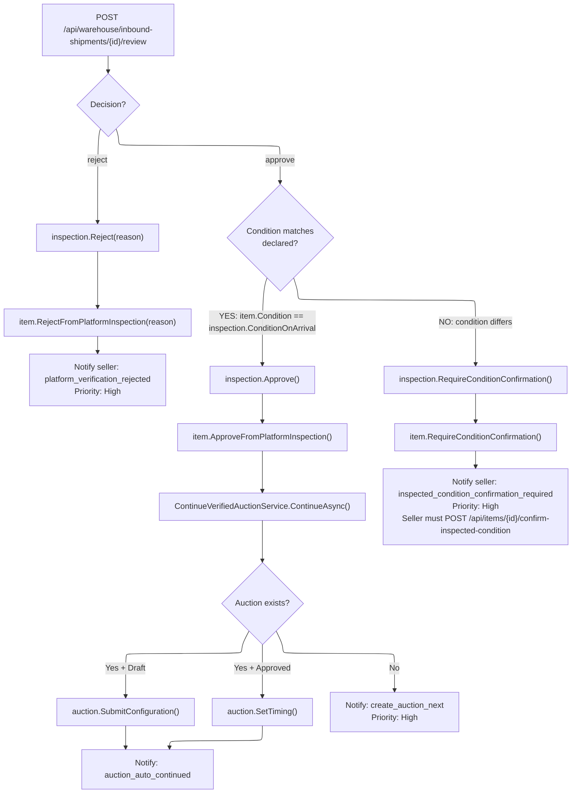

# 03 -- Inspection Review

> Admin reviews the warehouse inspection and decides whether to approve, reject,
> or require seller condition confirmation.

---

## Decision Flow

---

## Endpoint

| Field | Value |
|---|---|
| **Method** | `POST` |
| **URL** | `/api/warehouse/inbound-shipments/{shipmentId}/review` |
| **Permission** | `warehouse:item:inspect` (`Catalogs.Warehouse.Inspect`) |
| **Response** | `200 OK` with `WarehouseInspectionDto` |

### Request DTO: `ReviewWarehouseInspectionCommand`

| Field | Type | Required | Description |
|---|---|---|---|
| `InboundShipmentId` | `Guid` | Yes | Path param: the inbound shipment ID |
| `Decision` | `string` | Yes | `"approve"` or `"reject"` |
| `Reason` | `string?` | Required if reject | Rejection reason |

### Validation

- `InboundShipmentId`: must not be empty GUID.
- `Decision`: must not be whitespace, must be in set `["approve", "reject"]`.

---

## Three Decision Paths

### Path 1: Approve + Condition Matches

When `item.Condition.Id == inspection.ConditionOnArrival.Id` (case-sensitive string comparison):

1. `inspection.Approve(reviewerId, now)` -> `DecisionStatus = Approved`
2. `item.ApproveFromPlatformInspection(reviewerId, now)` -> Item status advances
3. `ContinueVerifiedAuctionService.ContinueAsync(itemId)`:
   - Loads the most recent `Auction` for this item
   - If auction is in `Draft` status: calls `auction.SubmitConfiguration()`
   - If auction is in `Approved` status with timing info: calls `auction.SetTiming()`
   - Returns `VerifiedAuctionContinuationResult { AuctionId, AuctionStatus, Continued }`
4. Notification to seller:
   - If auction continued: event = `auction_auto_continued_after_verification`
   - If no auction exists: event = `platform_verification_approved_create_auction_next` (Priority: High, includes action button to create auction)
   - Otherwise: event = `platform_verification_approved`

### Path 2: Approve + Condition Differs

When `item.Condition.Id != inspection.ConditionOnArrival.Id`:

1. `inspection.RequireConditionConfirmation(reviewerId, now)` -> `DecisionStatus = ConditionConfirmationRequired`
2. `item.RequireConditionConfirmation(reviewerId, now)` -> Item status reflects pending confirmation
3. Notification to seller:
   - Event: `inspected_condition_confirmation_required`
   - Message includes the actual condition found: `"tinh trang thuc te la \"{conditionOnArrival}\"`
   - Priority: High
   - Seller must respond via `POST /api/items/{id}/confirm-inspected-condition`

### Path 3: Reject

1. `reason` field is **required** -- error `WarehouseInspection.ReasonRequired` if missing.
2. `inspection.Reject(reviewerId, reason, now)` -> `DecisionStatus = Rejected`, `DecisionReason = reason`
3. `item.RejectFromPlatformInspection(reviewerId, reason, now)` -> Item status reflects rejection
4. Notification to seller:
   - Event: `platform_verification_rejected`
   - Message includes rejection reason
   - Priority: High

---

## Handler Logic (`ReviewWarehouseInspectionCommandHandler`)

1. **Load inspection** by `InboundShipmentId`. Error: `WarehouseInspection.NotFound`.
2. **Check not already reviewed** -- `DecisionStatus` must be `PendingReview`. Error: `WarehouseInspection.AlreadyReviewed`.
3. **Load Item** with `.Include(Media, ModerationReviews, Auctions)`. Error: `Item.NotFound`.
4. **Validate item status** -- must be `PendingVerify`. Error: `WarehouseInspection.InvalidItemState`.
5. **Execute decision path** (see above).
6. **Persist** -- `SaveChangesAsync()`.
7. **Send notification** based on decision outcome.

---

## ContinueVerifiedAuctionService

**Source:** `AuctionContext/Services/ContinueVerifiedAuctionService.cs`

Automatically advances an auction after platform verification is approved:

| Auction Status Before | Action | Auction Status After |
|---|---|---|
| `Draft` | `auction.SubmitConfiguration()` | Advances to next status |
| `Approved` (with timing) | `auction.SetTiming()` | Advances to scheduled/active |
| No auction found | Returns `{ Continued: false }` | N/A |
| Other status | No action | Unchanged |

---

## Error Codes

| Code | When |
|---|---|
| `WarehouseInspection.NotFound` | No inspection found for given shipment ID |
| `WarehouseInspection.AlreadyReviewed` | Inspection already has a decision |
| `Item.NotFound` | Catalog item not found |
| `WarehouseInspection.InvalidItemState` | Item is not in `PendingVerify` status |
| `WarehouseInspection.ReasonRequired` | Reject decision without reason |
| `WarehouseInspection.CannotReview` | Internal -- inspection not in PendingReview |
| `WarehouseInspection.UnsupportedApprovalCondition` | ConditionOnArrival cannot be mapped to ItemCondition for approval |
