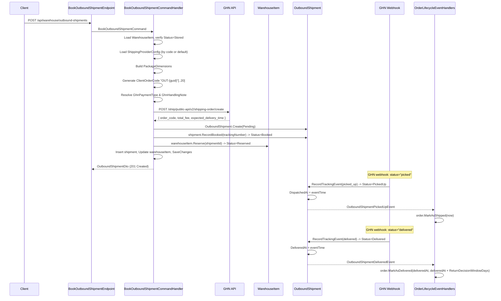

# Outbound Shipment

Books an outbound shipment to deliver a warehouse item to the buyer after order payment.

## End-to-End Sequence



## Endpoint

```
POST /api/warehouse/outbound-shipments
Permission: Warehouse.BookOutbound
```

### Request DTO (BookOutboundShipmentCommand)

| Field | Type | Required | Notes |
|---|---|---|---|
| `OrderId` | `Guid` | Yes | Must be non-empty GUID |
| `WarehouseItemId` | `Guid` | Yes | Must be non-empty GUID |
| `RecipientName` | `string` | Yes | Buyer name |
| `RecipientPhone` | `string` | Yes | Buyer phone |
| `RecipientAddress` | `string` | Yes | Buyer address |
| `RecipientWard` | `string` | Yes | Ward name |
| `RecipientDistrict` | `string` | Yes | District name |
| `RecipientProvince` | `string` | Yes | Province name |
| `WeightGrams` | `int` | Yes | Must be > 0 |
| `InsuranceValue` | `decimal` | Yes | Must be >= 0 |
| `CodAmount` | `decimal` | Yes | Must be >= 0 |
| `ItemName` | `string` | Yes | For carrier manifest |
| `ItemPrice` | `decimal` | Yes | Must be >= 0 |
| `LengthCm` | `int?` | No | Package length |
| `WidthCm` | `int?` | No | Package width |
| `HeightCm` | `int?` | No | Package height |
| `RecipientCarrierAddressDataJson` | `string?` | No | GHN: `{"district_id": 1442, "ward_code": "21012"}` |
| `ProviderCode` | `string?` | No | `null` = use default active provider |
| `GhnPaymentTypeId` | `string?` | No | `"1"` = shop pays (default), `"2"` = buyer pays (COD) |
| `GhnHandlingNote` | `string?` | No | See table below. Default: `CHOTHUHANG` |
| `ShippingMethod` | `string?` | No | Free-form shipping method label |
| `ExtraDataJson` | `string?` | No | `{"service_type_id": 2}` for GHN service override |

## Handler Logic

### Step 1: Load and validate WarehouseItem

Load by `WarehouseItemId`. Item must exist and have `Status == Stored`. If not stored, returns `WarehouseItem.NotAvailable`.

### Step 2: Load ShippingProviderConfig

- If `ProviderCode` is specified: look up active config matching that code
- If `ProviderCode` is null: look up the default active provider (`IsDefault && IsActive`)
- Error if not found: `ShippingProvider.NotFound` or `ShippingProvider.NoDefault`

### Step 3: Build PackageDimensions

Creates `PackageDimensions` value object from `WeightGrams`, `LengthCm`, `WidthCm`, `HeightCm`.

### Step 4: Generate ClientOrderCode

```csharp
var clientOrderCode = $"OUT-{Guid.NewGuid():N}"[..20];
```

Prefix `OUT-` identifies this as an outbound shipment in webhook processing.

### Step 5: Resolve GHN enums

| Input | Default | Resolution |
|---|---|---|
| `GhnPaymentTypeId` null/empty | `GhnPaymentType.ShopPays` (`"1"`) | `GhnPaymentType.FromId()` with fallback |
| `GhnHandlingNote` null/empty | `GhnHandlingNote.AllowTry` (`"CHOTHUHANG"`) | `GhnHandlingNote.FromId()` with fallback |

### Step 6: Call GHN API

Builds `BookShipmentRequest` with:
- **Recipient** = buyer address from command
- **Sender** = null (GHN uses the shop address registered in portal, matched by ShopId in auth headers)
- **Items**: single item with `Name`, `Code=clientOrderCode`, `Quantity=1`, `Price`, `WeightGrams`

Calls `IShippingService.BookShipmentAsync()` which delegates to GHN `POST /shiip/public-api/v2/shipping-order/create`.

Returns `ShipmentBookingResult` with `CarrierTrackingNumber` (GHN `order_code`), `ShippingFee` (`total_fee`), `EstimatedDeliveryAt`.

### Step 7: Create OutboundShipment

`OutboundShipment.Create()` with `Status=Pending`. Raises `OutboundShipmentCreatedEvent`.

### Step 8: Record booking and reserve item

1. `shipment.RecordBooked(carrierTrackingNumber, now, shippingLabelUrl, estimatedDeliveryAt)` -- sets `Status=Booked`. Raises `OutboundShipmentBookedEvent`.
2. `warehouseItem.Reserve(shipmentId, now)` -- sets `Status=Reserved`. Raises `WarehouseItemReservedEvent`.

### Step 9: Persist

Inserts the shipment and updates the warehouse item in a single transaction.

## GHN Webhook Chain

### PickedUp (GHN status: `picked`)

When GHN picks up the package from the warehouse:

1. `OutboundShipment.RecordTrackingEvent(picked_up)` sets `Status=PickedUp`, `DispatchedAt=eventTime`
2. Raises `OutboundShipmentPickedUpEvent`
3. `OrderMarkedShippedEventHandler` handles the event: calls `order.MarkAsShipped(now)`

Note: `WarehouseItem.MarkDispatched()` sets `Status=Dispatched` and clears `StorageLocationId=null` (freed from shelf). This is triggered separately when the picked_up tracking event is processed.

### Delivered (GHN status: `delivered`)

When GHN confirms delivery to the buyer:

1. `OutboundShipment.RecordTrackingEvent(delivered)` sets `Status=Delivered`, `DeliveredAt=eventTime`
2. Raises `OutboundShipmentDeliveredEvent`
3. `OrderMarkedDeliveredEventHandler` handles the event:
   - Reads `RuntimeSettings.Order.ReturnDecisionWindowDays`
   - Calls `order.MarkAsDelivered(deliveredAt, deliveredAt.AddDays(decisionWindowDays), now)`

## GhnPaymentType

| Id | Constant | Description |
|---|---|---|
| `"1"` | `ShopPays` | Warehouse/shop pays the shipping fee |
| `"2"` | `BuyerPays` | Buyer pays the shipping fee (COD) |

## GhnHandlingNote

| Id | Constant | Description |
|---|---|---|
| `CHOTHUHANG` | `AllowTry` | Allow buyer to inspect and try before accepting |
| `CHOXEMHANGKHONGTHU` | `AllowSee` | Allow buyer to see but not try |
| `KHONGCHOXEMHANG` | `NoInspection` | Do not allow buyer to inspect at all |

## OutboundShipment Lifecycle

```
Pending --> Booked --> PickedUp --> InTransit --> Delivered
                                              \-> Failed --> Returning --> Returned
        \-> Cancelled (only before PickedUp)
```

- `Cancel` is blocked when Status is `PickedUp`, `InTransit`, or `Delivered`
- `RecordDelivered` requires Status to be `InTransit` or `PickedUp`

## Error Codes

| Code | HTTP | Condition |
|---|---|---|
| `WarehouseItem.NotFound` | 404 | WarehouseItemId does not exist |
| `WarehouseItem.NotAvailable` | 409 | Item Status is not `Stored` |
| `ShippingProvider.NotFound` | 404 | No active provider for given code |
| `ShippingProvider.NoDefault` | 404 | No default provider configured |
| `OutboundShipment.AlreadyBooked` | 409 | CarrierTrackingNumber already set |
| `Ghn.CreateOrder.HttpError` | 500 | GHN returned non-success HTTP status |
| `Ghn.CreateOrder.ApiError` | 500 | GHN returned code != 200 |
| `Ghn.CreateOrder.Exception` | 500 | Unhandled exception calling GHN |
| `Ghn.Address.Missing` | 422 | RecipientCarrierAddressDataJson is required for GHN |
| `Ghn.Address.MissingFields` | 422 | Missing `district_id` or `ward_code` |
| `Ghn.Address.InvalidValues` | 422 | `district_id` is 0 or `ward_code` is empty |
