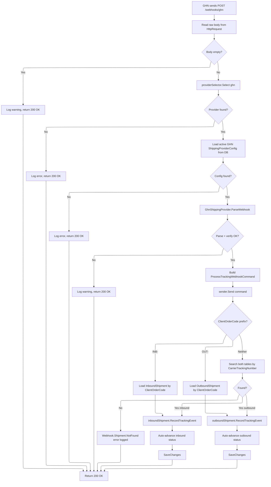

# GHN Webhook Tracking

Receives carrier status-update webhooks from GHN, normalizes statuses, and auto-advances shipment state.

## Webhook Processing Flow



## Endpoint

```
POST /webhooks/ghn
Auth: AllowAnonymous
Tags: Webhooks
Excluded from Swagger/Scalar
Always returns: 200 OK
```

## GHN Webhook JSON Format (GhnWebhookPayload)

| Field | JSON Key | Type | Description |
|---|---|---|---|
| `ShopId` | `ShopID` | `int` | Identifies the shop -- verified against config |
| `ClientOrderCode` | `ClientOrderCode` | `string?` | Our reference (INB-xxx or OUT-xxx) |
| `OrderCode` | `OrderCode` | `string` | GHN tracking number |
| `Status` | `Status` | `string` | GHN status string e.g. `"delivered"` |
| `ExtraInformation` | `ExtraInformation` | `string?` | Additional info |
| `Description` | `Description` | `string?` | Status description |
| `Reason` | `Reason` | `string?` | Failure/return reason |
| `Time` | `Time` | `string?` | ISO 8601 timestamp |
| `Timestamp` | `Timestamp` | `long?` | Unix seconds fallback |
| `Warehouse` | `Warehouse` | `string?` | Hub/location name |
| `WarehouseAddress` | `WarehouseAddress` | `string?` | Hub address |
| `CodAmount` | `CODAmount` | `decimal?` | COD amount |
| `CodTransferDate` | `CODTransferDate` | `string?` | COD transfer date |

## ParseWebhook Verification

GHN does not use HMAC signatures. Authentication is by matching `ShopId` in the webhook payload against the configured `shop_id` in `ShippingCredentials`.

1. Deserialize JSON to `GhnWebhookPayload`
2. Parse credentials from `ShippingProviderConfig.Credentials.RawJson`
3. Verify `payload.ShopId == creds.ShopId` -- mismatch returns `Ghn.Webhook.ShopIdMismatch`
4. Parse event time: try `Time` field (ISO 8601) first, fall back to `Timestamp` (Unix seconds), then `DateTime.UtcNow`
5. Normalize GHN status string to `NormalizedTrackingStatus`
6. Build location string: `"{Warehouse} - {WarehouseAddress}"` or just `Warehouse` if no address

## ProcessTrackingWebhookCommand

```csharp
public sealed record ProcessTrackingWebhookCommand(
    string  ProviderCode,
    string? ClientOrderCode,        // INB-xxx or OUT-xxx
    string? CarrierTrackingNumber,  // fallback lookup
    string  CarrierStatusRaw,
    string? CarrierStatusDesc,
    string  NormalizedStatusId,     // e.g. "delivered"
    string? Location,
    string? ReasonCode,
    string? ReasonDescription,
    DateTime EventTime,
    string  RawPayloadJson
) : ICommand;
```

### Shipment Type Detection

The handler determines shipment type from `ClientOrderCode` prefix:

| Prefix | Type | Lookup |
|---|---|---|
| `INB-` | Inbound | `InboundShipment` by `ClientOrderCode` |
| `OUT-` | Outbound | `OutboundShipment` by `ClientOrderCode` |
| Neither/null | Fallback | Search both tables by `CarrierTrackingNumber` (inbound first) |

If fallback search finds nothing: `Webhook.Shipment.NotFound` error.
If no `ClientOrderCode` and no `CarrierTrackingNumber`: `Webhook.NoReference` error.

## NormalizedTrackingStatus Values

| Id | Description |
|---|---|
| `confirmed` | Order confirmed/ready |
| `picked_up` | Carrier picked up package |
| `in_transit` | Package in transit |
| `delivered` | Delivered to recipient |
| `failed` | Delivery failed |
| `delayed` | Delivery delayed |
| `returning` | Package being returned |
| `returned` | Package returned to sender |
| `cancelled` | Shipment cancelled |

## GHN Status Normalization Mapping

| GHN Status | Normalized Status |
|---|---|
| `ready_to_pick` | `confirmed` |
| `picking` | `in_transit` |
| `picked` | `picked_up` |
| `storing` | `in_transit` |
| `transporting` | `in_transit` |
| `delivering` | `in_transit` |
| `delivered` | `delivered` |
| `delivery_fail` | `failed` |
| `waiting_to_return` | `returning` |
| `return` | `returning` |
| `returned` | `returned` |
| `cancel` | `cancelled` |
| `exception` | `failed` |
| `damage` | `failed` |
| `lost` | `failed` |
| _(unknown)_ | `in_transit` (default) |

## Auto-Advance Status Mapping

### Inbound Shipments

| Normalized Status | New Inbound Status | Condition |
|---|---|---|
| `picked_up` / `in_transit` / `delayed` | `InTransit` | Only if currently `AwaitingPickup` or `InTransit` |
| `delivered` | `Arrived` | Only if not already `Arrived`, `Inspected`, or `Completed` |
| `cancelled` | `Cancelled` | Only if not `Completed`, `Cancelled`, or `Failed` |
| `failed` / `returning` / `returned` | `Failed` | Only if not `Completed`, `Cancelled`, or `Failed` |

### Outbound Shipments

| Normalized Status | New Outbound Status | Side Effects |
|---|---|---|
| `picked_up` | `PickedUp` | Sets `DispatchedAt = eventTime` |
| `in_transit` | `InTransit` | -- |
| `delivered` | `Delivered` | Sets `DeliveredAt = eventTime` |
| `failed` | `Failed` | -- |
| `returning` | `Returning` | -- |
| `returned` | `Returned` | -- |

## ShipmentTrackingEvent Entity

Each webhook creates an append-only `ShipmentTrackingEvent` record:

| Field | Type | Description |
|---|---|---|
| `Id` | `ShipmentTrackingEventId` | GUID v7 |
| `ShipmentType` | `string` | `"inbound"` or `"outbound"` |
| `ShipmentId` | `Guid` | FK to inbound or outbound shipment |
| `ProviderCode` | `ShippingProviderCode` | e.g. `ghn` |
| `CarrierStatusRaw` | `string` | Exact status from carrier (never transformed) |
| `CarrierStatusDesc` | `string?` | Status description |
| `NormalizedStatus` | `NormalizedTrackingStatus` | Our mapped status |
| `Location` | `string?` | GHN: hub name. GHTK: station address |
| `ReasonCode` | `string?` | Failure reason code |
| `ReasonDescription` | `string?` | GHN: `Reason` field |
| `EventTime` | `DateTime` | Carrier's action timestamp (not our received time) |
| `RawPayload` | `WebhookRawPayload` | Full webhook body as JSON |
| `CreatedAt` | `DateTime` | When we recorded this event |

## Error Handling

Errors are logged but NEVER returned to GHN in the HTTP response. The endpoint always returns `200 OK` to prevent GHN from retrying indefinitely.

| Error Scenario | Behavior |
|---|---|
| Empty body | Log warning, return 200 |
| GHN provider not registered | Log error, return 200 |
| No active GHN config in DB | Log error, return 200 |
| ShopId mismatch | Log warning, return 200 |
| JSON parse failure | Log warning, return 200 |
| Shipment not found | Log warning, return 200 |
| Unknown normalized status | Log warning, return 200 |
| SaveChanges failure | Exception propagates (500), but GHN retries are acceptable for real errors |
