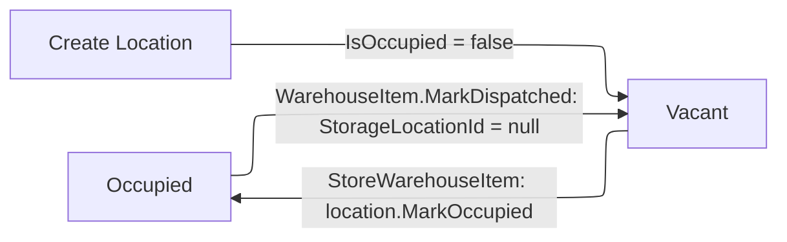

# Storage Management

CRUD operations for warehouse storage locations (physical shelves/bins).

## Entity: WarehouseStorageLocation

| Property | Type | Description |
|---|---|---|
| `Id` | `WarehouseStorageLocationId` | GUID v7 |
| `Zone` | `string` | Zone code, stored uppercase |
| `Aisle` | `string` | Aisle identifier |
| `Shelf` | `string` | Shelf identifier |
| `Bin` | `string` | Bin identifier |
| `Label` | `string` | Composite label: `"{Zone}-{Aisle}-{Shelf}-{Bin}"` e.g. `"A-01-03-02"` |
| `IsOccupied` | `bool` | Whether a warehouse item is stored here |
| `CreatedAt` | `DateTime` | Creation timestamp |

## Create Storage Location

### Endpoint

```
POST /api/warehouse/storage-locations
Permission: Warehouse.ManageLocations
```

### Request Body (CreateStorageLocationCommand)

```json
{
  "Zone": "A",
  "Aisle": "01",
  "Shelf": "03",
  "Bin": "02"
}
```

### Handler Logic

1. Trim all fields. Zone is converted to uppercase (`ToUpperInvariant()`)
2. Build label: `"{zone}-{aisle}-{shelf}-{bin}"`
3. **Uniqueness check**: query DB for existing location with same label
4. Create `WarehouseStorageLocation.Create(zone, aisle, shelf, bin, now)` -- `IsOccupied = false`
5. Insert and SaveChanges
6. Return `StorageLocationDto`

### Response: 201 Created

## List Storage Locations

### Endpoint

```
GET /api/warehouse/storage-locations
Permission: Warehouse.ManageLocations
```

### Query Parameters (GetStorageLocationsQuery)

| Parameter | Type | Default | Description |
|---|---|---|---|
| `VacantOnly` | `bool` | `false` | Filter to only show vacant (unoccupied) locations |
| `Zone` | `string?` | `null` | Filter by zone (uppercased before comparison) |
| `Search` | `string?` | `null` | Search by label (contains match) |
| `Page` | `int` | `1` | Page number |
| `PageSize` | `int` | `50` | Items per page |

### Sorting

Results are ordered by: `Zone` -> `Aisle` -> `Shelf` -> `Bin` (all ascending).

### Response: 200 OK with `IReadOnlyList<StorageLocationDto>`

## Update Storage Location

### Endpoint

```
PUT /api/warehouse/storage-locations/{locationId}
Permission: Warehouse.ManageLocations
```

### Request Body

```json
{
  "Zone": "B",
  "Aisle": "02",
  "Shelf": "01",
  "Bin": "05"
}
```

### Handler Logic

1. Load location by ID
2. **Occupied check**: cannot update if `IsOccupied == true` -- returns `StorageLocation.Occupied`
3. Build new label from trimmed/uppercased fields
4. **Label uniqueness check**: verify no other location (different ID) has the same label
5. `location.Update(zone, aisle, shelf, bin)` -- recalculates `Label`
6. SaveChanges
7. Return updated `StorageLocationDto`

### Response: 200 OK with `StorageLocationDto`

## Delete Storage Location

### Endpoint

```
DELETE /api/warehouse/storage-locations/{locationId}
Permission: Warehouse.ManageLocations
```

### Handler Logic

1. Load location by ID
2. **Occupied check**: cannot delete if `IsOccupied == true` -- returns `StorageLocation.Occupied`
3. Remove from DbSet
4. SaveChanges

### Response: 204 No Content

## IsOccupied Lifecycle



| Transition | Triggered By | Method |
|---|---|---|
| Vacant -> Occupied | `StoreWarehouseItemCommand` stores an item at this location | `location.MarkOccupied()` |
| Occupied -> Vacant | `WarehouseItem.MarkDispatched()` clears `StorageLocationId` | Item sets `StorageLocationId = null` |

The `WarehouseStorageLocation` entity exposes two methods:
- `MarkOccupied()` -- sets `IsOccupied = true`
- `MarkVacant()` -- sets `IsOccupied = false`

## Label Format

The label is a composite of all four location components:

```
{Zone}-{Aisle}-{Shelf}-{Bin}
```

- Zone is always uppercase (e.g. `"A"`, `"B"`, `"COLD"`)
- All parts are trimmed of whitespace
- Examples: `"A-01-03-02"`, `"B-02-01-05"`, `"COLD-01-01-01"`

Label uniqueness is enforced at both create and update time.

## Error Codes

| Code | HTTP | Condition |
|---|---|---|
| `StorageLocation.LabelAlreadyExists` | 409 | Another location with same label exists |
| `StorageLocation.Occupied` | 409 | Cannot update/delete an occupied location |
| `StorageLocation.NotFound` | 404 | Location ID does not exist |
