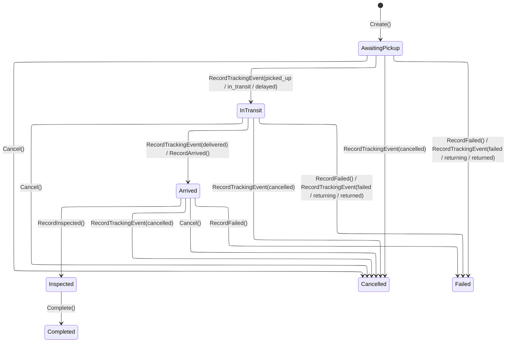
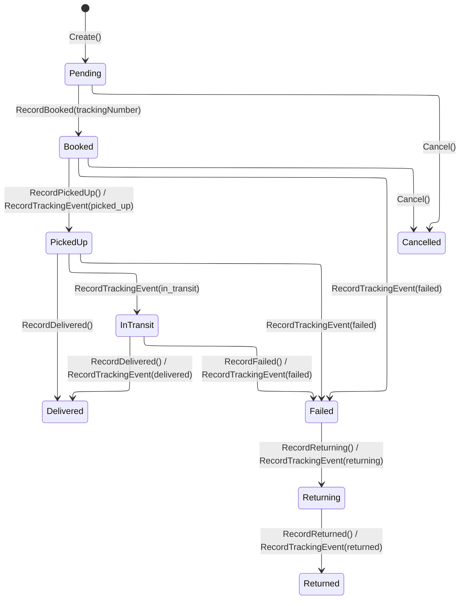
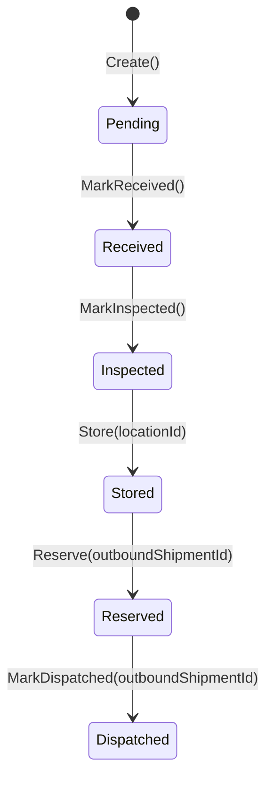
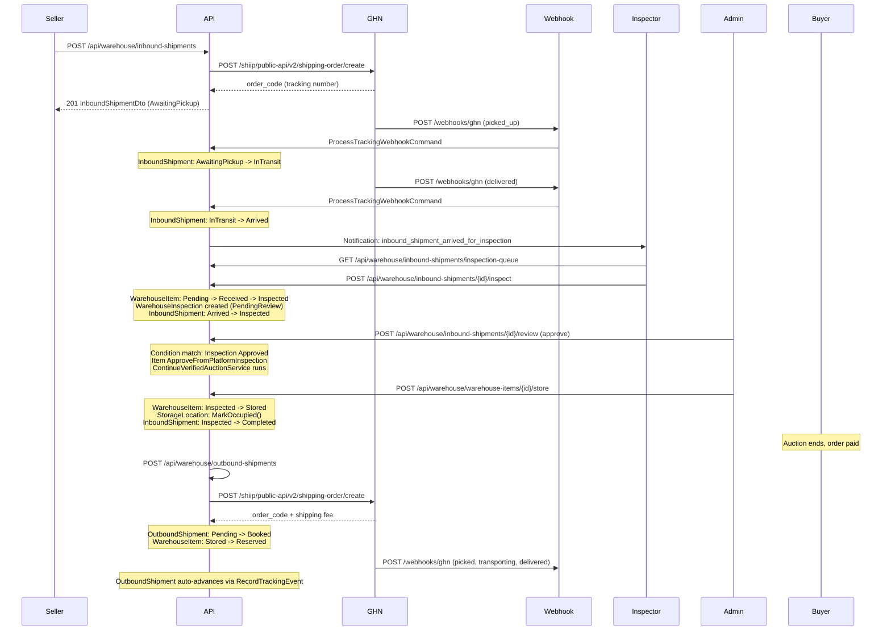

# Flow 11 -- Warehouse & Shipping

> Covers inbound shipments (seller to warehouse), warehouse inspection and storage,
> outbound shipments (warehouse to buyer), and carrier webhook processing via GHN.

---

## 1. State Machines

### 1.1 InboundShipment Status

**Source:** `InboundShipment.cs` -- statuses defined in `WarehouseEnums.cs` as `InboundShipmentStatus`.

### 1.2 OutboundShipment Status

**Source:** `OutboundShipments.cs` -- `Cancel()` rejects if status is `PickedUp`, `InTransit`, or `Delivered`.

### 1.3 WarehouseItem Status

**Source:** `WarehouseItem.cs` -- `Store()` sets `StorageLocationId` and marks `Stored`. `MarkDispatched()` clears `StorageLocationId` (frees the shelf).

### 1.4 End-to-End Sequence

---

## 2. Aggregates Overview

| Aggregate | Location | Key Fields |
|---|---|---|
| **InboundShipment** | `WarehouseContext/Aggregates/InboundShipments/` | `ItemId`, `SellerId`, `ProviderCode`, `ClientOrderCode`, `CarrierTrackingNumber`, `Status`, `Dimensions`, `ShippingFee`, `InsuranceValue`, `SenderCarrierAddressData` |
| **OutboundShipment** | `WarehouseContext/Aggregates/OutboundShipments/` | `OrderId`, `WarehouseItemId`, `ProviderCode`, `ClientOrderCode`, `CarrierTrackingNumber`, `ShippingLabelUrl`, `CodAmount`, `GhnPaymentType`, `GhnHandlingNote`, `Status` |
| **WarehouseItem** | `WarehouseContext/Aggregates/WarehouseItems/` | `ItemId`, `InboundShipmentId`, `StorageLocationId`, `Status`, `ReceivedAt` |
| **WarehouseInspection** | `WarehouseContext/Aggregates/WarehouseItems/` | `WarehouseItemId`, `InboundShipmentId`, `ItemId`, `DeclaredCondition`, `ConditionOnArrival`, `Evidence`, `DecisionStatus`, `DecisionReason`, `InspectedBy`, `ReviewedBy` |
| **WarehouseStorageLocation** | `WarehouseContext/Aggregates/WarehouseStorage/` | `Zone`, `Aisle`, `Shelf`, `Bin`, `Label`, `IsOccupied` |
| **ShippingProviderConfig** | `WarehouseContext/Aggregates/ShippingProviders/` | `ProviderCode`, `DisplayName`, `Environment`, `ApiBaseUrl`, `Credentials` (encrypted), `WebhookSecret`, `Pick*` (warehouse address), `IsActive`, `IsDefault` |

---

## 3. Endpoints

### 3.1 Inbound Shipments

| # | Method | URL | Permission | Handler | Description |
|---|--------|-----|------------|---------|-------------|
| 1 | `POST` | `/api/warehouse/inbound-shipments` | `warehouse:inbound:book` | `BookInboundShipmentCommand` | Book an inbound shipment (seller to warehouse) via GHN |
| 2 | `GET` | `/api/warehouse/inbound-shipments` | `warehouse:shipments:read` | `GetInboundShipmentsQuery` | List inbound shipments (paginated, filterable) |
| 3 | `GET` | `/api/warehouse/inbound-shipments/{shipmentId}` | `warehouse:shipments:read` | `GetInboundShipmentByIdQuery` | Get single inbound shipment details |
| 4 | `POST` | `/api/warehouse/inbound-shipments/{shipmentId}/cancel` | `warehouse:shipments:read` | `CancelInboundShipmentCommand` | Cancel inbound shipment + GHN cancel API |
| 5 | `GET` | `/api/warehouse/inbound-shipments/inspection-queue` | `warehouse:shipments:read` | `GetInspectionQueueQuery` | Get inspection queue (awaiting_inspection / awaiting_review) |
| 6 | `POST` | `/api/warehouse/inbound-shipments/{shipmentId}/inspect` | `warehouse:item:inspect` | `InspectWarehouseItemCommand` | Inspector submits inspection (condition + media) |
| 7 | `POST` | `/api/warehouse/inbound-shipments/{shipmentId}/review` | `warehouse:item:inspect` | `ReviewWarehouseInspectionCommand` | Admin reviews inspection (approve/reject) |

### 3.2 Outbound Shipments

| # | Method | URL | Permission | Handler | Description |
|---|--------|-----|------------|---------|-------------|
| 8 | `POST` | `/api/warehouse/outbound-shipments` | `warehouse:outbound:book` | `BookOutboundShipmentCommand` | Book outbound shipment (warehouse to buyer) via GHN |
| 9 | `GET` | `/api/warehouse/outbound-shipments` | `warehouse:shipments:read` | `GetOutboundShipmentsQuery` | List outbound shipments |
| 10 | `GET` | `/api/warehouse/outbound-shipments/{shipmentId}` | `warehouse:shipments:read` | `GetOutboundShipmentByIdQuery` | Get single outbound shipment details |
| 11 | `POST` | `/api/warehouse/outbound-shipments/{shipmentId}/cancel` | `warehouse:shipments:read` | `CancelOutboundShipmentCommand` | Cancel outbound shipment + GHN cancel + release WarehouseItem |

### 3.3 Warehouse Items & Storage

| # | Method | URL | Permission | Handler | Description |
|---|--------|-----|------------|---------|-------------|
| 12 | `GET` | `/api/warehouse/warehouse-items` | `warehouse:shipments:read` | `GetWarehouseItemsQuery` | List warehouse items |
| 13 | `POST` | `/api/warehouse/warehouse-items/{warehouseItemId}/store` | `warehouse:item:store` | `StoreWarehouseItemCommand` | Assign storage location to inspected item |
| 14 | `GET` | `/api/warehouse/storage-locations` | `warehouse:locations:manage` | `GetStorageLocationsQuery` | List all storage locations |
| 15 | `POST` | `/api/warehouse/storage-locations` | `warehouse:locations:manage` | `CreateStorageLocationCommand` | Create new storage location |
| 16 | `PUT` | `/api/warehouse/storage-locations/{locationId}` | `warehouse:locations:manage` | `UpdateStorageLocationCommand` | Update storage location |
| 17 | `DELETE` | `/api/warehouse/storage-locations/{locationId}` | `warehouse:locations:manage` | `DeleteStorageLocationCommand` | Delete storage location |

### 3.4 Config & Webhooks

| # | Method | URL | Permission | Handler | Description |
|---|--------|-----|------------|---------|-------------|
| 18 | `PUT` | `/api/warehouse/shipping-provider-configs/{configId}` | `warehouse:locations:manage` | `UpdateShippingProviderConfigCommand` | Update shipping provider config (credentials, pickup address) |
| W1 | `POST` | `/webhooks/ghn` | Anonymous | `GhnWebhookEndpoint` | GHN carrier status-update webhook (always returns 200) |

---

## 4. Permissions

| Permission String | Constant | Description |
|---|---|---|
| `warehouse:inbound:book` | `Catalogs.Warehouse.BookInbound` | Book inbound shipments |
| `warehouse:outbound:book` | `Catalogs.Warehouse.BookOutbound` | Book outbound shipments |
| `warehouse:item:inspect` | `Catalogs.Warehouse.Inspect` | Inspect items + review inspections |
| `warehouse:item:store` | `Catalogs.Warehouse.Store` | Assign storage locations to items |
| `warehouse:shipments:read` | `Catalogs.Warehouse.ReadShipments` | Read shipments, inspection queue, cancel shipments |
| `warehouse:locations:manage` | `Catalogs.Warehouse.ManageLocations` | CRUD storage locations + update shipping provider config |

**Source:** `AppPermissions.cs` lines 82-89; assigned to `Inspector` and `Admin` roles in `AppRoles.cs`.

---

## 5. Domain Events

### InboundShipment Events

| Event | Raised When |
|---|---|
| `InboundShipmentCreatedEvent` | `InboundShipment.Create()` |
| `InboundShipmentBookedEvent` | `RecordBooked(trackingNumber)` |
| `InboundShipmentArrivedEvent` | `RecordArrived()` |
| `InboundShipmentInspectedEvent` | `RecordInspected(inspectedBy)` |
| `InboundShipmentCompletedEvent` | `Complete()` |
| `InboundShipmentCancelledEvent` | `Cancel(reason)` |
| `InboundShipmentFailedEvent` | `RecordFailed(reason)` |
| `InboundTrackingEventRecordedEvent` | `RecordTrackingEvent()` |

### OutboundShipment Events

| Event | Raised When |
|---|---|
| `OutboundShipmentCreatedEvent` | `OutboundShipment.Create()` |
| `OutboundShipmentBookedEvent` | `RecordBooked(trackingNumber)` |
| `OutboundShipmentPickedUpEvent` | `RecordPickedUp()` |
| `OutboundShipmentDeliveredEvent` | `RecordDelivered(deliveredAt)` |
| `OutboundShipmentFailedEvent` | `RecordFailed(reason)` |
| `OutboundShipmentReturningEvent` | `RecordReturning(reason)` |
| `OutboundShipmentReturnedEvent` | `RecordReturned()` |
| `OutboundShipmentCancelledEvent` | `Cancel(reason)` |
| `OutboundTrackingEventRecordedEvent` | `RecordTrackingEvent()` |

### WarehouseItem Events

| Event | Raised When |
|---|---|
| `WarehouseItemCreatedEvent` | `WarehouseItem.Create()` |
| `WarehouseItemStoredEvent` | `Store(locationId, label)` |
| `WarehouseItemReservedEvent` | `Reserve(outboundShipmentId)` |
| `WarehouseItemDispatchedEvent` | `MarkDispatched(outboundShipmentId)` |

### Event Handler

| Handler | Trigger | Action |
|---|---|---|
| `InboundShipmentArrivedEventHandler` | `InboundShipmentArrivedEvent` | Notifies all active users with `Inspector` or `Admin` role that an item has arrived for inspection |

---

## 6. Inspection Decision Status

| Status | Value | Description |
|---|---|---|
| Pending Review | `pending_review` | Default after inspector creates inspection |
| Approved | `approved` | Admin approved, condition matches declared |
| Rejected | `rejected` | Admin rejected with reason |
| Condition Confirmation Required | `condition_confirmation_required` | Admin approved but inspected condition differs from declared; seller must confirm via `POST /api/items/{id}/confirm-inspected-condition` |
| Condition Confirmed | `condition_confirmed` | Seller confirmed the updated condition |

**Source:** `WarehouseInspectionDecisionStatus` in `WarehouseEnums.cs`.

---

## 7. Subflow Index

| # | File | Description |
|---|------|-------------|
| 1 | [01-inbound-shipment.md](01-inbound-shipment.md) | Book inbound shipment via GHN API |
| 2 | [02-inspector-queue.md](02-inspector-queue.md) | Inspection queue and warehouse item inspection |
| 3 | [03-inspection-review.md](03-inspection-review.md) | Admin review of inspection decisions |
| 4 | [04-store-warehouse-item.md](04-store-warehouse-item.md) | Store item in warehouse location |
