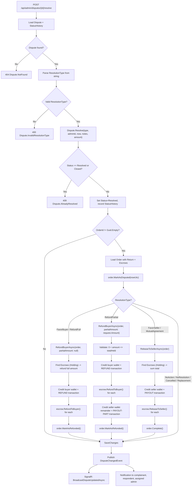

# 05 - Resolve Dispute

## Resolution Flow



## Endpoint

**POST** `/api/admin/disputes/{disputeId:guid}/resolve`

**Authorization:** `App.Permissions.Catalogs.Admin.ManageItems`

### Request Body

```json
{
  "ResolutionType": "favor_buyer",
  "Notes": "Seller failed to ship within SLA",
  "Amount": null
}
```

| Field | Type | Required | Description |
|-------|------|----------|-------------|
| ResolutionType | string | Yes | One of the 9 `ResolutionType` enum values |
| Notes | string? | No | Admin explanation for the resolution |
| Amount | decimal? | No | Required when `ResolutionType = refund_partial`; must be > 0 and <= total held escrow |

### Response

- **204 No Content** -- resolution applied successfully
- **400 Bad Request** -- validation failure (empty GUID, blank resolution type, invalid amount)
- **404 Not Found** -- dispute not found
- **409 Conflict** -- dispute already resolved or closed

## ResolutionType Enum

All 9 values defined in `ResolutionType : EnumValueObject<ResolutionType>`:

| Value | Escrow Action | Order Outcome |
|-------|--------------|---------------|
| `no_resolution` | None | No change |
| `refund_full` | `RefundBuyerAsync(partialAmount: null)` -- full escrow refunded to buyer | `MarkAsRefunded()` |
| `refund_partial` | `RefundBuyerAsync(partialAmount: Amount)` -- partial to buyer, remainder to seller | `MarkAsRefunded()` |
| `replacement` | None | No change |
| `favor_buyer` | `RefundBuyerAsync(partialAmount: null)` -- full escrow refunded to buyer | `MarkAsRefunded()` |
| `favor_seller` | `ReleaseToSellerAsync()` -- full escrow released to seller | `Complete()` |
| `mutual_agreement` | `ReleaseToSellerAsync()` -- full escrow released to seller | `Complete()` |
| `no_action` | None | No change |
| `cancelled` | None | No change |

## Handler Logic (ResolveDisputeCommandHandler)

**Source:** `OIO.Application/Context/ModerationContext/Commands/ResolveDispute/ResolveDisputeCommand.cs`

### Step-by-step

1. **Load dispute** with `StatusHistory` included via `GetByIdAsync`.
2. **Parse resolution type** using `ResolutionType.FromId(string)` -- returns `Maybe<ResolutionType>`.
3. **Domain method** `Dispute.Resolve(type, adminId, nowUtc, notes, amount)`:
   - Rejects if `Status == Resolved` or `Status == Closed` (409).
   - Sets `Status = Resolved`, `ResolutionType`, `ResolutionNotes`, `ResolutionAmount`, `ResolvedAt`, `ModifiedAt`.
   - Appends `DisputeStatusHistory`: `{oldStatus} -> resolved`, reason `"Resolved: {type.Id}"`.
4. **Order linkage check**: if `OrderId != Guid.Empty`, loads order with `Return` and `Escrows`.
5. **Mark order disputed**: `order.MarkAsDisputed(nowUtc)` -- skips error if already in `disputed` status.
6. **Escrow settlement** based on resolution type (see table above).
7. **Persist** via `SaveChangesAsync`.
8. **Publish** `DisputeChangedEvent(disputeId, nowUtc)`.

### DisputeChangedEvent Side Effects

**Source:** `OIO.Application/Context/ModerationContext/EventHandlers/DisputeRealtimeEventHandlers.cs`

- **SignalR:** `BroadcastDisputeUpdatedAsync(disputeId, metaDto, isInternal: false)` -- sends updated dispute metadata to connected clients.
- **Notifications:** Creates `CreateNotificationCommand` for each participant (complainant, respondent, assigned admin):
  - `EventType`: `"dispute_updated"`
  - `Title`: `"Dispute resolved"` when status is `resolved`
  - `Message`: `"Dispute {number} has been resolved."`
  - `Metadata`: `{ disputeId, status }`

## EscrowSettlementService

**Source:** `OIO.Application/Context/OrderContext/Services/EscrowSettlementService.cs`

### ReleaseToSellerAsync

Used by: `FavorSeller`, `MutualAgreement`

1. Query all `Escrow` records with `Status == Holding` for the order.
2. Load seller's active `Wallet`.
3. Create `PAYOUT-{guid}` transaction with `TransactionType.Payout`, mark completed immediately.
4. Credit seller wallet with total escrow amount.
5. Call `escrow.ReleaseToSeller()` on each escrow record.
6. `order.Complete()` to finalize the order.

### RefundBuyerAsync

Used by: `FavorBuyer`, `RefundFull`, `RefundPartial`

1. Query all `Escrow` records with `Status == Holding` for the order.
2. Determine refund amount: `partialAmount ?? totalHeldAmount`.
3. **Validation:** `refundAmount > 0 && refundAmount <= totalHeldAmount` -- else returns `Refund.InvalidAmount`.
4. Load buyer's active `Wallet`.
5. Create `REFUND-{guid}` transaction with `TransactionType.Refund`, mark completed immediately.
6. Call `escrow.RefundToBuyer()` on each escrow record.
7. Credit buyer wallet with refund amount.
8. **Partial refund only:** if `partialAmount` is set and less than total:
   - Load seller's active wallet.
   - Create `PAYOUT-PART-{guid}` transaction for `remainder = totalHeld - refundAmount`.
   - Credit seller wallet with the remainder.
9. `order.MarkAsRefunded()`.

## Partial Refund Details

When `ResolutionType = refund_partial`:

- `Amount` field in the request is **required** and passed as `partialAmount`.
- Must satisfy: `0 < Amount <= totalHeldEscrowAmount`.
- The buyer receives `Amount`; the seller receives `totalHeld - Amount`.
- Two separate transactions are created: one `REFUND` for the buyer, one `PAYOUT-PART` for the seller.

## Validation (Command)

```csharp
public ViolationsError Validate()
{
    return ResolveDisputeCommand.Check()
        .WithOwnerName("ResolveDispute")
        .Field(DisputeId).NotEmptyGuid()
        .Field(ResolutionType).NotWhiteSpace();
}
```

- `DisputeId` must be a non-empty GUID.
- `ResolutionType` must be a non-whitespace string.
- `Amount` validation happens downstream in `EscrowSettlementService.RefundBuyerAsync`.

## Error Codes

| Code | Type | Condition |
|------|------|-----------|
| `Dispute.NotFound` | 404 | Dispute ID does not exist |
| `Dispute.InvalidResolutionType` | 400 | String does not match any `ResolutionType` enum value |
| `Dispute.AlreadyResolved` | 409 | Dispute status is already `Resolved` or `Closed` |
| `Refund.InvalidAmount` | 400 | Refund amount <= 0 or exceeds total held escrow |
| `Wallet.NotFound` | 404 | Buyer or seller wallet not found |
| `Order.EscrowNotFound` | 404 | No escrows with `Holding` status for the order |

## Source Files

| File | Path |
|------|------|
| Command + Handler | `src/core/OIO.Application/Context/ModerationContext/Commands/ResolveDispute/ResolveDisputeCommand.cs` |
| Domain Aggregate | `src/core/OIO.Domain/Context/ModerationContext/Aggregates/Disputes/Dispute.cs` |
| ResolutionType Enum | `src/core/OIO.Domain/Context/ModerationContext/Enums/ResolutionType.cs` |
| EscrowSettlementService | `src/core/OIO.Application/Context/OrderContext/Services/EscrowSettlementService.cs` |
| Endpoint | `src/presentation/OIO.Api/Endpoints/AuctionContext/Admins/ResolveDisputeEndpoint.cs` |
| Event Handlers | `src/core/OIO.Application/Context/ModerationContext/EventHandlers/DisputeRealtimeEventHandlers.cs` |
