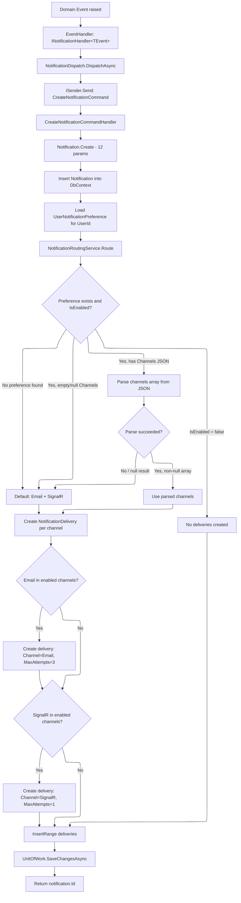

# 01 -- Event to Notification

## Flow



## CreateNotificationCommand Signature

```csharp
public sealed record CreateNotificationCommand(
    Guid UserId,                     // Target user
    string NotificationType,         // Category: auction, order, moderation, financial, etc.
    string EventType,                // Specific event: auction_won, order_shipped, etc.
    string Title,                    // Vietnamese display title
    string Message,                  // Vietnamese display message
    NotificationPriority? Priority = null,   // Default: Normal
    string? EntityType = null,       // Related entity type: Auction, Order, Item
    Guid? EntityId = null,           // Related entity PK
    string? Metadata = null,         // JSONB serialized event payload
    string? RelatedEntities = null,  // JSONB array
    string? Actions = null,          // JSONB array of action objects
    DateTime? ExpiresAt = null       // Optional TTL
) : ICommand<Guid>;
```

Returns `Result<Guid, Error>` where `Guid` is the created `NotificationId`.

## NotificationDispatch Helper

`NotificationDispatch` is an `internal static class` in the Application layer that provides three helper methods:

| Method | Signature | Purpose |
|---|---|---|
| `DispatchAsync` | `(ISender, ILogger, CreateNotificationCommand, CancellationToken) -> Task` | Sends the command via MediatR; logs warning on failure |
| `SerializeMetadata` | `(object?) -> string?` | Null-safe `JsonSerializer.Serialize` |
| `FormatAmount` | `(decimal, string?) -> string` | Formats amount with `vi-VN` culture (`N0`), appends currency if provided |

**DispatchAsync** never throws -- failures are logged as warnings and swallowed, so notification creation does not block the originating operation.

## NotificationRoutingService.Route() Logic

```
Input:  Notification, UserNotificationPreference?
Output: IEnumerable<NotificationDelivery>
```

**Decision tree:**

1. If `preference` is not null AND `preference.IsEnabled` is true:
   - Try to deserialize `preference.Channels` as `string[]`
   - If non-null/non-empty array: use those channels
   - If null/empty Channels string OR deserialization fails: fallback to `["Email", "SignalR"]`
2. If `preference` is null (no record exists): default to `["Email", "SignalR"]`
3. If `preference.IsEnabled` is false: return empty list (no deliveries)

**Channel-to-MaxAttempts mapping:**

| Channel | MaxAttempts |
|---|---|
| Email | 3 |
| SignalR | 1 |

## Notification Types

| NotificationType | Event Count | Example EventTypes |
|---|---|---|
| `auction` | 18 | auction_won, auction_sold, auction_started, auction_cancelled, runner_up_offer_received |
| `moderation` | 15 | item_approved, item_rejected, report_created, dispute_message_received |
| `order` | 9 | order_cancelled, order_shipped, order_delivered, return_requested |
| `financial` | 8 | wallet_credited, wallet_debited, escrow_released, withdrawal_completed |
| `account` | 2 | user_email_confirmed, user_status_changed |
| `security` | 2+ | suspicious_login_new_ip, user_locked_out, session_revoked (conditional) |
| `item_question` | 2 | item_question_asked, item_question_answered |
| `session` | 1+ | session_nearing_expiration, session_revoked (conditional) |
| `warehouse` | 1 | inbound_shipment_arrived_for_inspection |
| `verification` | 1+ | Dynamic per verification type from VerificationSubmittedEventHandler |

## Handler Pattern

All notification event handlers follow the same pattern:

1. Receive domain event via `INotificationHandler<TEvent>`
2. Load related entity from `IDbContext` if needed (e.g., Auction with Item, Order)
3. Return early with warning log if entity not found
4. Call `NotificationDispatch.DispatchAsync()` with a `CreateNotificationCommand` containing:
   - Target `UserId` (seller, buyer, or asker depending on context)
   - `NotificationType` category string
   - `EventType` specific string
   - Vietnamese `Title` and `Message`
   - `Priority` (Normal for info, High for rejections/cancellations)
   - `EntityType` and `EntityId` for deep linking
   - `Metadata` serialized via `NotificationDispatch.SerializeMetadata()`
