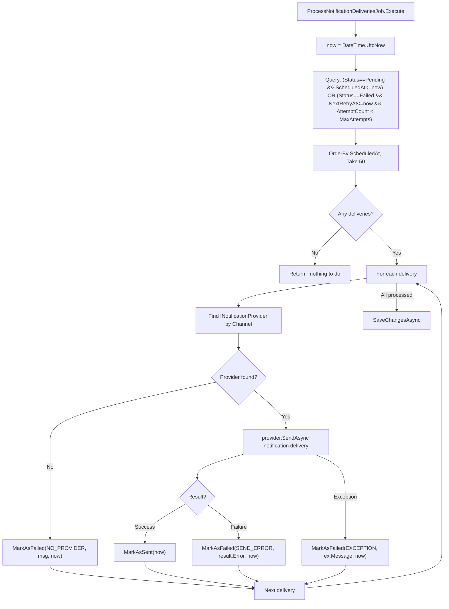

# 02 -- Delivery Background Job

## Flow



## Quartz Configuration

Defined in `ProcessNotificationDeliveriesJobSetup : IConfigureOptions<QuartzOptions>`:

| Setting | Value |
|---|---|
| Job type | `ProcessNotificationDeliveriesJob` |
| Schedule | `WithSimpleSchedule` -- interval 10 seconds, repeat forever |
| Concurrency | `[DisallowConcurrentExecution]` on job class |
| Job key | `ProcessNotificationDeliveriesJob` (class name) |

## Query Condition

The job queries `NotificationDelivery` entities that match either:

1. **New deliveries:** `Status == Pending AND ScheduledAt <= now`
2. **Retryable failures:** `Status == Failed AND NextRetryAt <= now AND AttemptCount < MaxAttempts`

Results are ordered by `ScheduledAt` ascending and limited to **50 per batch**.

The query includes `.Include(d => d.Notification)` to eagerly load the parent `Notification` entity, which providers need for title, message, userId, etc.

## Retry Strategy

| Channel | MaxAttempts | Retry behavior |
|---|---|---|
| Email | 3 | On failure with AttemptCount < MaxAttempts, `MarkAsFailed` is called. If `nextRetryAt` is provided, delivery stays queryable for retry. |
| SignalR | 1 | Single attempt only. Failure is permanent. |

### MarkAsFailed Logic

```csharp
public void MarkAsFailed(string errorCode, string errorMessage, DateTime failedAt, DateTime? nextRetryAt = null)
{
    AttemptCount++;
    ErrorCode = errorCode;
    ErrorMessage = errorMessage;

    if (AttemptCount >= MaxAttempts || nextRetryAt is null)
    {
        Status = NotificationDeliveryStatus.Failed;  // Permanent failure
        FailedAt = failedAt;
    }
    else
    {
        NextRetryAt = nextRetryAt;  // Status stays as-is, eligible for retry
    }
}
```

**Key detail:** When `nextRetryAt` is null (which is the case for all calls in `ProcessNotificationDeliveriesJob`), the delivery is permanently failed after the first failure increment. The job calls `MarkAsFailed(errorCode, message, now)` without providing `nextRetryAt`, so in practice Email deliveries also fail permanently on first attempt unless a caller explicitly provides a retry time.

### Error Codes

| ErrorCode | When |
|---|---|
| `NO_PROVIDER` | No `INotificationProvider` registered for the delivery's channel |
| `SEND_ERROR` | Provider returned `Result.Failure(message)` |
| `EXCEPTION` | Unhandled exception during `SendAsync` |

## NotificationDelivery State Transitions

| Current State | Trigger | New State | Fields Updated |
|---|---|---|---|
| Pending | `MarkAsSent(sentAt)` | Sent | `Status=Sent`, `SentAt=sentAt`, `DeliveryMetadata=metadata` |
| Pending | `MarkAsFailed(...)`, AttemptCount >= MaxAttempts or no nextRetryAt | Failed | `Status=Failed`, `AttemptCount++`, `ErrorCode`, `ErrorMessage`, `FailedAt` |
| Pending | `MarkAsFailed(...)`, AttemptCount < MaxAttempts and nextRetryAt provided | (stays Pending) | `AttemptCount++`, `ErrorCode`, `ErrorMessage`, `NextRetryAt` |

## Provider Resolution

The job resolves providers by matching `INotificationProvider.ChannelType` against `delivery.Channel.Id` (case-insensitive):

```csharp
var provider = _providers.FirstOrDefault(p =>
    p.ChannelType.Equals(delivery.Channel.Id, StringComparison.OrdinalIgnoreCase));
```

Registered providers:
- `EmailNotificationProvider` -- `ChannelType = "Email"`
- `SignalRNotificationProvider` -- `ChannelType = "SignalR"`
