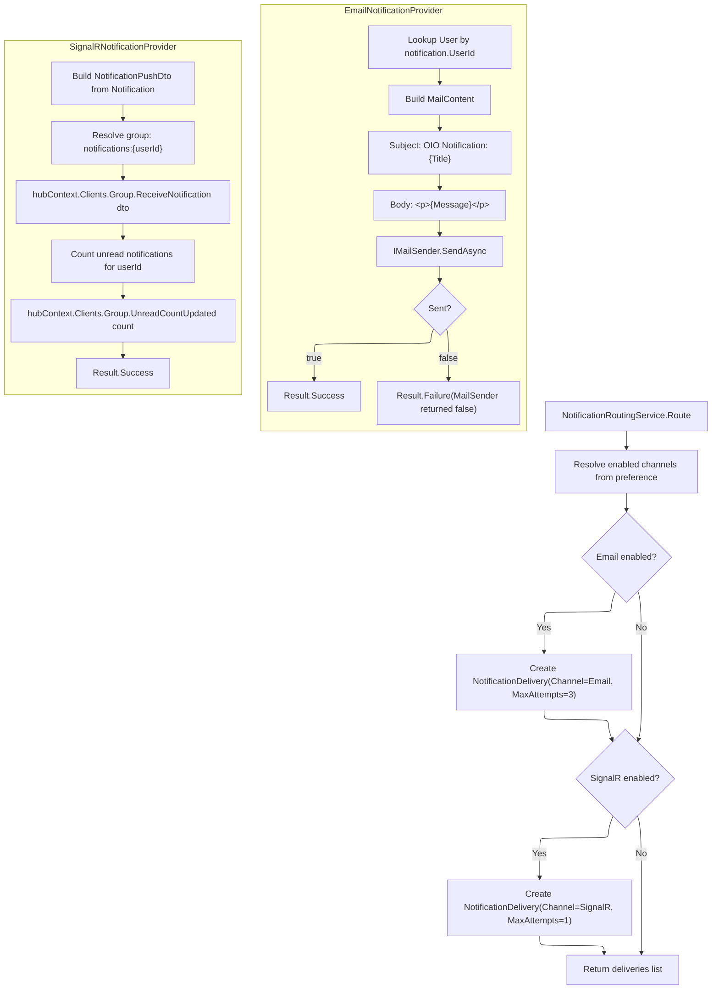

# 03 -- Notification Channels

## Channel Routing



## INotificationProvider Interface

```csharp
public interface INotificationProvider
{
    string ChannelType { get; }
    Task<Result> SendAsync(Notification notification, NotificationDelivery delivery, CancellationToken ct = default);
}
```

Two implementations are registered:

| Provider | ChannelType | Location |
|---|---|---|
| `EmailNotificationProvider` | `"Email"` | `OIO.Infrastructure` |
| `SignalRNotificationProvider` | `"SignalR"` | `OIO.Api` |

## Email Provider

**Class:** `EmailNotificationProvider` in `OIO.Infrastructure.Notification.Providers`

**Dependencies:** `IMailSender`, `ApplicationDbContext`

**Flow:**
1. Look up `User` entity by `notification.UserId` from database
2. If user not found, return `Result.Failure("User not found")`
3. Build `MailContent`:
   - **To:** `user.Email`
   - **Subject:** `"OIO Notification: {notification.Title}"`
   - **Body:** `"<p>{notification.Message}</p>"`
4. Call `IMailSender.SendAsync(content, ct)`
5. If returns `true` -> `Result.Success()`; if `false` -> `Result.Failure("MailSender returned false")`
6. Any exception is caught and returned as `Result.Failure(ex.Message)`

**Retry:** MaxAttempts=3 (set at delivery creation), but actual retry depends on job providing `nextRetryAt`.

## SignalR Provider

**Class:** `SignalRNotificationProvider` in `OIO.Api.Services`

**Dependencies:** `IHubContext<NotificationHub, INotificationHubClient>`, `IDbContext`

**Flow:**
1. Build `NotificationPushDto` from the `Notification` entity:
   ```
   NotificationPushDto(
       NotificationId,
       NotificationType,
       EventType,
       Title,
       Message,
       EntityType,
       EntityId,
       Priority.Id,    // string value of the enum
       CreatedAt
   )
   ```
2. Resolve group name: `NotificationHub.UserGroupName(notification.UserId.Value)` -> `"notifications:{userId}"`
3. Push `ReceiveNotification(dto)` to the group
4. Query unread count: `COUNT(Notification WHERE UserId == notification.UserId AND Status == Unread)`
5. Push `UnreadCountUpdated(unreadCount)` to the same group
6. Return `Result.Success()`
7. Any exception is caught and returned as `Result.Failure(ex.Message)`

**Retry:** MaxAttempts=1 (single attempt only).

## NotificationHub

**Class:** `NotificationHub : Hub<INotificationHubClient>` in `OIO.Api.Hubs`

| Attribute | Value |
|---|---|
| Route | `/hubs/notifications` |
| Auth | `[Authorize]` |
| Tag | `ApiEndpoint.Tags.Hub` |

**Lifecycle:**

| Event | Action |
|---|---|
| `OnConnectedAsync` | `Groups.AddToGroupAsync(connectionId, "notifications:{userId}")` |
| `OnDisconnectedAsync` | `Groups.RemoveFromGroupAsync(connectionId, "notifications:{userId}")` |

The hub resolves the current user via `ICurrentUser.UserId`.

## INotificationHubClient

```csharp
public interface INotificationHubClient
{
    Task ReceiveNotification(NotificationPushDto notification);
    Task UnreadCountUpdated(int count);
}
```

## NotificationPushDto

| Field | Type | Source |
|---|---|---|
| `NotificationId` | `Guid` | `notification.Id.Value` |
| `NotificationType` | `string` | `notification.NotificationType` |
| `EventType` | `string` | `notification.EventType` |
| `Title` | `string` | `notification.Title` |
| `Message` | `string` | `notification.Message` |
| `EntityType` | `string?` | `notification.EntityType` |
| `EntityId` | `Guid?` | `notification.EntityId` |
| `Priority` | `string` | `notification.Priority.Id` |
| `CreatedAt` | `DateTime` | `notification.CreatedAt` |

## InApp Channel

The `NotificationChannel.InApp` value (`"In App"`) exists in the enum but **no `INotificationProvider` implementation** is registered for it. If a delivery is created with `Channel = InApp`, the background job will fail it with error code `NO_PROVIDER`.

In practice, the `NotificationRoutingService` only creates deliveries for `Email` and `SignalR` channels, so InApp deliveries are never created by the current routing logic.
