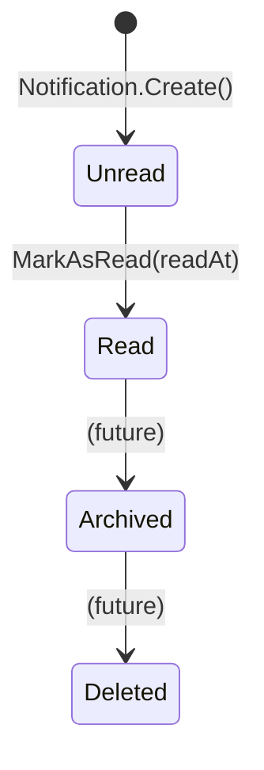
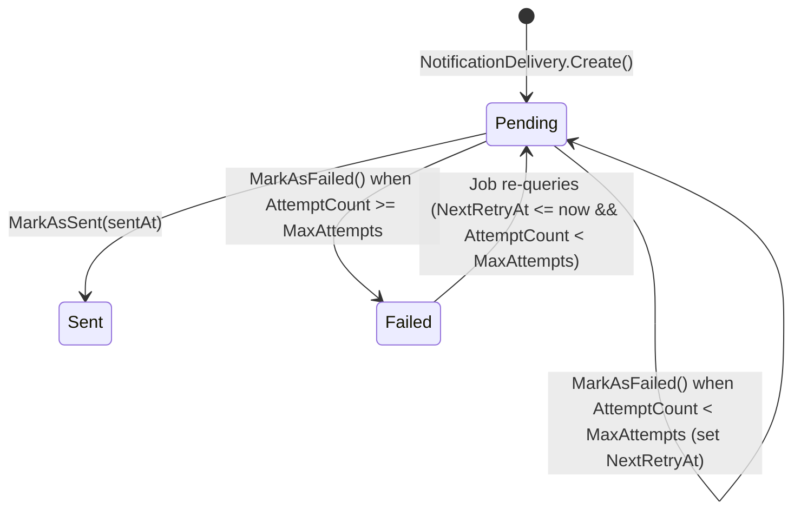
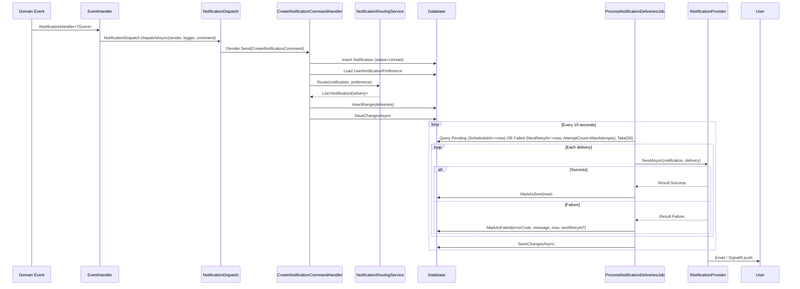

# Flow 13 -- Notification System

## State Machines

### Notification Status



### Delivery Status



### End-to-End Sequence



## Entities

### Notification

| Field | Type | Notes |
|---|---|---|
| `Id` | `NotificationId` (Guid) | PK |
| `UserId` | `UserId` (Guid) | FK to User |
| `NotificationType` | `string` | Category: auction, order, moderation, etc. |
| `EventType` | `string` | Specific event: auction_won, order_shipped, etc. |
| `Title` | `string` | Vietnamese display title |
| `Message` | `string` | Vietnamese display message |
| `Metadata` | `string?` | JSONB -- event-specific payload |
| `EntityType` | `string?` | Related entity type: Auction, Order, Item, etc. |
| `EntityId` | `Guid?` | Related entity PK |
| `RelatedEntities` | `string?` | JSONB array |
| `Status` | `NotificationStatus` | Unread / Read / Archived / Deleted |
| `Priority` | `NotificationPriority` | Low / Normal / High / Urgent |
| `Actions` | `string?` | JSONB array of action objects |
| `CreatedAt` | `DateTime` | UTC |
| `ModifiedAt` | `DateTime?` | UTC, set on MarkAsRead |
| `ReadAt` | `DateTime?` | UTC |
| `ExpiresAt` | `DateTime?` | Optional TTL |

### NotificationDelivery

| Field | Type | Notes |
|---|---|---|
| `Id` | `NotificationDeliveryId` (Guid) | PK |
| `NotificationId` | `NotificationId` | FK to Notification |
| `UserId` | `UserId` | FK to User |
| `Channel` | `NotificationChannel` | In App / Email / SignalR |
| `Status` | `NotificationDeliveryStatus` | Pending / Sent / Failed |
| `AttemptCount` | `int` | Starts at 0, incremented on failure |
| `MaxAttempts` | `int` | Email=3, SignalR=1 |
| `NextRetryAt` | `DateTime?` | Set when retry is possible |
| `DeliveryMetadata` | `string?` | JSONB, set on success |
| `ErrorCode` | `string?` | e.g. NO_PROVIDER, SEND_ERROR, EXCEPTION |
| `ErrorMessage` | `string?` | Human-readable error |
| `ErrorDetails` | `string?` | JSONB |
| `ScheduledAt` | `DateTime` | When delivery was scheduled |
| `SentAt` | `DateTime?` | Set on MarkAsSent |
| `DeliveredAt` | `DateTime?` | Provider-level acknowledgement |
| `FailedAt` | `DateTime?` | Set when permanently failed |

## API Endpoints

| # | Method | Route | Auth | Description |
|---|---|---|---|---|
| 1 | `GET` | `/api/notifications` | User | List my notifications (paged, ordered by CreatedAt desc) |
| 2 | `GET` | `/api/notifications/unread-count` | User | Get unread notification count |
| 3 | `PATCH` | `/api/notifications/{notificationId}/read` | User | Mark single notification as read |
| 4 | `PATCH` | `/api/notifications/read-all` | User | Mark all unread notifications as read |
| 5 | `GET` | `/api/me/notification-preferences` | User | Get notification preferences |
| 6 | `PUT` | `/api/me/notification-preferences` | User | Update notification preferences |

## Background Job

| Job | Schedule | Batch | Concurrency |
|---|---|---|---|
| `ProcessNotificationDeliveriesJob` | Every 10 seconds | 50 deliveries | `[DisallowConcurrentExecution]` |

**Query condition:**
```
(Status == Pending && ScheduledAt <= now) OR (Status == Failed && NextRetryAt <= now && AttemptCount < MaxAttempts)
```

## SignalR Hub

| Hub | Route | Auth |
|---|---|---|
| `NotificationHub` | `/hubs/notifications` | `[Authorize]` |

**Group naming:** `notifications:{userId}`

**Client callbacks (`INotificationHubClient`):**

| Method | Payload | Description |
|---|---|---|
| `ReceiveNotification` | `NotificationPushDto` | Pushed when SignalR delivery succeeds |
| `UnreadCountUpdated` | `int count` | Pushed immediately after ReceiveNotification |

**`NotificationPushDto` fields:** NotificationId, NotificationType, EventType, Title, Message, EntityType, EntityId, Priority, CreatedAt

## Enums

### NotificationStatus

| Value | Description |
|---|---|
| `unread` | Initial state on creation |
| `read` | After MarkAsRead() |
| `archived` | Future -- not yet triggered by code |
| `deleted` | Future -- not yet triggered by code |

### NotificationPriority

| Value | Description |
|---|---|
| `low` | Low importance |
| `normal` | Default when no priority specified |
| `high` | Used for rejections, cancellations, security events |
| `urgent` | Highest priority |

### NotificationChannel

| Value | Description |
|---|---|
| `In App` | Delivery record created; no active provider implementation yet |
| `Email` | EmailNotificationProvider -- via IMailSender |
| `SignalR` | SignalRNotificationProvider -- via IHubContext |

### NotificationDeliveryStatus

| Value | Description |
|---|---|
| `Pending` | Initial state; waiting for job pickup |
| `Sent` | Successfully delivered by provider |
| `Failed` | All retry attempts exhausted or no retry scheduled |

## Event Sources (59 dispatches)

### Auction Context (18 events)

| EventType | NotificationType | Source Event / Handler |
|---|---|---|
| `auction_cancelled` | auction | `AuctionCancelledEvent` |
| `auction_pending_publish` | auction | `AuctionCreatedEventHandler` |
| `auction_cancelled_deposit_returned` | auction | `AuctionDepositReleaseEventHandlers` |
| `auction_failed_deposit_returned` | auction | `AuctionDepositReleaseEventHandlers` |
| `auction_ended_deposit_returned` | auction | `AuctionDepositReleaseEventHandlers` |
| `auction_failed` | auction | `AuctionFailedEventHandler` |
| `auction_ended` | auction | `AuctionEndedEventHandler` |
| `auction_payment_defaulted` | auction | `AuctionFallbackEventHandlers` |
| `runner_up_offer_received` | auction | `AuctionFallbackEventHandlers` |
| `runner_up_offer_responded` | auction | `AuctionFallbackEventHandlers` |
| `auction_terminated` | auction | `AuctionFallbackEventHandlers` |
| `auction_won` | auction | `AuctionSoldEventHandler` |
| `auction_sold` | auction | `AuctionSoldEventHandler` |
| `auction_ended` | auction | `AuctionSoldEventHandler` (losers) |
| `auction_started` | auction | `AuctionStartedEventHandler` |
| `auction_configuration_submitted` | auction | `AuctionSubmittedEventHandler` |
| `runner_up_offer_expired` | auction | `ExpireRunnerUpOffersJob` (x2) |

### Moderation Context (15 events)

| EventType | NotificationType | Source |
|---|---|---|
| `item_approved` | moderation | `AuctionApprovedNotificationHandler` |
| `item_rejected` | moderation | `AuctionRejectedNotificationHandler` |
| `item_submitted_for_review` | moderation | `SubmitItemCommand` |
| `item_resubmitted_for_review` | moderation | `ResubmitItemCommand` |
| `item_shipping_required` | moderation | `ChooseItemShippingCommand` / `ConfirmInspectedConditionCommand` |
| `report_created` | moderation | `CreateReportCommand` |
| `report_dismissed` / `report_resolved` | moderation | `ResolveReportCommand` |
| `dispute_message_received` / `dispute_internal_message_received` | moderation | `DisputeRealtimeEventHandlers` |
| `dispute_updated` | moderation | `DisputeRealtimeEventHandlers` |
| `platform_inspection_recorded` | moderation | `ReviewWarehouseInspectionCommand` |
| `platform_verification_rejected` | moderation | `ReviewWarehouseInspectionCommand` |
| `inspected_condition_confirmation_required` | moderation | `ReviewWarehouseInspectionCommand` |

### Order Context (9 events)

| EventType | NotificationType | Source |
|---|---|---|
| `order_cancelled` | order | `OrderCancelledEvent` |
| `order_shipped` | order | `OutboundShipmentPickedUpEvent` |
| `order_delivered` | order | `OutboundShipmentDeliveredEvent` |
| `decision_window_started` | order | `OutboundShipmentDeliveredEvent` |
| `return_requested` | order | `OrderLifecycleEventHandlers` |
| `return_approved` | order | `OrderLifecycleEventHandlers` |
| `return_rejected` | order | `OrderLifecycleEventHandlers` |
| `return_shipped` | order | `OrderLifecycleEventHandlers` |
| `refund_completed` | order | `OrderLifecycleEventHandlers` |

### Financial Context (8 events)

| EventType | NotificationType | Source |
|---|---|---|
| `wallet_credited` | financial | `PaymentNotificationEventHandlers` |
| `wallet_debited` | financial | `PaymentNotificationEventHandlers` |
| `transaction_failed` | financial | `PaymentNotificationEventHandlers` |
| `withdrawal_completed` | financial | `PaymentNotificationEventHandlers` |
| `withdrawal_rejected` | financial | `PaymentNotificationEventHandlers` |
| `invoice_paid` | financial | `PaymentNotificationEventHandlers` |
| `escrow_released` | financial | `PaymentNotificationEventHandlers` |
| `escrow_refunded` | financial | `PaymentNotificationEventHandlers` |

### User / Account Context (6 events)

| EventType | NotificationType | Source |
|---|---|---|
| `user_email_confirmed` | account | `UserEmailConfirmedEventHandler` |
| `user_status_changed` | account | `UserStatusChangedEventHandler` |
| `user_locked_out` | security | `UserLockedOutEventHandler` |
| `suspicious_login_new_ip` | security | `LoginAttemptedEventHandler` |
| `session_nearing_expiration` | session | `SessionNearingExpirationEventHandler` |
| `session_revoked` | security / session | `SessionRevokedEventHandler` (conditional) |

### Item Question Context (2 events)

| EventType | NotificationType | Source |
|---|---|---|
| `item_question_asked` | item_question | `ItemQuestionAskedEvent` |
| `item_question_answered` | item_question | `ItemQuestionAnsweredEvent` |

### Warehouse Context (1 event)

| EventType | NotificationType | Source |
|---|---|---|
| `inbound_shipment_arrived_for_inspection` | warehouse | `InboundShipmentArrivedEventHandler` |

### Verification Context (1+ events)

| EventType | NotificationType | Source |
|---|---|---|
| (dynamic per verification type) | verification | `VerificationSubmittedEventHandler` |

## Subflow Index

| # | File | Topic |
|---|---|---|
| 1 | [01-event-to-notification.md](01-event-to-notification.md) | Event dispatch, routing, delivery creation |
| 2 | [02-delivery-job.md](02-delivery-job.md) | Background job processing and retry |
| 3 | [03-channels.md](03-channels.md) | Email and SignalR providers |
| 4 | [04-user-preferences.md](04-user-preferences.md) | Notification preference management |
| 5 | [05-read-management.md](05-read-management.md) | Read status, unread count, listing |
