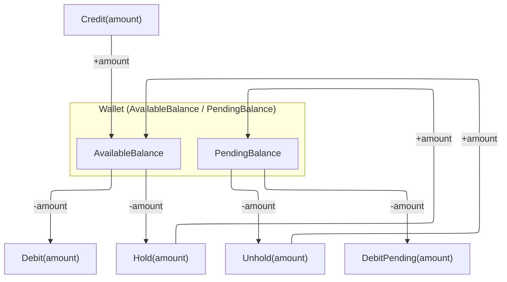

# 01 - Wallet Operations

## Five Core Operations

## Operation Details

### 1. Credit

- **Effect:** `AvailableBalance += amount`; `PendingBalance` unchanged
- **Validation:** amount must be non-negative
- **Transaction type:** `credit`
- **Sources:**
  - VNPay wallet top-up (purpose = `wallet_top_up`)
  - Auction deposit refund
  - Escrow refund to buyer
  - Late buy-now payment credit (reservation expired but payment succeeded)
- **Domain event:** `WalletCreditedDomainEvent(WalletId, UserId, Amount, BalanceAfter, Description)`
- **Description examples:** `"VNPay wallet top-up - TxnRef: {ref}"`, `"Late buy-now payment credited to wallet - TxnRef: {ref}"`

### 2. Debit

- **Effect:** `AvailableBalance -= amount`; `PendingBalance` unchanged
- **Validation:** amount must be non-negative AND `amount <= AvailableBalance`
- **Transaction type:** `debit`
- **Use cases:** Direct balance deduction (e.g., fallback when DebitPending insufficient for deposit conversion)
- **Domain event:** `WalletDebitedDomainEvent(WalletId, UserId, Amount, BalanceAfter, Description)`

### 3. Hold

- **Effect:** `AvailableBalance -= amount`; `PendingBalance += amount`
- **Validation:** amount must be non-negative AND `amount <= AvailableBalance`
- **Transaction type:** `hold`
- **Use cases:**
  - Withdrawal request creation (funds reserved until admin processes)
  - Auction deposit hold (VNPay deposit callback)
  - Hybrid payment wallet portion hold (`[HybridHold]`)
  - Auto-bid reserve
- **Domain event:** `WalletHeldDomainEvent(WalletId, UserId, Amount, Description)`

### 4. Unhold

- **Effect:** `AvailableBalance += amount`; `PendingBalance -= amount`
- **Validation:** amount must be non-negative AND `amount <= PendingBalance`
- **Transaction type:** `release`
- **Use cases:**
  - Cancel withdrawal (user-initiated)
  - Reject withdrawal (admin-initiated)
  - Auto-bid cancel / outbid release
- **Domain event:** `WalletUnheldDomainEvent(WalletId, UserId, Amount, Description)`

### 5. DebitPending

- **Effect:** `AvailableBalance` unchanged; `PendingBalance -= amount`
- **Validation:** amount must be non-negative AND `amount <= PendingBalance`
- **Transaction type:** `debit` (same as Debit -- money leaves the system)
- **Use cases:**
  - Complete withdrawal (funds sent to bank)
  - Checkout finalize (hybrid wallet portion committed to escrow)
  - Auction winner deposit applied to order
- **Domain event:** None (no domain event raised by `DebitPending` -- the calling use case raises its own event)

## WalletTransaction Record

Every operation above creates a `WalletTransaction` entry:

| Field | Description |
|-------|-------------|
| `WalletId` | Parent wallet |
| `TransactionId?` | Linked payment transaction (nullable for internal ops like withdrawal hold) |
| `Type` | `credit` / `debit` / `hold` / `release` |
| `Amount` | Operation amount |
| `BalanceBefore` | `AvailableBalance` before the operation |
| `BalanceAfter` | `AvailableBalance` after the operation |
| `Description` | Human-readable context string |
| `CreatedAt` | UTC timestamp |

## Database Constraints

| Constraint | SQL |
|------------|-----|
| `chk_non_negative_balance` | `balance >= 0` |
| `chk_non_negative_pending` | `pending_balance >= 0` |

These constraints ensure the wallet can never go negative at the database level, providing a safety net beyond domain validation.
