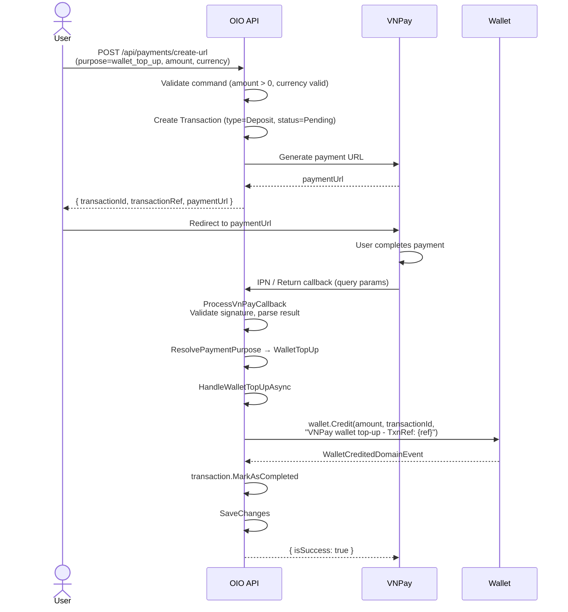

# 02 - Wallet Top-Up (VNPay)

## Flow Overview

## Request (CreateVnPayPaymentUrlCommand)

| Field | Type | Required | Notes |
|-------|------|----------|-------|
| `Amount` | `decimal` | Yes | Amount in VND |
| `Currency` | `string` | Yes | Must be `"VND"` |
| `Purpose` | `string` | Yes | Must be `"wallet_top_up"` |
| `Description` | `string` | Yes | Free-text description |
| `IpAddress` | `IPAddress` | Yes | Client IP (injected by endpoint) |
| `BankCode` | `string?` | No | Optional VNPay bank code |
| `PaymentMethodId` | `Guid?` | No | Use saved VNPay token |
| `SaveCard` | `bool` | No | Save card for future use |

## Callback Processing

1. `ProcessVnPayCallbackCommand` validates the VNPay signature
2. `ResolvePaymentPurpose` returns `WalletTopUp` (fallback when no AuctionId/OrderId/BuyNowReservationId)
3. `HandleWalletTopUpAsync`:
   - Finds wallet by `transaction.UserId`
   - Calls `wallet.Credit(amount, transactionId, description)`
   - Description format: `"VNPay wallet top-up - TxnRef: {transactionNumber}"`
4. Transaction marked as `Completed`
5. Optional: VNPay token auto-linked/created if callback contains token data

## Error Cases

| Error | Code | When |
|-------|------|------|
| `Wallet.NotFound` | 404 | User has no wallet |
| `Transaction.NotFound` | 404 | TxnRef from callback not found in DB |
| Credit validation failure | 400 | Negative amount (should not happen via VNPay) |

## Notes

- No special business validation beyond the standard VNPay flow
- The `wallet_top_up` purpose maps to `TransactionType.Deposit`
- Idempotency: if the transaction is already `Completed` or `Failed`, the callback returns immediately without re-processing
