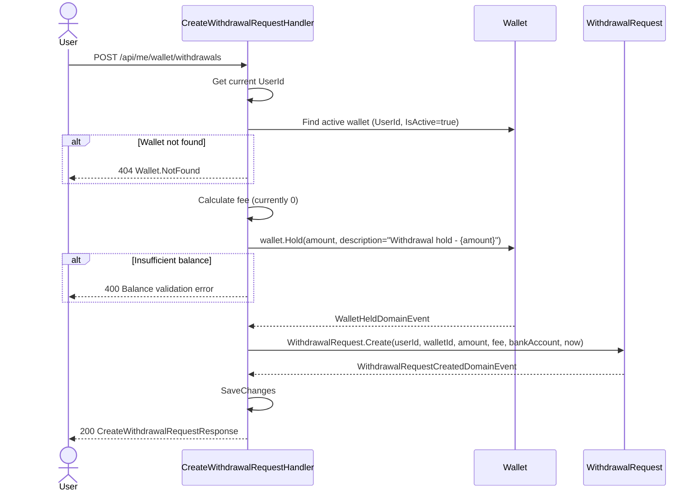

# 03 - Create Withdrawal Request

## Endpoint

| | |
|---|---|
| **Method** | `POST` |
| **URL** | `/api/me/wallet/withdrawals` |
| **Auth** | Authenticated user |
| **Handler** | `CreateWithdrawalRequestCommandHandler` |

## Request Body

```json
{
  "amount": 500000,
  "bankName": "Vietcombank",
  "accountNumber": "1234567890",
  "accountHolder": "NGUYEN VAN A"
}
```

| Field | Type | Required | Validation |
|-------|------|----------|------------|
| `Amount` | `decimal` | Yes | Must be positive; must not exceed AvailableBalance |
| `BankName` | `string` | Yes | Trimmed |
| `AccountNumber` | `string` | Yes | Trimmed |
| `AccountHolder` | `string` | Yes | Trimmed |

## Handler Flow



## BankAccount Value Object

Created via `BankAccount.Create(bankName, accountNumber, accountHolder)`. All fields are trimmed. Used as an owned entity on `WithdrawalRequest`.

| Property | Type | Nullable |
|----------|------|----------|
| `BankName` | `string?` | Yes |
| `AccountNumber` | `string?` | Yes |
| `AccountHolder` | `string?` | Yes |

## Response

```json
{
  "withdrawalRequestId": "3fa85f64-5717-4562-b3fc-2c963f66afa6",
  "amount": 500000,
  "fee": 0,
  "netAmount": 500000,
  "status": "pending"
}
```

| Field | Type | Description |
|-------|------|-------------|
| `WithdrawalRequestId` | `Guid` | New withdrawal request ID |
| `Amount` | `decimal` | Requested withdrawal amount |
| `Fee` | `decimal` | Withdrawal fee (currently always 0) |
| `NetAmount` | `decimal` | `Amount - Fee` |
| `Status` | `string` | Always `"pending"` on creation |

## Key Behaviors

- **Fee calculation:** Currently hardcoded to `0`. The handler has a placeholder for configurable fees.
- **Hold:** The full `Amount` is held (moved from AvailableBalance to PendingBalance) immediately on creation. This ensures funds are reserved.
- **NetAmount:** `Amount - Fee`. This is the amount the user will actually receive in their bank account.
- **Domain events raised:**
  - `WalletHeldDomainEvent` (from `wallet.Hold`)
  - `WithdrawalRequestCreatedDomainEvent` (from `WithdrawalRequest.Create`)
