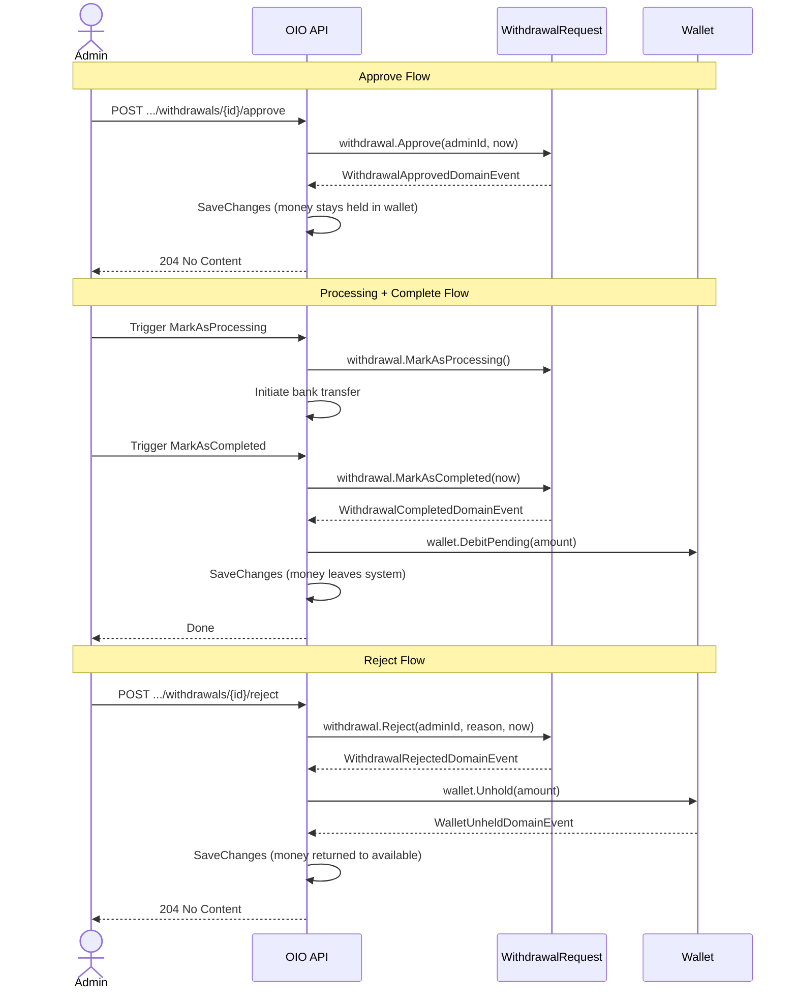

# 04 - Admin Withdrawal Management

## Admin Withdrawal Lifecycle

## Endpoints

### GET /api/admin/payments/withdrawals

| | |
|---|---|
| **Permission** | `ReadPayments` |
| **Query** | Paginated with `AdminWithdrawalFilterParameters` (status, userId) |
| **Response** | `PagedList<WithdrawalRequestDto>` |

Returns all withdrawal requests across all users. Bank account numbers are **masked** in the list DTO.

### GET /api/admin/payments/withdrawals/{withdrawalId}

| | |
|---|---|
| **Permission** | `ReadPayments` |
| **Response** | `AdminWithdrawalRequestDetailDto` |

Returns full detail including **unmasked** `AccountNumber`. Additional fields vs user DTO:

| Field | Type | Description |
|-------|------|-------------|
| `UserId` | `Guid` | Requesting user |
| `WalletId` | `Guid` | Source wallet |
| `AccountNumber` | `string?` | Unmasked bank account number |
| `ProcessedBy` | `Guid?` | Admin who processed |

### POST /api/admin/payments/withdrawals/{withdrawalId}/approve

| | |
|---|---|
| **Permission** | `ManagePayments` |
| **Request** | Path parameter `withdrawalId` only |
| **Response** | `204 No Content` |

**Behavior:**
- Only from `Pending` status
- Sets status to `Approved`, records `ProcessedBy` and `ProcessedAt`
- Money **remains held** in the wallet (PendingBalance unchanged)
- A job or admin will subsequently trigger `MarkAsProcessing` then `MarkAsCompleted` + `wallet.DebitPending`
- Raises `WithdrawalApprovedDomainEvent`

### POST /api/admin/payments/withdrawals/{withdrawalId}/reject

| | |
|---|---|
| **Permission** | `ManagePayments` |
| **Request body** | `{ "reason": "string" }` (required) |
| **Response** | `204 No Content` |

**Behavior:**
- Only from `Pending` status
- Sets status to `Rejected`, records `ProcessedBy`, `ProcessedAt`, `RejectionReason`
- Calls `wallet.Unhold(amount)` to release held funds back to AvailableBalance
- Description: `"Withdrawal rejected - unheld {amount}"`
- Raises `WithdrawalRejectedDomainEvent` + `WalletUnheldDomainEvent`

## Processing and Completion

After approval, the withdrawal goes through two more transitions:

### MarkAsProcessing

- **Precondition:** Status must be `Approved`
- Sets status to `Processing`
- Represents the bank transfer being initiated

### MarkAsCompleted

- **Precondition:** Status must be `Processing` or `Approved`
- Sets status to `Completed`
- Calls `wallet.DebitPending(amount)` to remove funds from PendingBalance permanently
- Description: contextual based on the calling handler
- Raises `WithdrawalCompletedDomainEvent`

## Error Codes

| Code | HTTP | When |
|------|------|------|
| `Withdrawal.NotFound` | 404 | Withdrawal ID not found |
| `Withdrawal.InvalidStatus` | 409 | Status transition not allowed |
