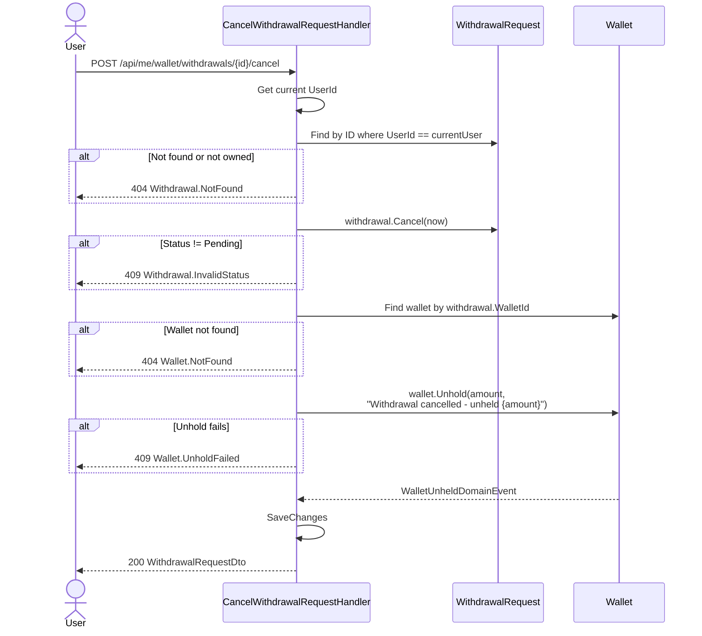

# 05 - Cancel Withdrawal Request

## Endpoint

| | |
|---|---|
| **Method** | `POST` |
| **URL** | `/api/me/wallet/withdrawals/{withdrawalId}/cancel` |
| **Auth** | Authenticated user (owner only) |
| **Handler** | `CancelWithdrawalRequestCommandHandler` |

## Flow



## Request

| Parameter | Source | Type | Description |
|-----------|--------|------|-------------|
| `withdrawalId` | Path | `Guid` | ID of the withdrawal to cancel |

No request body required.

## Response

Returns `WithdrawalRequestDto`:

```json
{
  "id": "3fa85f64-5717-4562-b3fc-2c963f66afa6",
  "amount": 500000,
  "fee": 0,
  "netAmount": 500000,
  "status": "cancelled",
  "bankName": "Vietcombank",
  "accountNumberMasked": "****7890",
  "accountHolder": "NGUYEN VAN A",
  "rejectionReason": null,
  "createdAt": "2026-03-20T10:00:00Z",
  "processedAt": "2026-03-20T12:00:00Z"
}
```

## Key Behaviors

- **Ownership check:** The handler filters by both `Id` and `UserId == currentUser`, ensuring users can only cancel their own withdrawals.
- **Status guard:** `Cancel()` only succeeds from `Pending` status. Once an admin has approved, the user can no longer cancel.
- **Unhold:** The full `Amount` is released from PendingBalance back to AvailableBalance.
- **Description:** `"Withdrawal cancelled - unheld {amount}"`
- **ProcessedAt** is set to `now` on cancellation.

## Error Codes

| Code | HTTP | When |
|------|------|------|
| `Withdrawal.NotFound` | 404 | Withdrawal not found or not owned by current user |
| `Withdrawal.InvalidStatus` | 409 | Status is not `Pending` |
| `Wallet.NotFound` | 404 | Wallet for the withdrawal not found |
| `Wallet.UnholdFailed` | 409 | Unhold operation failed (e.g., PendingBalance < amount) |
