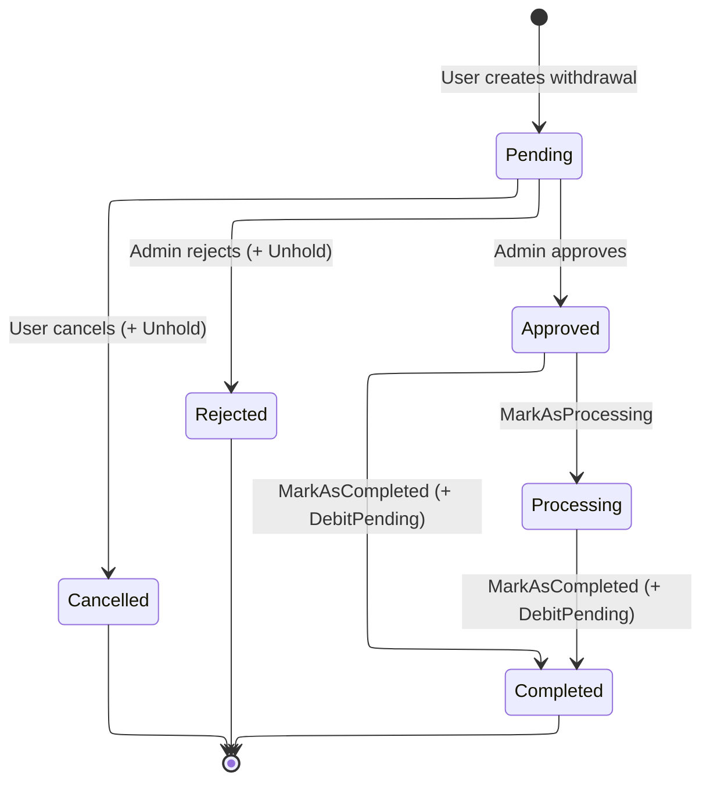
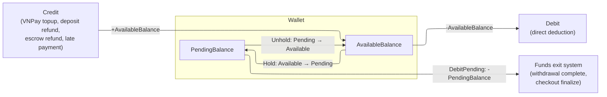

# Flow 14 - Wallet & Withdrawal

## Withdrawal State Machine

## Wallet Balance Model

## Entity Overview

| Entity | Aggregate Root | Key Fields | Description |
|--------|---------------|------------|-------------|
| `Wallet` | Yes | `UserId?`, `Type` (Personal/Platform), `WalletFunds` (BalanceAmount, PendingBalanceAmount, Currency), `IsActive`, `Version` | Holds user or platform funds; supports Credit, Debit, Hold, Unhold, DebitPending |
| `WalletTransaction` | No (child of Wallet) | `WalletId`, `TransactionId?`, `Type` (credit/debit/hold/release), `Amount`, `BalanceBefore`, `BalanceAfter`, `Description` | Immutable ledger entry created by every wallet operation |
| `WithdrawalRequest` | Yes | `UserId`, `WalletId`, `Amount`, `Fee`, `NetAmount`, `BankAccount` (VO), `Status`, `ProcessedBy?`, `RejectionReason?` | Tracks a user's request to withdraw funds to a bank account |

## Endpoint Summary

### User Endpoints

| Method | URL | Auth | Description |
|--------|-----|------|-------------|
| `GET` | `/api/me/wallet` | User | Get own wallet summary |
| `GET` | `/api/me/wallet/transactions` | User | List own wallet transactions (paginated) |
| `GET` | `/api/me/wallet/transactions/{transactionId}` | User | Get single wallet transaction |
| `POST` | `/api/me/wallet/withdrawals` | User | Create withdrawal request |
| `GET` | `/api/me/wallet/withdrawals` | User | List own withdrawal requests (paginated, filterable) |
| `POST` | `/api/me/wallet/withdrawals/{withdrawalId}/cancel` | User | Cancel a pending withdrawal |

### Admin Endpoints

| Method | URL | Permission | Description |
|--------|-----|------------|-------------|
| `GET` | `/api/admin/payments/withdrawals` | `ReadPayments` | List all withdrawals (paginated, filter by status/userId) |
| `GET` | `/api/admin/payments/withdrawals/{withdrawalId}` | `ReadPayments` | Get withdrawal detail (unmasked bank account) |
| `POST` | `/api/admin/payments/withdrawals/{withdrawalId}/approve` | `ManagePayments` | Approve a pending withdrawal |
| `POST` | `/api/admin/payments/withdrawals/{withdrawalId}/reject` | `ManagePayments` | Reject a pending withdrawal (with reason) |
| `GET` | `/api/admin/payments/platform-wallet` | `ReadPayments` | Get platform wallet summary |

## Subflow Index

| # | File | Description |
|---|------|-------------|
| 1 | [01-wallet-operations.md](01-wallet-operations.md) | Five core wallet operations (Credit, Debit, Hold, Unhold, DebitPending) |
| 2 | [02-wallet-topup.md](02-wallet-topup.md) | VNPay wallet top-up flow |
| 3 | [03-create-withdrawal.md](03-create-withdrawal.md) | User creates a withdrawal request |
| 4 | [04-admin-withdrawal.md](04-admin-withdrawal.md) | Admin approve / reject / process / complete withdrawal |
| 5 | [05-cancel-withdrawal.md](05-cancel-withdrawal.md) | User cancels a pending withdrawal |
| 6 | [06-platform-wallet.md](06-platform-wallet.md) | Platform wallet (seeded at startup, admin-readable) |

## Domain Events

| Event | Raised By | Key Data |
|-------|-----------|----------|
| `WalletCreditedDomainEvent` | `Wallet.Credit` | WalletId, UserId, Amount, BalanceAfter, Description |
| `WalletDebitedDomainEvent` | `Wallet.Debit` | WalletId, UserId, Amount, BalanceAfter, Description |
| `WalletHeldDomainEvent` | `Wallet.Hold` | WalletId, UserId, Amount, Description |
| `WalletUnheldDomainEvent` | `Wallet.Unhold` | WalletId, UserId, Amount, Description |
| `WithdrawalRequestCreatedDomainEvent` | `WithdrawalRequest.Create` | WithdrawalRequestId, UserId, Amount |
| `WithdrawalApprovedDomainEvent` | `WithdrawalRequest.Approve` | WithdrawalRequestId, UserId, ApprovedBy, Amount |
| `WithdrawalRejectedDomainEvent` | `WithdrawalRequest.Reject` | WithdrawalRequestId, UserId, RejectedBy, Reason, Amount |
| `WithdrawalCompletedDomainEvent` | `WithdrawalRequest.MarkAsCompleted` | WithdrawalRequestId, UserId, NetAmount |
