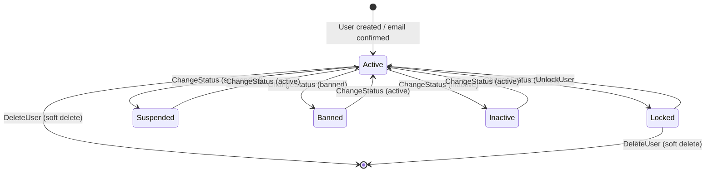

# 01 - User Management

## Overview

Admin user management covers creating users, listing/viewing users, changing user status, unlocking locked accounts, flagging users with risk indicators, and deleting user accounts. All operations enforce **role-level escalation prevention**: the acting admin must have a strictly higher max role level than the target user.

---

## User Status State Diagram

**UserStatus values:** `active`, `inactive`, `locked`, `banned`, `suspended`

**Revoked statuses** (trigger session revocation): `banned`, `inactive`, `locked`, `suspended`

---

## Endpoints

### 1. POST `api/admin/users` -- Create User

**Permission:** `admin:users:manage`

**Request body (`AdminCreateUserCommand`):**

| Field | Type | Required | Notes |
|---|---|---|---|
| `UserName` | string | Yes | Min/max length, regex-validated |
| `Email` | string | Yes | Max length, regex-validated |
| `Password` | string | No | If omitted, a 12-char temporary password is auto-generated |
| `Currency` | string | Yes | Must be a supported currency ID |
| `FirstName` | string | Yes | Min/max length validated |
| `LastName` | string | Yes | Min/max length validated |
| `DisplayName` | string | No | Defaults to `UserName` if not provided |
| `Roles` | string[] | No | Defaults to `["bidder", "user"]` if not provided |
| `EmailConfirmed` | bool | No | Default `false`. If `true`, skips email verification |
| `SkipNotifications` | bool | No | Default `false`. If `true`, clears domain events (no welcome email) |

**Handler logic (`AdminCreateUserCommandHandler`):**
1. Validates `UserEmail`, `UserName`, `Password` value objects
2. Generates 12-char temporary password if `Password` is null (Fisher-Yates shuffle, cryptographic RNG)
3. Validates `Currency` against supported currencies
4. Checks email and username uniqueness
5. Validates actor's max role level > each requested role's level (escalation prevention)
6. Creates `User` aggregate
7. If `EmailConfirmed = true`, calls `user.ConfirmEmail()`
8. Assigns each requested role
9. If `SkipNotifications = true`, clears domain events
10. Persists and returns `AdminUserCreatedDto`

**Response (`AdminUserCreatedDto`):**

| Field | Type |
|---|---|
| `UserId` | Guid |
| `UserName` | string |
| `Email` | string |
| `Status` | string |
| `Roles` | string[] |
| `EmailConfirmed` | bool |
| `TemporaryPassword` | string? (only if password was auto-generated) |

---

### 2. GET `api/admin/users` -- List Users

**Permission:** `admin:users:read`

**Query parameters (`GetUsersFilterParameters`):**

| Parameter | Type | Notes |
|---|---|---|
| `Search` | string? | Free-text search |
| `Status` | string? | Filter by `UserStatus` (`active`, `inactive`, `locked`, `banned`, `suspended`) |
| `Role` | string? | Filter by role name (`user`, `admin`, `seller`, `bidder`, `inspector`) |
| `SortBy` | string? | Sort field, validated against `UserListItemDtoSortMapping` |
| `Page` | int | Page number (from `PagedParameters`) |
| `PageSize` | int | Items per page (from `PagedParameters`) |

**Response:** `PagedList<UserListItemDto>`

---

### 3. GET `api/admin/users/{userId}` -- Get User by ID

**Permission:** `admin:users:read`

**Path parameter:** `userId` (Guid, non-empty)

**Response:** `UserDto`

---

### 4. PATCH `api/admin/users/{userId}/status` -- Change User Status

**Permission:** `admin:users:manage`

**Request body (`ChangeUserStatusCommand`):**

| Field | Type | Required | Notes |
|---|---|---|---|
| `UserId` | Guid | Yes | From route |
| `NewStatus` | string | Yes | Must be valid `UserStatus` ID |

**Handler logic (`ChangeUserStatusCommandHandler`):**
1. Prevents self-status-change (`CannotChangeOwnStatus`)
2. Loads actor and target user with roles
3. Checks `actor.CanManage(targetUser)` -- requires higher role level
4. Calls `targetUser.ChangeStatus(newStatus, nowUtc)`
5. If new status is in `RevokedStatus` set (`banned`, `inactive`, `locked`, `suspended`):
   - Revokes all user sessions with reason message
   - Invalidates session revocation store for all devices

---

### 5. PATCH `api/admin/users/{userId}/unlock` -- Unlock User

**Permission:** `admin:users:manage`

**Handler logic (`UnlockUserCommandHandler`):**
1. Prevents self-unlock (`CannotUnlockYourself`)
2. Loads actor and target with roles
3. Checks `actor.CanManage(targetUser)`
4. Calls `targetUser.Unlock(nowUtc)`

---

### 6. POST `api/admin/users/{userId}/risk-flags` -- Flag User

**Permission:** `admin:users:manage`

**Request body (`CreateUserRiskFlagCommand`):**

| Field | Type | Required | Notes |
|---|---|---|---|
| `UserId` | Guid | Yes | From route |
| `FlagType` | string | Yes | Free-text flag type identifier |
| `Reason` | string | No | Optional explanation |
| `Severity` | string | No | Default `"medium"`. Parsed via `ModerationValueParsers.ParseRiskSeverity()` |

**Handler logic (`CreateUserRiskFlagCommandHandler`):**
1. Looks up user by ID
2. Parses severity value
3. Creates `UserRiskFlag` entity with `flagType`, `reason`, `severity`, `createdBy`
4. Logs audit entry (`"user_risk_flag_created"`) with entity type `"User"`
5. Returns `UserRiskFlagDto`

---

### 7. DELETE `api/admin/users/{userId}` -- Delete User

**Permission:** `admin:users:manage`

**Handler:** Uses `DeleteUserCommand(userId)`. Performs soft delete.

---

## Error Codes

| Code | HTTP | Description |
|---|---|---|
| `User.NotFound` | 404 | Target user not found |
| `User.Email.AlreadyExists` | 409 | Email already registered |
| `User.UserName.AlreadyExists` | 409 | Username already taken |
| `User.Status.Change.Self` | 403 | Cannot change own status |
| `User.Unlock.Self` | 403 | Cannot unlock own account |
| `User.Remove.Self` | 403 | Cannot delete own account |
| `User.Role.Insufficient.Level` | 403 | Actor role level too low to manage target |
| `Role.NotFound` | 404 | Requested role does not exist |
| `Role.CannotAssign.HigherOrEqual` | 403 | Cannot assign role at equal or higher level |

---

## Source References

- `src/core/OIO.Application/Context/UserContext/Commands/AdminCreateUser/`
- `src/core/OIO.Application/Context/UserContext/Commands/ChangeUserStatus/`
- `src/core/OIO.Application/Context/UserContext/Commands/UnlockUser/`
- `src/core/OIO.Application/Context/ModerationContext/Commands/CreateUserRiskFlag/`
- `src/core/OIO.Application/Context/UserContext/Queries/GetUsers/`
- `src/core/OIO.Application/Context/UserContext/Queries/GetUserById/`
- `src/core/OIO.Domain/Context/UserContext/Enums/UserStatus.cs`
- `src/core/OIO.Domain/Context/UserContext/Errors/UserErrors.cs`
