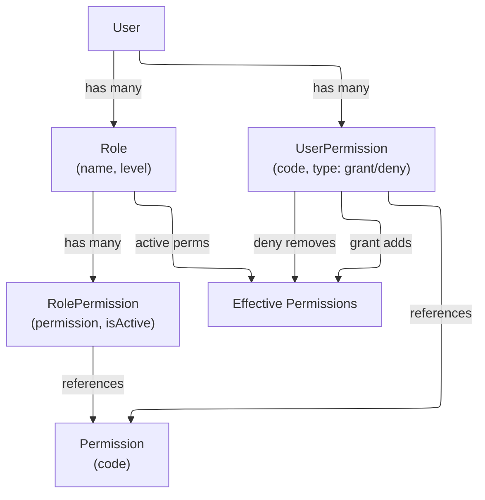

# 02 - Role & Permission Management

## Overview

The permission model uses a layered approach: **Roles** contain a set of **Permissions**, and **Users** are assigned **Roles** plus optional direct **Granted** or **Denied** permissions. The effective permission set is computed as:

```
Effective = (Role Permissions + Granted Permissions) - Denied Permissions
```

All role/permission management operations enforce escalation prevention and invalidate the permission cache for affected users.

---

## Permission Model



**Key rules:**
- `Grant` adds a permission directly to the user, supplementing role permissions
- `Deny` explicitly blocks a permission, overriding any role-based grant
- `Revoke` removes a direct grant/deny entry (returns to role-based default)
- `Toggle` on a role adds the permission if not present, or flips `IsActive` if present

---

## Endpoints

### 1. GET `api/admin/roles` -- List All Roles

**Permission:** `admin:roles:read`

**Handler (`GetAllRolesQueryHandler`):**
- Queries `Role` entities with `RolePermissions` -> `Permission` included
- Returns only permissions where `IsActive = true`

**Response:** `IReadOnlyList<RoleDto>`

| Field | Type |
|---|---|
| `Name` | string |
| `Permissions` | string[] (active permission codes) |

---

### 2. GET `api/admin/permissions` -- List All Permissions

**Permission:** `admin:permissions:read`

**Query parameters (`PermissionFilterParameters`):**

| Parameter | Type | Notes |
|---|---|---|
| `Search` | string? | Free-text search filter |
| `Page` | int | Page number |
| `PageSize` | int | Items per page |

**Response:** `PagedList<string>` (permission codes)

---

### 3. POST `api/admin/users/{userId}/roles/{role}` -- Assign Role

**Permission:** `admin:roles:assign`

**Request (`AssignRoleCommand`):** `UserId` (Guid, from route), `Role` (string, from route)

**Handler logic (`AssignRoleCommandHandler`):**
1. Prevents self-assignment (`CannotAssignRoleYourself`)
2. Loads actor with roles
3. Loads target user with roles
4. Validates role exists in `App.Roles.Definitions.All`
5. Checks `actor.CanManage(targetUser)` -- actor must have higher role level
6. Checks `actor.GetMaxRoleLevel() > targetRole.Level` -- cannot assign equal or higher role
7. Calls `targetUser.AssignRole(roleName, nowUtc)`
8. Persists and invalidates permission cache for target user

---

### 4. DELETE `api/admin/users/{userId}/roles/{role}` -- Revoke Role

**Permission:** `admin:roles:revoke`

**Request (`RevokeRoleCommand`):** `UserId` (Guid), `Role` (string)

**Handler logic (`RevokeRoleCommandHandler`):**
1. Prevents self-revocation (`CannotRevokeRoleYourself`)
2. Actor must have higher role level than target
3. Actor must have higher role level than the role being revoked
4. **Last admin protection:** if revoking `admin` role, checks that at least one other admin exists (`CannotRevokeLastAdminUser`)
5. Calls `targetUser.RevokeRole(roleName, nowUtc)`
6. Invalidates permission cache

---

### 5. POST `api/admin/users/{userId}/permissions/{permission}` -- Grant Permission

**Permission:** `admin:permissions:grant`

**Request (`GrantPermissionCommand`):** `UserId` (Guid), `Permission` (string)

**Handler logic (`GrantPermissionCommandHandler`):**
1. Prevents self-management (`CannotManageOwnPermissions`)
2. Actor must have higher role level than target
3. Validates permission exists in `App.Permissions.Definitions.All`
4. **Critical permission guard:** if permission is in `CriticalPermissions` set, actor must have admin-level role (`level >= 100`)
5. Calls `targetUser.GrantPermission(permissionCode, nowUtc)`
6. Invalidates permission cache

---

### 6. DELETE `api/admin/users/{userId}/permissions/{permission}` -- Revoke Permission

**Permission:** `admin:permissions:revoke`

**Request (`RevokePermissionCommand`):** `UserId` (Guid), `Permission` (string)

**Handler logic (`RevokePermissionCommandHandler`):**
- Same escalation checks as Grant
- Same critical permission guard
- Calls `targetUser.RevokePermission(permissionCode, nowUtc)`
- **Effect:** Removes the direct permission entry entirely. The user falls back to whatever their roles provide.

---

### 7. PUT `api/admin/users/{userId}/permissions/{permission}` -- Deny Permission

**Permission:** `admin:permissions:deny`

**Request (`DenyPermissionCommand`):** `UserId` (Guid), `Permission` (string)

**Handler logic (`DenyPermissionCommandHandler`):**
- Same escalation checks as Grant
- Same critical permission guard
- Calls `targetUser.DenyPermission(permissionCode, nowUtc)`
- **Effect:** Creates a deny entry that overrides any role-based grant. The user will NOT have this permission regardless of their roles.

### Deny vs Revoke

| Operation | Effect | Use Case |
|---|---|---|
| **Revoke** | Removes direct grant/deny entry | Undo a previous Grant or Deny; return to role default |
| **Deny** | Creates explicit deny entry | Block a specific permission even though the user's role includes it |

---

### 8. PUT `api/admin/roles/{role}/permissions/{permission}` -- Toggle Permission in Role

**Permission:** `admin:permissions:manage`

**Request (`TogglePermissionCommand`):** `Role` (string), `Permission` (string), `IsActive` (bool)

**Handler logic (`TogglePermissionCommandHandler`):**
1. Validates role and permission exist
2. Actor must have higher role level than the target role
3. Cannot modify the `admin` role's permissions
4. Critical permission guard applies
5. Loads `Role` entity from DB with `RolePermissions`
6. Calls `roleInDb.TogglePermission(permission, isActive, nowUtc)` -- adds if not present, or updates `IsActive` flag
7. Persists changes
8. **Cascading cache invalidation:** queries all users with this role and invalidates each user's permission cache

---

## Error Codes

| Code | HTTP | Description |
|---|---|---|
| `User.Role.Assign.Self` | 403 | Cannot assign role to yourself |
| `User.Role.Revoke.Self` | 403 | Cannot revoke your own role |
| `User.Permission.Manage.Self` | 403 | Cannot manage own permissions |
| `User.Role.Insufficient.Level` | 403 | Actor role level too low |
| `User.Role.LastAdmin.Revoke` | 403 | Cannot revoke last admin |
| `Role.CannotAssign.HigherOrEqual` | 403 | Cannot assign role at equal/higher level |
| `Role.CannotRevoke.HigherOrEqual` | 403 | Cannot revoke role at equal/higher level |
| `Role.NotFound` | 404 | Role does not exist |
| `Permission.NotFound` | 404 | Permission does not exist |
| `Auth.Insufficient.Permissions` | 403 | Non-admin trying to manage critical permissions |

---

## Source References

- `src/core/OIO.Application/Context/UserContext/Commands/AssignRole/`
- `src/core/OIO.Application/Context/UserContext/Commands/RevokeRole/`
- `src/core/OIO.Application/Context/UserContext/Commands/GrantPermission/`
- `src/core/OIO.Application/Context/UserContext/Commands/RevokePermission/`
- `src/core/OIO.Application/Context/UserContext/Commands/DenyPermissionFromUser/`
- `src/core/OIO.Application/Context/UserContext/Commands/TogglePermissionInRole/`
- `src/core/OIO.Application/Context/UserContext/Queries/GetAllRoles/`
- `src/core/OIO.Application/Context/UserContext/Queries/GetPermissions/`
