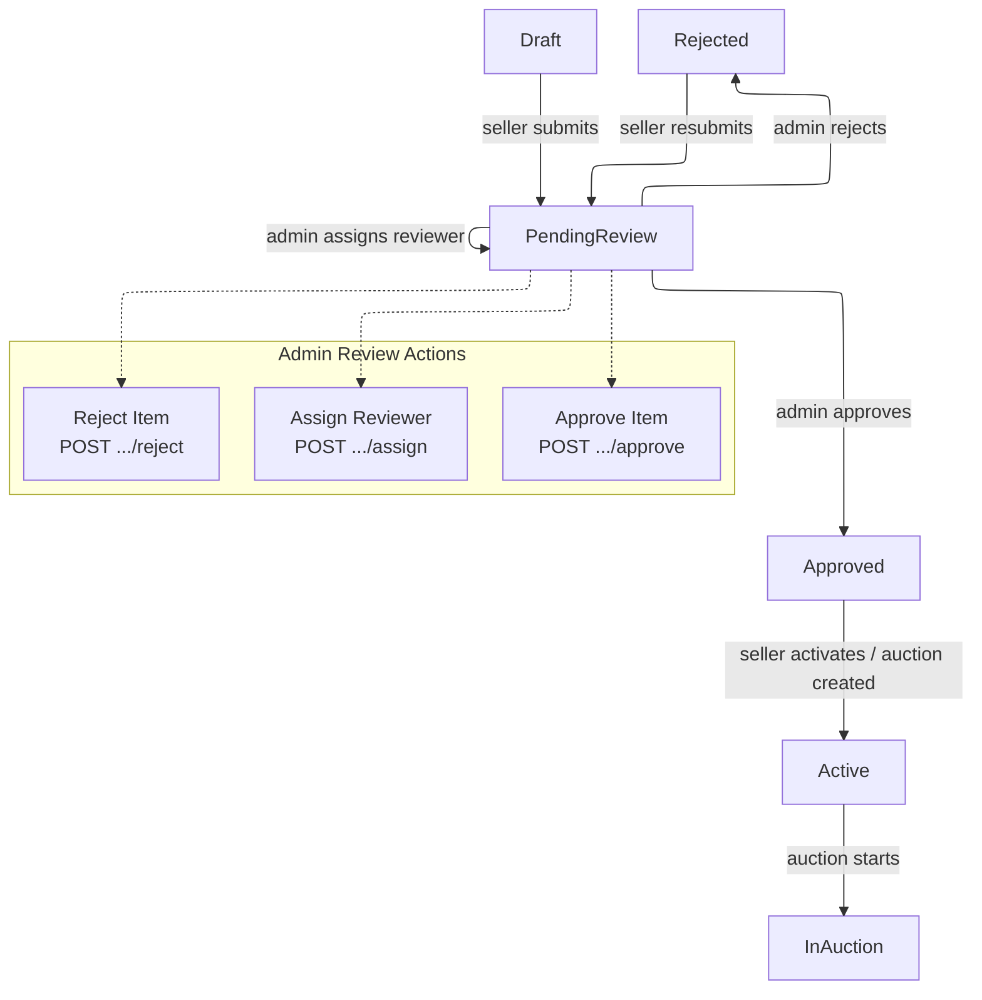

# 05 - Item Review

## Overview

Item review is the admin moderation process for seller-submitted items. Items in `pending_review` status appear in the review queue. Admins can assign a reviewer, approve (transitioning to `approved`), or reject (with reason). Rejected items can be resubmitted by the seller, re-entering the review queue. Each moderation action creates an `ItemModerationReview` audit record.

---

## Review Flow

**ItemStatus values:** `draft`, `pending_verify`, `pending_review`, `pending_condition_confirmation`, `approved`, `rejected`, `active`, `in_auction`, `sold`, `removed`

**Valid transitions relevant to admin review:**

| From | To | Trigger |
|---|---|---|
| `draft` | `pending_review` | Seller submits item |
| `pending_review` | `approved` | Admin approves |
| `pending_review` | `rejected` | Admin rejects |
| `rejected` | `pending_review` | Seller resubmits |
| `rejected` | `pending_verify` | Seller resubmits (warehouse verification path) |

---

## Endpoints

### 1. GET `api/admin/items/review-queue` -- Get Review Queue

**Permission:** `admin:items:read`

**Query parameters (`GetReviewQueueQueryFilterParameters`):**

| Parameter | Type | Notes |
|---|---|---|
| `Status` | string? | Filter by `ItemStatus` ID |
| `AssignedAdminId` | Guid? | Filter by assigned admin |
| `Page` | int | Page number |
| `PageSize` | int | Items per page |

**Handler (`GetReviewQueueQueryHandler`):**
- Base query: items where `Status == PendingReview`
- Optional filters on status and `AssignedAdminId`
- Orders by `SubmittedAt` ascending (oldest first)
- Includes `Auctions` and `Media` (split query)

**Response (`PagedList<ReviewQueueItemDto>`):**

| Field | Type | Description |
|---|---|---|
| `ItemId` | Guid | Item identifier |
| `AuctionId` | Guid | Most recent auction ID (by `CreatedAt`) |
| `Title` | string | Item title |
| `Status` | string | Current item status |
| `Condition` | string | Item condition |
| `SellerId` | Guid | Seller user ID |
| `AssignedAdminId` | Guid? | Assigned reviewer admin ID |
| `ResubmissionCount` | int | Number of times resubmitted |
| `MediaCount` | int | Number of attached media files |
| `SubmittedAt` | DateTime? | When the item was submitted for review |
| `CreatedAt` | DateTime | Item creation timestamp |

---

### 2. GET `api/admin/items/{itemId}` -- Get Item Detail

**Permission:** `admin:items:read`

**Handler:** Uses the standard `GetItemByIdQuery(itemId)` to return full item details.

---

### 3. POST `api/admin/items/{itemId}/assign` -- Assign Item Reviewer

**Permission:** `admin:items:manage`

**Request (`AssignItemReviewerCommand`):**

| Field | Type | Required |
|---|---|---|
| `ItemId` | Guid | Yes (from route) |
| `AdminId` | Guid | Yes (from body) |

**Handler logic (`AssignItemReviewerCommandHandler`):**
1. Loads item with `ModerationReviews`
2. Validates item status is `Draft` or `PendingReview` -- returns `InvalidState` error otherwise
3. Calls `item.AssignAdmin(adminId, nowUtc)`
4. Persists changes

**Effect:** Sets `item.AssignedAdminId` to the specified admin. This allows filtering the review queue by assigned admin.

---

### 4. POST `api/admin/items/{itemId}/approve` -- Approve Item

**Permission:** `admin:items:manage`

**Request (`ApproveItemCommand`):** `ItemId` (Guid)

**Handler logic (`ApproveItemCommandHandler`):**
1. Loads item with `ModerationReviews`
2. Validates `item.Status == PendingReview` -- returns `InvalidState` error if not
3. Calls `item.Approve(adminId, nowUtc)` where `adminId` is the current user
4. Persists changes

**Effect:** Creates an `ItemModerationReview` record with action `approved`, transitions item to `approved` status. The seller can then activate the item or create an auction from it.

---

### 5. POST `api/admin/items/{itemId}/reject` -- Reject Item

**Permission:** `admin:items:manage`

**Request (`RejectItemCommand`):**

| Field | Type | Required | Notes |
|---|---|---|---|
| `ItemId` | Guid | Yes | From route |
| `Reason` | string | Yes | Max 1000 characters |

**Handler logic (`RejectItemCommandHandler`):**
1. Loads item with `ModerationReviews`
2. Validates `item.Status == PendingReview`
3. Calls `item.Reject(adminId, reason, nowUtc)`
4. Persists changes

**Effect:** Creates an `ItemModerationReview` record with action `rejected` and the reason. Transitions item to `rejected` status. The seller receives a notification (via `ItemRejectedEventHandler`) and can resubmit after making corrections.

---

### 6. GET `api/admin/items/{itemId}/reviews` -- Get Item Review History

**Permission:** `admin:items:read`

**Request (`GetItemReviewHistoryQuery`):** `ItemId` (Guid)

**Handler (`GetItemReviewHistoryQueryHandler`):**
1. Loads item with `ModerationReviews`
2. Orders reviews by `CreatedAt` descending (newest first)
3. Maps to DTO list

**Response (`IReadOnlyList<ItemModerationReviewDto>`):**

| Field | Type | Description |
|---|---|---|
| `Id` | Guid | Review record ID |
| `Action` | string | Moderation action (`approved`, `rejected`, etc.) |
| `ReviewerId` | Guid | Admin who performed the action |
| `Reason` | string? | Rejection reason (null for approvals) |
| `OldStatus` | string? | Status before the action |
| `NewStatus` | string? | Status after the action |
| `CreatedAt` | DateTime | When the review occurred |

---

## Error Codes

| Code | HTTP | Description |
|---|---|---|
| `Item.NotFound` | 404 | Item with given ID not found |
| `Item.InvalidState` | 403 | Item is not in the required status for the requested action |

---

## Source References

- `src/core/OIO.Application/Context/AuctionContext/Queries/GetReviewQueue/GetReviewQueueQuery.cs`
- `src/core/OIO.Application/Context/AuctionContext/Commands/AssignItemReviewer/AssignItemReviewerCommand.cs`
- `src/core/OIO.Application/Context/AuctionContext/Commands/ApproveItem/ApproveItemCommand.cs`
- `src/core/OIO.Application/Context/AuctionContext/Commands/RejectItem/RejectItemCommand.cs`
- `src/core/OIO.Application/Context/AuctionContext/Queries/GetItemReviewHistory/GetItemReviewHistoryQuery.cs`
- `src/core/OIO.Application/Context/AuctionContext/DTOs/ReviewQueueItemDto.cs`
- `src/core/OIO.Domain/Context/CatalogContext/Enums/ItemStatus.cs`
- `src/core/OIO.Application/Context/AuctionContext/EventHandlers/ItemRejectedEventHandler.cs`
