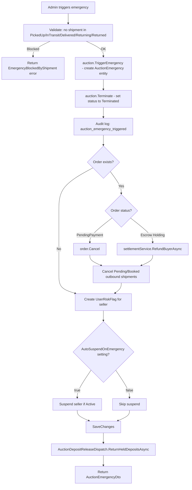

# 07 - Auction Emergency

Trigger and resolve auction emergencies. An emergency terminates the auction, cancels related orders, refunds escrows, cancels pending shipments, flags the seller with a risk flag, and optionally auto-suspends the seller account.

---

## Emergency Flow



---

## Endpoints

### Trigger Emergency

| Method | Route | Permission |
|--------|-------|------------|
| `POST` | `api/admin/auctions/{auctionId}/emergencies` | `Catalogs.Admin.ManageItems` |

**Request Body:**

```json
{
  "triggerSource": "report_escalation",
  "reason": "Fraudulent listing detected",
  "payload": { "details": "..." }
}
```

| Field | Type | Required | Description |
|-------|------|----------|-------------|
| `triggerSource` | `string` | Yes | Origin of the emergency (e.g., `"report_escalation"`, `"admin_manual"`). |
| `reason` | `string` | Yes | Human-readable explanation. |
| `payload` | `object` | Yes | Arbitrary JSON payload serialized and stored as an emergency action. |

### Resolve Emergency

| Method | Route | Permission |
|--------|-------|------------|
| `POST` | `api/admin/auctions/{auctionId}/emergencies/{emergencyId}/resolve` | `Catalogs.Admin.ManageItems` |

**Request Body:**

```json
{
  "status": "resolved",
  "payload": { "resolution": "..." }
}
```

| Field | Type | Required | Description |
|-------|------|----------|-------------|
| `status` | `string` | Yes | Target emergency status. Must be one of the `EmergencyStatus` values. |
| `payload` | `object` | Yes | Resolution details, serialized and stored as an emergency action. |

---

## Emergency Status Values

| Status | Description |
|--------|-------------|
| `triggered` | Initial state when emergency is created. |
| `investigating` | Under investigation. |
| `mitigated` | Threat has been mitigated. |
| `resolved` | Fully resolved. Sets `ResolvedAt`. |
| `dismissed` | False alarm. Sets `ResolvedAt`. |

---

## Side Effects (Trigger)

| Step | Detail |
|------|--------|
| **Shipment guard** | Blocks emergency if any outbound shipment is in `PickedUp`, `InTransit`, `Delivered`, `Returning`, or `Returned` status. |
| **Auction termination** | `auction.Terminate()` sets status to `Terminated`. |
| **Order cancellation** | If order is `PendingPayment`, calls `order.Cancel()`. |
| **Escrow refund** | If order has `Holding` escrows, calls `EscrowSettlementService.RefundBuyerAsync()` with full refund. |
| **Shipment cancellation** | Cancels all outbound shipments in `Pending` or `Booked` status. |
| **Seller risk flag** | Creates a `UserRiskFlag` with `flagType: "auction_emergency"` and `severity: High`. |
| **Auto-suspend** | If `RuntimeSettings.Ops.AutoSuspendOnEmergency` is `true`, suspends the seller (changes status to `Suspended`). |
| **Deposit release** | After save, calls `AuctionDepositReleaseDispatch.ReturnHeldDepositsAsync` to return all held auction deposits. |
| **Audit log** | Logs `"auction_emergency_triggered"` via `ModerationAuditService`. |

---

## AuctionEmergency Entity

| Property | Type | Description |
|----------|------|-------------|
| `Id` | `AuctionEmergencyId` | Unique identifier. |
| `AuctionId` | `AuctionId` | Parent auction. |
| `TriggeredById` | `UserId?` | Admin who triggered it. |
| `TriggerSource` | `string` | Origin identifier. |
| `Reason` | `string` | Explanation text. |
| `Status` | `EmergencyStatus` | Current lifecycle status. |
| `TriggeredAt` | `DateTime` | When the emergency was created. |
| `ResolvedAt` | `DateTime?` | Set when status moves to `Resolved` or `Dismissed`. |
| `Actions` | `IReadOnlyCollection<AuctionEmergencyAction>` | Audit trail of actions taken. |

---

## Response DTO

```json
{
  "id": "guid",
  "auctionId": "guid",
  "triggeredById": "guid | null",
  "triggerSource": "report_escalation",
  "reason": "Fraudulent listing detected",
  "status": "triggered",
  "triggeredAt": "2026-03-21T00:00:00Z",
  "resolvedAt": null
}
```

---

## Key Source Files

| File | Path |
|------|------|
| Trigger command + handler | `src/core/OIO.Application/Context/AuctionContext/Commands/TriggerAuctionEmergency/TriggerAuctionEmergencyCommand.cs` |
| Resolve command + handler | `src/core/OIO.Application/Context/AuctionContext/Commands/ResolveAuctionEmergency/ResolveAuctionEmergencyCommand.cs` |
| Trigger endpoint | `src/presentation/OIO.Api/Endpoints/AuctionContext/Admins/TriggerAuctionEmergencyEndpoint.cs` |
| Resolve endpoint | `src/presentation/OIO.Api/Endpoints/AuctionContext/Admins/ResolveAuctionEmergencyEndpoint.cs` |
| Domain entity | `src/core/OIO.Domain/Context/AuctionContext/Aggregates/Auctions/AuctionEmergency.cs` |
| Emergency status enum | `src/core/OIO.Domain/Context/AuctionContext/Enums/EmergencyStatus.cs` |
| Deposit release dispatch | `src/core/OIO.Application/Context/AuctionContext/AuctionDepositReleaseDispatch.cs` |
